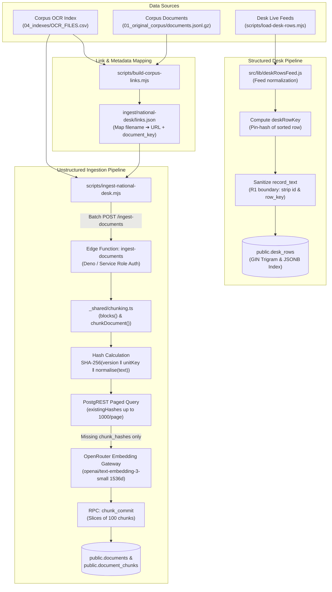
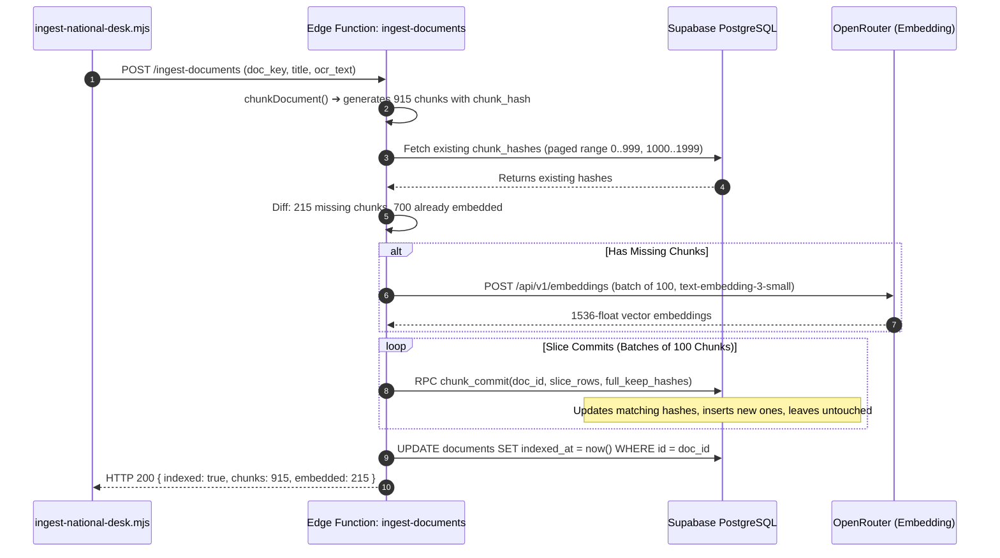
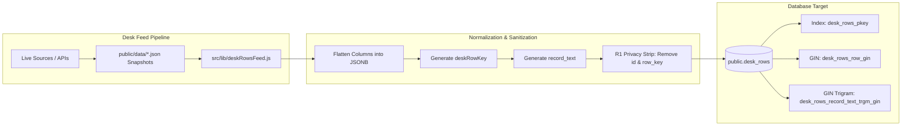

# Ingestion Pipeline Architecture: Documents, Chunks, Embeddings, and Desk Rows

> **Status: Living.** Documented on 2026-09-22.
> Reflects the verified implementation in `scripts/ingest-national-desk.mjs`, `scripts/load-desk-rows.mjs`, `supabase/functions/ingest-documents/`, `_shared/chunking.ts`, and database migrations 0003, 0004, 0009 and 0014. *(Corrected 2026-09-28: this line also cited a migration `20260922144105`, which does not exist in `supabase/migrations/`.)*

## Current PDF pipeline (2026-10-03)

The sections below describe legacy OCR/text-package ingestion and desk-row loading.
The deployed PDF path additionally uses `admin-ingest`, `ingest-worker` and private
`corpus` storage. Files are content-addressed; jobs use skip-locked claims, leases
and fencing. The worker calls pinned Mistral OCR directly under ADR 0002, persists
page/block/image coordinates, embeds via OpenRouter and activates completed extraction.
See [ingestion-v2](../specs/2026-10-01-rag-v2-ingestion-v2.md),
[page contract](../specs/2026-09-30-rag-v2-chunk-contract.md) and
[open-work](../plans/open-work.md) for pilot scope and owner acceptance.
Legacy documents retain their text-only reader; PDF storage and coordinates are
not retroactively inferred for them.

---

## 1. Executive Summary & Topology

Niyantran Terminal (NTER) operates a **dual ingestion architecture**:
1. **Unstructured Document Corpus (National Desk RAG):** Ingests long-form government gazettes, parliamentary bills, and official acts into character-exact, 1536-dimensional vector-embedded chunks with deterministic content-hash reconciliation.
2. **Structured Desk Datasets (SQL & Trigram Retrieval):** Ingests and sanitizes 34,184 rows across 34 intelligence desk modules into structured JSONB and trigram-indexed text representations.



---

## 2. Unstructured Document Ingestion Pipeline

### 2.1 The Two Corpus Packages

The system processes two distinct layers of document data:

| Asset | Location / Format | Count | Characteristics | Ingestion Status |
| :--- | :--- | :--- | :--- | :--- |
| **OCR Sidecar Slice** | `04_indexes/OCR_FILES.csv` | 12,830 rows | Scanned OCR text with whitespace noise and OCR line breaks. | **2,338 ingested** (100% indexed; affidavits and oversized files excluded). |
| **Full Source Package** | `01_original_corpus/documents.jsonl.gz` | 1,876,044 records | 18,071 `pdf_text` (extracted directly from digital PDF layers; 7,966 bills, 6,758 parliamentary questions, 2,813 regulatory docs). | **Parked** pending Supabase instance memory upgrade (nano tier `shared_buffers` constraint). |

### 2.2 Link Extraction & Document Keying

Source documents must resolve to an exact `document_key` (e.g. `bill:2006:16`) so that structured desk rows can be joined to underlying legal text.

The script `scripts/build-corpus-links.mjs` scans datasets to construct `ingest/national-desk/links.json`:

```json
{
  "2006-16-gaz.pdf": {
    "file_url": "https://egazette.gov.in/WriteReadData/2006/E_16_2006_014.pdf",
    "document_key": "bill:2006:16",
    "bill_year": 2006,
    "bill_no": "16",
    "source_feature": "Sansad (Bills)"
  }
}
```

---

### 2.3 The Chunking Engine (`_shared/chunking.ts`)

Chunking translates raw document OCR strings into discrete, embeddable units while strictly preserving absolute character offsets for the citation reader.

#### Core Parameters
```typescript
export const CHUNK = {
  targetChars: 1000,      // Ideal target size for a chunk
  maxChars: 6000,         // Hard upper ceiling for oversized sections
  overlapLines: 2,        // Sliding window overlap on broken paragraphs
  tableAtomicMax: 1500,   // Tables under 1.5k chars are never split
  minChars: 80,           // Filter out OCR debris
} as const;
```

#### Step 1: Structural Block Segmentation (`blocks()`)
`blocks(text)` segments the document into contiguous non-overlapping spans:
- **Heading Block:** Lines starting with `#` through `######`.
- **Markdown Table Block:** Consecutive lines starting with `|`.
- **HTML Table Block:** Blocks containing `<table`, `<tr`, `<td`, etc.
- **Paragraph Block:** Normal text bounded by double newlines (`\n\n`).

#### Step 2: Atomic Table Preservation
Over 1,845 chunks in the corpus contain HTML tables, and 1,590 chunks contain merged cells (`rowspan`/`colspan`). Cutting a table mid-cell corrupts HTML parsing and ruins readability.
- If `table.length <= CHUNK.tableAtomicMax` (1,500 chars), the entire table is preserved as **one atomic chunk**.
- If `table.length > CHUNK.tableAtomicMax`, the table is divided cleanly on row boundaries (`</tr>` or line breaks), never mid-cell.

#### Step 3: Absolute Character Invariants
For all 54,219 chunks in production, the following mathematical invariant holds:
$$\text{char\_to} - \text{char\_from} = \text{length}(\text{content})$$

This guarantee allows the front-end citation reader ([`SourceReader.jsx`](../../src/ai/SourceReader.jsx)) to map citations directly onto the document DOM without character drift.

---

### 2.4 The Ingestion Chunk Sandwich Architecture

Every chunk ingested into PostgreSQL is constructed as a **Data Sandwich**: immutable metadata and provenance form the outer bread layers, protecting the structural text filling in between:

```
====================================================================================================
                     THE INGESTION CHUNK SANDWICH ARCHITECTURE
====================================================================================================

+--------------------------------------------------------------------------------------------------+
| TOP LAYER: METADATA & IDENTITY HEADER                                                            |
|  - document_id (UUID foreign key -> public.documents.id ON DELETE CASCADE)                       |
|  - chunk_hash (Deterministic SHA-256 digest: version | unitKey | normalise(content))             |
|  - chunk_index (0-indexed sequence position within document)                                     |
|  - source_kind ('pdf_text' | 'ocr_sidecar')                                                      |
|  - Document Metadata: title, ministry, desk_tier, desk_feature, gazette_date                     |
+--------------------------------------------------------------------------------------------------+
| MIDDLE LAYER (THE FILLING): STRUCTURAL CONTENT & ATOMIC TABLES                                   |
|  - Cleaned, normalized structural text (~1,000 characters target, 6,000 maximum ceiling)         |
|  - Atomic HTML Table preservation (rowspan / colspan preserved, split on </tr> boundaries only)  |
|  - Absolute character coordinate spans: char_from to char_to (exact substring slice)            |
|  - Heading hierarchy context: prepends parent # and ## section headings to broken blocks        |
+--------------------------------------------------------------------------------------------------+
| BOTTOM LAYER: VECTOR EMBEDDING & PROVENANCE FOOTER                                               |
|  - 1536-dimensional float vector (OpenAI text-embedding-3-small, cosine distance <=>)            |
|  - HNSW index entry (380MB vector index in PostgreSQL shared_buffers)                           |
|  - Slice Commit Envelope (100-chunk batch transaction prevents PostgreSQL memory exhaustion)     |
+--------------------------------------------------------------------------------------------------+
```

---

### 2.5 Deterministic Chunk Identity & Reconciliation (ADR 0004)

Chunk identity does not depend on database auto-increment IDs or sequence indices. Instead, each chunk carries a content hash:

$$\text{chunk\_hash} = \text{SHA-256}(\text{chunker\_version} \parallel \text{unit\_key} \parallel \text{normalise}(\text{content}))$$

```typescript
export function chunkHashInput(version: number, unitKey: string, content: string): string {
  return `${version}|${unitKey}|${normalise(content)}`;
}
```



#### Why Content Hashing Matters
1. **Zero Duplicate Vectors:** Re-running ingestion over an existing document costs $0.00 in embedding fees.
2. **Resumable Batches:** If an edge function times out at 150 seconds, a subsequent run reads the committed hashes and only embeds the uncommitted remainder.
3. **Citation Durability:** Citations carry `chunk_id` and `text_hash` for passage verification. Hash reconciliation preserves unchanged chunk UUIDs; changed or removed passages must not be presented as verified solely because a document still exists.

---

### 2.5 Resumable Slicing & Postgres Stability

On 2026-09-22, committing "The Finance Bill, 2006" (969k characters, 915 chunks) in a single RPC call caused a 17 MB JSONB payload that triggered an immediate out-of-memory crash of PostgreSQL (`postmaster killed; 2m 38s downtime`).

Two architectural fixes resolved this:

#### 1. Slice Committing (`supabase/functions/ingest-documents/handler.ts`)
Chunks are committed in slices of 100. Critically, the `p_keep_hashes` parameter must contain the **complete document keep list** on every slice, preventing earlier slices from being deleted:

```typescript
const SLICE_SIZE = 100;
for (let i = 0; i < chunks.length; i += SLICE_SIZE) {
  const slice = chunks.slice(i, i + SLICE_SIZE);
  await client.rpc('chunk_commit', {
    p_document_id: docId,
    p_rows: slice.map(c => toCommitRow(c)),
    p_keep_hashes: allKeepHashes, // ENTIRE document list, NOT slice list!
  });
}
```

#### 2. PostgREST Pagination Cap (`existingHashes`)
PostgREST enforces a strict `max-rows: 1000` limit per query. When checking existing hashes for large files, unpaged queries silently truncated at 1,000 rows. The paged fetcher now loops with `.range()` until a short page is encountered:

```typescript
let from = 0;
const PAGE = 1000;
while (true) {
  const { data } = await client
    .from('document_chunks')
    .select('chunk_hash')
    .eq('document_id', docId)
    .order('chunk_index', { ascending: true })
    .range(from, from + PAGE - 1);
    
  for (const row of data) set.add(row.chunk_hash);
  if (data.length < PAGE) break;
  from += PAGE;
}
```

---

## 3. Structured Desk Rows Ingestion Pipeline

The 34 intelligence desks display tabular, highly structured data (e.g., Sansad Bills, Cabinet Decisions, Insolvency Cases, Port Disruptions).



### 3.1 Desk Row Identity & The Pin-Key Sandwich (`deskRowKey`)
Row identity is shared by the loader, browser and Edge port. `rowPinKey()`
(`src/lib/sourceUrls.js`) takes the first truthy value among `id`, `record_id`,
`bill_number`, `source_url`, `bill_name`, `title`, `name` and `subject`, then
trims, lowercases and truncates it to 160 characters. This is not a SHA-256 digest.

`deskRowKey(row)` (`src/lib/deskRows.js`) first flattens the row, then uses that
pin key or `h:` plus FNV-1a-64 over normalized record text. `tier` and `feature`
are separate namespace columns in the table key; they are not concatenated by
`deskRowKey`. `document_key` is a separate record-to-document linkage contract.

### 3.2 The R1 Grounding Boundary (Privacy & Nonce Safety)
In production, LLMs frequently imitated internal identifiers into user-facing answers (e.g. emitting `[open-fronts:russia-ukraine-war:0]`). 

To enforce strict citation handle syntax (`ref:xxxxxx-n`), `rowRecordText` explicitly strips primary keys and internal identifiers:

```javascript
// Excluded from record_text:
const SKIP_FIELDS = new Set([
  'id', 'record_id', 'row_key', '__key', 'members_json', 'timeline', 'record_text'
]);
```

Corpus audit: **14,550 of 34,184 rows previously leaked internal keys**. Following the R1 migration, **0 rows leak internal keys**.

---

## 4. Execution Runbook & Verification

### 4.1 Dry Run & Validation
Before running ingestion, verify chunk boundaries and parser safety:

```bash
# Run chunker unit tests
deno test -A supabase/functions/_shared/chunking_test.ts

# Dry-run desk feed normalization
npm test src/lib/deskRowsFeed.test.js
```

### 4.2 Ingesting National Desk OCR Files
Ingest a specific feature into the Supabase database:

```bash
# Run with service role key exported in environment
export SUPABASE_URL="https://vfgcppstyzjarlzyqdac.supabase.co"
export SUPABASE_SECRET_KEY="sb_secret_..."

node scripts/ingest-national-desk.mjs \
  --corpus ~/Downloads/NTER-Complete-Processed-Data \
  --feature "Sansad (Bills)" \
  --batch 2
```

### 4.3 Refreshing Desk Datasets
Reload structured desk rows and rebuild search indices:

```bash
npx vite-node --config vitest.config.js scripts/load-desk-rows.mjs
```

### 4.4 PostgreSQL Post-Ingestion Maintenance
After any bulk ingest, autovacuum statistics must be updated manually so the query planner uses B-tree index scans rather than sequential scans:

```sql
ANALYZE public.documents;
ANALYZE public.document_chunks;
ANALYZE public.desk_rows;
```
