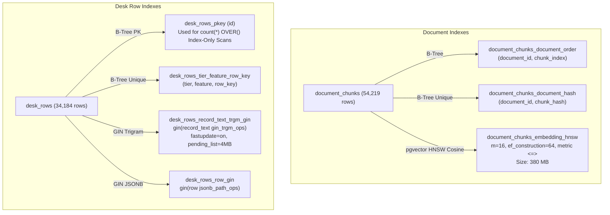

# Database Architecture: Schema, Tables, Indexes, and RLS Security Matrix

> **Status: Living.** Documented on 2026-09-22.
> Reflects the verified PostgreSQL schema on Supabase project `NTER` (`vfgcppstyzjarlzyqdac`, region `ap-south-1`), incorporating migrations 0001 through 0015, `20260921115831`, `20260922073820`, `20260922073933`, `20260922082308`, `20260922084135`, `20260922104646`, and `20260922121946`.

---

## 1. System-Wide Entity-Relationship (ER) Diagram

The database strictly separates **global public knowledge** (documents, chunks, desk rows, model catalogue) from **private, user-scoped interactions** (conversations, messages, research turns, token spend).

```mermaid
erDiagram
    auth_users ||--o{ user_profiles : "has profile (1:1)"
    auth_users ||--o{ conversations : "owns (1:N)"
    auth_users ||--o{ model_call_logs : "incurs spend (1:N)"
    
    conversations ||--o{ chat_messages : "contains (1:N, cascade)"
    conversations ||--o{ research_turns : "tracks in-flight state (1:N)"
    
    documents ||--o{ document_chunks : "partitioned into (1:N, cascade)"
    
    ai_models ||--o{ ai_roles : "assigned to role (1:N)"
    model_pricing ||--o{ ai_models : "validates tool support & clamps efforts"

    auth_users {
        uuid id PK
        string email
        timestamptz created_at
    }

    user_profiles {
        uuid id PK
        uuid user_id FK "REFERENCES auth.users(id)"
        text email
        text full_name
        text role "user | admin"
        text plan "explorer | pro | enterprise"
        text status "active | suspended"
        text active_persona "lawyer | analyst | journalist | etc"
        boolean is_admin
        timestamptz updated_at
    }

    conversations {
        uuid id PK
        uuid user_id FK "REFERENCES auth.users(id)"
        text title
        text persona "analyst | lawyer | journalist | student | policy"
        text focus "attached | desk | broad"
        text model_id
        text reasoning_effort "off | minimal | low | medium | high | xhigh | max"
        timestamptz created_at
        timestamptz updated_at
    }

    chat_messages {
        uuid id PK
        uuid conversation_id FK "REFERENCES conversations(id)"
        uuid user_id FK "REFERENCES auth.users(id)"
        text role "user | assistant | system"
        text content
        jsonb sources "Array of citable source objects"
        jsonb follow_ups "Array of suggested follow-up questions"
        text status "in_progress | complete | error"
        jsonb metadata
        timestamptz created_at
    }

    research_turns {
        uuid user_id PK "PK (user_id, turn_key); REFERENCES auth.users(id)"
        text turn_key PK "1-64 chars"
        text request_hash "64-char hex digest"
        uuid conversation_id FK "(conversation_id, user_id) REFERENCES conversations(id, user_id), SET NULL"
        uuid user_message_id FK "UNIQUE, REFERENCES chat_messages(id)"
        uuid assistant_message_id FK "UNIQUE, REFERENCES chat_messages(id)"
        uuid execution_token
        timestamptz created_at
    }

    documents {
        uuid id PK
        text document_key UK "e.g. bill:2006:16"
        text title
        text file_url
        text content_sha256
        text ocr_text
        int chunker_version
        int page_count
        jsonb metadata
        timestamptz indexed_at
        timestamptz created_at
    }

    document_chunks {
        uuid id PK
        uuid document_id FK "REFERENCES documents(id)"
        int chunk_index
        text chunk_hash "SHA-256 content hash"
        text unit_key "document id or page id"
        text source_kind "document | pdf_page"
        int char_from "Absolute character start offset"
        int char_to "Absolute character end offset"
        int page_number
        text content "Normalised text chunk"
        int token_estimate
        jsonb metadata
        vector_1536 embedding "openai/text-embedding-3-small"
    }

    desk_rows {
        uuid id PK
        text tier "national | state | law | economics | etc"
        text feature "Sansad (Bills) | Cabinet Decisions | etc"
        text row_key "tier:feature:pinKey"
        text document_key "bill:2006:16"
        jsonb row "Full structured row fields"
        text record_text "Sanitized text representation"
        timestamptz snapshot_at
        timestamptz loaded_at
    }

    ai_models {
        uuid id PK
        text model_id UK "OpenRouter ID e.g. google/gemini-3.7-flash"
        text label
        text vendor "google | anthropic | openai | deepseek"
        int context_length
        boolean enabled
        boolean is_default
        text_array efforts "Allowed reasoning efforts"
        jsonb params
        timestamptz created_at
    }

    model_pricing {
        text model_id PK "OpenRouter ID"
        int context_length
        int max_completion_tokens
        numeric prompt_usd
        numeric completion_usd
        numeric cache_read_usd
        numeric cache_write_usd
        numeric internal_reasoning_usd
        text_array supported_parameters
        text_array reasoning_efforts "cheapest first"
        text reasoning_default
        boolean reasoning_required
        boolean is_available
        timestamptz fetched_at
    }

    ai_roles {
        text role_id PK "analyst | expert | pdf | visual"
        text model_id FK "REFERENCES ai_models(model_id)"
        text notes
    }

    model_call_logs {
        uuid id PK
        uuid user_id FK "REFERENCES auth.users(id)"
        uuid conversation_id FK
        uuid message_id FK
        text call_type "chat_research | chat_answer | embedding | repair"
        text model_id
        int prompt_tokens
        int completion_tokens
        int cached_prompt_tokens
        int reasoning_tokens
        numeric cost_usd
        int latency_ms
        text status "success | error | abort"
        text error
        timestamptz created_at
    }
```



---

## 2. Table Specifications & Data Dictionary

### Group A: National Desk Document Corpus

#### 1. `public.documents`
Stores long-form official documents (bills, acts, gazettes, committee reports).
- **`id`** (`uuid`, Primary Key, `DEFAULT gen_random_uuid()`): Stable internal identifier.
- **`document_key`** (`text`, Unique Index): Canonical identifier (e.g. `bill:2006:16`). Used by desk rows and search tools to join structured records to document text.
- **`title`** (`text`, `NOT NULL`): Full official document title.
- **`file_url`** (`text`): Direct URL to official PDF source (e.g. `egazette.gov.in` or `sansad.in`).
- **`content_sha256`** (`text`, `NOT NULL`): SHA-256 hash over full `ocr_text` to verify package integrity.
- **`ocr_text`** (`text`, `NOT NULL`): Full unsegmented OCR text layer.
- **`chunker_version`** (`int`): Tracks which chunker iteration sliced this document. Incrementing forces re-chunking.
- **`metadata`** (`jsonb`, `DEFAULT '{}'`): Carries source package attributes: `{ dataset_key, n_pages, prid, posted_on, profile_ref }`.
- **`page_count`** (`int`): Nullable; reserved for coming page-wise Markdown extraction.
- **`indexed_at`** (`timestamptz`): Null when in-flight; stamped with `now()` only when all chunk slices are committed.
- **`created_at`** (`timestamptz`, `DEFAULT now()`).

#### 2. `public.document_chunks`
Stores discrete, embeddable passages with absolute offsets for the citation reader.
- **`id`** (`uuid`, Primary Key, `DEFAULT gen_random_uuid()`): Random identifier (ADR 0004).
- **`document_id`** (`uuid`, `NOT NULL`, `REFERENCES documents(id) ON DELETE CASCADE`): Owning document.
- **`chunk_index`** (`int`, `NOT NULL`): 0-indexed sequential position in the document.
- **`chunk_hash`** (`text`, `NOT NULL`): SHA-256 over `chunker_version ‖ unit_key ‖ normalise(content)`.
- **`unit_key`** (`text`, `NOT NULL`): Document ID or future page ID.
- **`source_kind`** (`text`, `NOT NULL`): `document` today; `pdf_page` when page-level OCR arrives.
- **`char_from`** (`int`, `NOT NULL`): 0-indexed character start offset into `documents.ocr_text`.
- **`char_to`** (`int`, `NOT NULL`): Character end offset. Satisfies `char_to - char_from = length(content)`.
- **`page_number`** (`int`): Nullable.
- **`content`** (`text`, `NOT NULL`): Raw chunk text (headings, markdown pipe tables, or HTML table markup).
- **`token_estimate`** (`int`, `NOT NULL`): Heuristic token weight.
- **`embedding`** (`vector(1536)`): 1536-dimensional float vector produced by `openai/text-embedding-3-small` via OpenRouter.
- **Constraints:** `UNIQUE(document_id, chunk_hash)`.

---

### Group B: Structured Intelligence Desks

#### 3. `public.desk_rows`
Stores real-time intelligence feeds across 34 modules (e.g. Sansad Bills, Cabinet Decisions, Tribunals).
- **`id`** (`uuid`, Primary Key, `DEFAULT gen_random_uuid()`).
- **`tier`** (`text`, `NOT NULL`): Navigation category: `national`, `state`, `law`, `economics`, `carbon`, `sports`, `entertainment`.
- **`feature`** (`text`, `NOT NULL`): Module name: `Sansad (Bills)`, `Cabinet Decisions`, `Supreme Court Order & Judgment Feed`, etc.
- **`row_key`** (`text`, `NOT NULL`): Deterministic pin-hash: `${tier}:${feature}:${rowPinKey}`.
- **`document_key`** (`text`): Links to `documents.document_key` when the row represents an indexed bill or act.
- **`row`** (`jsonb`, `NOT NULL`): Complete tabular data payload.
- **`record_text`** (`text`, `NOT NULL`): Clean, sanitized string representation used for text search and LLM context. Stripped of internal primary keys (`id`, `record_id`, `row_key`, UUIDs) under R1 grounding rules.
- **`snapshot_at`** (`timestamptz`, `NOT NULL`): Timestamp of the source feed snapshot.
- **`loaded_at`** (`timestamptz`, `DEFAULT now()`).
- **Constraints:** `UNIQUE(tier, feature, row_key)`.

---

### Group C: Conversations & Streaming Research State

#### 4. `public.conversations`
Chat sessions. Owned by authenticated users.
- **`id`** (`uuid`, Primary Key, `DEFAULT gen_random_uuid()`).
- **`user_id`** (`uuid`, `NOT NULL`, `REFERENCES auth.users(id)`).
- **`title`** (`text`, `DEFAULT 'New Research'`): User-editable conversation title.
- **`persona`** (`text`, `DEFAULT 'analyst'`): Analytical lens: `lawyer`, `analyst`, `journalist`, `student`, `policy`.
- **`focus`** (`text`, `DEFAULT 'broad'`): Retrieval constraint: `attached`, `desk`, `broad`.
- **`model_id`** (`text`, `DEFAULT 'google/gemini-3.7-flash'`).
- **`reasoning_effort`** (`text`, `DEFAULT 'low'`): Selected reasoning budget (`off` through `max`).
- **`created_at`** (`timestamptz`, `DEFAULT now()`).
- **`updated_at`** (`timestamptz`, `DEFAULT now()`).

#### 5. `public.chat_messages`
Individual turns within a conversation.
- **`id`** (`uuid`, Primary Key, `DEFAULT gen_random_uuid()`).
- **`conversation_id`** (`uuid`, `NOT NULL`, `REFERENCES conversations(id) ON DELETE CASCADE`).
- **`user_id`** (`uuid`, `NOT NULL`, `REFERENCES auth.users(id)`).
- **`role`** (`text`, `NOT NULL`): `user`, `assistant`, or `system`.
- **`content`** (`text`, `NOT NULL`): Message markdown body.
- **`sources`** (`jsonb`, `DEFAULT '[]'`): Array of verified citable objects: `[{ handle, kind, title, document_id, char_from, char_to, text_hash }]`.
- **`follow_ups`** (`jsonb`, `DEFAULT '[]'`): Array of up to three context-aware follow-up question strings.
- **`status`** (`text`, `DEFAULT 'complete'`): `in_progress`, `complete`, `error`.
- **`metadata`** (`jsonb`, `DEFAULT '{}'`): Stores search stats (`search_ms`, `scoped`, `model_calls`).
- **`created_at`** (`timestamptz`, `DEFAULT now()`).

#### 6. `public.research_turns`
Durable, server-owned turn claims (migration `20260921115831`). Prevents duplicate submissions of the same turn key. The table has no state or heartbeat columns: whether a turn is still running is read from the linked assistant row in `chat_messages` (`status`, `execution_expires_at`). *(Corrected 2026-09-24 against `20260921115831_research_turn_persistence.sql`; an earlier version described `state`, `claim_token`, `message_id`, `claimed_at`, `completed_at` and `heartbeat_at` columns that do not exist.)*
- **Primary Key:** `(user_id, turn_key)`.
- **`user_id`** (`uuid`, `NOT NULL`, `REFERENCES auth.users(id) ON DELETE CASCADE`).
- **`turn_key`** (`text`, `NOT NULL`): 1–64 characters, not blank.
- **`request_hash`** (`text`, `NOT NULL`): 64-character lowercase hex digest of the request.
- **`conversation_id`** (`uuid`, nullable): `FOREIGN KEY (conversation_id, user_id) REFERENCES conversations(id, user_id) ON DELETE SET NULL (conversation_id)`.
- **`user_message_id`** (`uuid`, `UNIQUE`, `REFERENCES chat_messages(id) ON DELETE SET NULL`).
- **`assistant_message_id`** (`uuid`, `UNIQUE`, `REFERENCES chat_messages(id) ON DELETE SET NULL`).
- **`execution_token`** (`uuid`, nullable): Token of the executing claim; immutable once set (enforced by the `guard_research_turn` trigger).
- **`created_at`** (`timestamptz`, `NOT NULL`, `DEFAULT clock_timestamp()`).
- **Access:** RLS enabled; all privileges revoked from `PUBLIC`, `anon` and `authenticated`; only `service_role` holds `SELECT, INSERT, UPDATE`.

---

### Group D: Model Catalogue, Pricing & Spend Telemetry

#### 7. `public.ai_models`
Server-side allowlist of LLMs accessible through the platform.
- **`id`** (`uuid`, Primary Key, `DEFAULT gen_random_uuid()`).
- **`model_id`** (`text`, `NOT NULL`, Unique): OpenRouter identifier (e.g. `anthropic/claude-sonnet-5`).
- **`label`** (`text`, `NOT NULL`): UI display label (e.g. `Claude Sonnet 3.5`).
- **`vendor`** (`text`, `NOT NULL`): `google`, `anthropic`, `openai`, `deepseek`.
- **`context_length`** (`int`, `NOT NULL`): Maximum context tokens.
- **`enabled`** (`boolean`, `DEFAULT true`): Admin toggle.
- **`is_default`** (`boolean`, `DEFAULT false`): Exactly one model is marked default.
- **`efforts`** (`text[]`, `DEFAULT '{}'`): Allowed reasoning rungs. Clamped to `model_pricing.reasoning_efforts`.
- **`params`** (`jsonb`, `DEFAULT '{}'`).

#### 8. `public.model_pricing`
Live mirror of OpenRouter's model catalogue, synchronized every 12 hours.
- **`model_id`** (`text`, Primary Key): OpenRouter model ID.
- **`context_length`** (`int`).
- **`max_completion_tokens`** (`int`).
- **`prompt_usd`** (`numeric(14,8)`): Cost per token in USD.
- **`completion_usd`** (`numeric(14,8)`): Cost per token in USD.
- **`cache_read_usd`** / **`cache_write_usd`** (`numeric(14,8)`): Prompt caching prices.
- **`internal_reasoning_usd`** (`numeric(14,8)`): Cost per reasoning token.
- **`supported_parameters`** (`text[]`): Validated for `tools` parameter support.
- **`reasoning_efforts`** (`text[]`, `DEFAULT '{}'`): OpenRouter's published ladder, cheapest-first (e.g. `['low', 'medium', 'high', 'xhigh', 'max']`).
- **`reasoning_default`** (`text`): Default effort level.
- **`reasoning_required`** (`boolean`, `DEFAULT false`): If `true`, reasoning cannot be turned `off`.
- **`is_available`** (`boolean`, `DEFAULT true`).
- **`fetched_at`** (`timestamptz`).

#### 9. `public.model_call_logs`
Financial and performance audit trail for every outbound model invocation.
- **`id`** (`uuid`, Primary Key, `DEFAULT gen_random_uuid()`).
- **`user_id`** (`uuid`, `REFERENCES auth.users(id)`).
- **`conversation_id`** / **`message_id`** (`uuid`).
- **`call_type`** (`text`, `NOT NULL`): `chat_research`, `chat_answer`, `embedding`, `repair`.
- **`model_id`** (`text`, `NOT NULL`).
- **`prompt_tokens`** / **`completion_tokens`** / **`cached_prompt_tokens`** / **`reasoning_tokens`** (`int`).
- **`cost_usd`** (`numeric(12,8)`, `NOT NULL`): Exact spend reported by provider.
- **`latency_ms`** (`int`, `NOT NULL`): Round-trip wall clock time.
- **`status`** (`text`, `NOT NULL`): `success`, `error`, `abort`.
- **`created_at`** (`timestamptz`, `DEFAULT now()`).

---

## 3. Indexing Topology & Performance Engineering



### 3.1 Vector Index: HNSW Cosine (`document_chunks_embedding_hnsw`)
```sql
CREATE INDEX document_chunks_embedding_hnsw ON public.document_chunks 
USING hnsw (embedding vector_cosine_ops) 
WITH (m = 16, ef_construction = 64);
```
- **Operational Footprint:** 380 MB index for 54,219 chunks.
- **Memory Pressure:** On Supabase Nano tier (`shared_buffers = 224 MB`), the vector index exceeds available memory.
- **Mitigation:** Unscoped searches query the HNSW graph directly. Scoped searches (attaching a document) completely **bypass HNSW**, using B-tree pre-filtering over `document_chunks_document_order` and scoring exact cosine distance in memory (<20 ms).

### 3.2 Full-Text Search: Trigram GIN (`desk_rows_record_text_trgm_gin`)
```sql
CREATE INDEX desk_rows_record_text_trgm_gin ON public.desk_rows 
USING gin (record_text gin_trgm_ops) 
WITH (fastupdate = on, gin_pending_list_limit = 4096);
```
- **Impact:** Replaced sequential table scans over 34,184 rows. Dropped search query latencies from **6,197 ms down to 18 ms**.
- **Buffer Optimization:** Uses `fastupdate = on` with a 4 MB pending list to ensure bulk feed inserts do not block concurrent research queries.

### 3.3 Index-Only Window Aggregations
The RPC `search_desk_rows` returns both a paginated row set and the `total` matching count. Running `count(*) OVER()` across a wide table spills 46 MB into PostgreSQL temporary files.
- **Solution:** The window aggregation is computed over the primary key alone (`id`), enabling an **Index-Only Scan on `desk_rows_pkey`**. Wide JSONB columns are fetched by key only for the $\le 50$ returned rows.

---

## 4. Row-Level Security (RLS) Policy Matrix

Row-Level Security is strictly enabled across all 18 public tables: 12 created in `supabase/migrations/` and 6 (`organisations`, `organisation_members`, `user_roles`, `organisation_invites`, `privacy_policy_consents`, `user_profiles`) created in `backend/sql/auth_schema.sql`. The `anon` role holds zero table privileges. The matrix below covers the AI-backend tables and `user_profiles`; the five organisation and consent tables are governed by the policies in `auth_schema.sql`. *(Corrected 2026-09-24: the count was 17, which predates `research_turns`, and the matrix omitted `chat_cancellations`, `chat_turn_traces` and `ai_roles`.)*

| Table Name | Public Read (`anon`) | Authenticated Read (`user`) | Authenticated Write (`user`) | Service Role (`service_role`) |
| :--- | :---: | :---: | :---: | :---: |
| **`documents`** | ❌ Denied | ✅ Full Read (`true`) | ❌ Denied | ✅ Full Access |
| **`document_chunks`** | ❌ Denied | ✅ Full Read (`true`) | ❌ Denied | ✅ Full Access |
| **`desk_rows`** | ❌ Denied | ✅ Full Read (`true`) | ❌ Denied | ✅ Full Access |
| **`conversations`** | ❌ Denied | 🔒 Own Rows (`user_id = auth.uid()`) | 🔒 Own Rows (`user_id = auth.uid()`) | ✅ Full Access |
| **`chat_messages`** | ❌ Denied | 🔒 Own Rows (`user_id = auth.uid()`) | 🔒 Own Rows (`user_id = auth.uid()`) | ✅ Full Access |
| **`chat_cancellations`** | ❌ Denied | 🔒 Own Rows in own conversations | 🔒 Own Rows in own conversations | ✅ Full Access |
| **`research_turns`** | ❌ Denied | ❌ Denied (no grant; corrected 2026-09-24) | ❌ Denied (server only) | 🔒 `SELECT, INSERT, UPDATE` |
| **`ai_models`** | ❌ Denied | ✅ Enabled Models (`enabled = true`) | ❌ Denied (Admin RPC only) | ✅ Full Access |
| **`ai_roles`** | ❌ Denied | ✅ Full Read (`true`) | ❌ Denied | ✅ Full Access |
| **`model_pricing`** | ❌ Denied | ✅ Available Models (`is_available`) | ❌ Denied (Cron sync only) | ✅ Full Access |
| **`model_call_logs`** | ❌ Denied | 🔒 Own Rows (`user_id = auth.uid()`) | ❌ Denied (Service role logs) | ✅ Full Access |
| **`chat_turn_traces`** | ❌ Denied | 🔒 Own Rows (`user_id = auth.uid()`) | ❌ Denied | ✅ Full Access |
| **`user_profiles`** | ❌ Denied | 🔒 Own Profile (`user_id = auth.uid()`) | 🔒 Restricted Profile Fields | ✅ Full Access |

---

## 5. Security & Isolation Invariants

1. **Global Corpus Boundary (ADR 0003):** Document and desk datasets have no tenancy columns (`user_id` or `organisation_id`). Every signed-in user reads the same verified public records, eliminating cross-tenant leakage risks.
2. **Server-Side Assistant Writes (Migration 0013):** Ordinary user clients are granted `INSERT` on `chat_messages` **only for `role = 'user'`**. Assistant messages carrying citable evidence (`sources`) can only be inserted by the server via `service_role` or security-definer RPCs, preventing users from forging authoritative-looking citations.
3. **Turn-Locking Atomicity (Migration `20260921115831`):** `claim_research_turn` uses atomic row-level locks (`SELECT ... FOR UPDATE`) to ensure that rapid double-clicks or multiple tabs cannot initiate duplicate billable AI streams for the same research turn.
4. **Search Path Hardening (Migration `20260922000002`):** This migration sets `search_path = ''` on one function only, the trigger function `update_updated_at_column()`, which its header describes as the last function in the schema with a mutable search_path. Other functions set their search_path where they are defined, or in migration 0012 for the `auth_schema.sql` helpers. *(Corrected 2026-09-24: this entry previously said the migration hardened all security definer functions.)*
