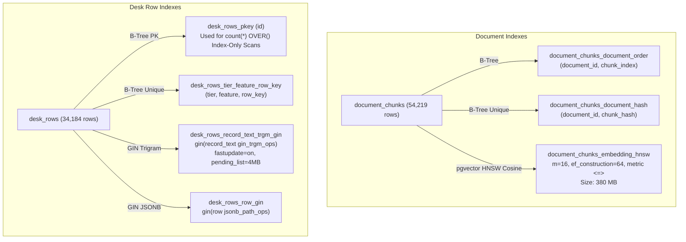

# Database Architecture: Schema, Tables, Indexes, and RLS Security Matrix

> **Status: Living.** Documented on 2026-09-22.
> Reflects the verified PostgreSQL schema on Supabase project `NTER` (`vfgcppstyzjarlzyqdac`, region `ap-south-1`), incorporating all 32 migrations in `supabase/migrations/` (`20260921000001` through `20260929100000_plan_entitlements`), plus `backend/sql/auth_schema.sql`.
> Corrected 2026-09-28: the seven tables added that day (Group E), the RLS matrix for them, and the `user_profiles`, `conversations`, `chat_messages`, `ai_models`, `ai_roles` and `model_call_logs` entries, which described columns that do not exist.
> Corrected 2026-09-29: migration `20260929100000_plan_entitlements` added the `user_profiles` plan columns and the `plan_grants` table (#17).

---

## 1. System-Wide Entity-Relationship (ER) Diagram

The database strictly separates **global public knowledge** (documents, chunks, desk rows, model catalogue) from **private, user-scoped interactions** (conversations, messages, research turns, token spend).

```mermaid
erDiagram
    auth_users ||--o{ user_profiles : "has profile (1:1)"
    auth_users ||--o{ conversations : "owns (1:N)"
    auth_users ||--o{ model_call_logs : "incurs spend (1:N)"
    auth_users ||--o{ plan_grants : "plan grant log (1:N, cascade)"
    
    conversations ||--o{ chat_messages : "contains (1:N, cascade)"
    conversations ||--o{ research_turns : "tracks in-flight state (1:N)"
    
    documents ||--o{ document_chunks : "partitioned into (1:N, cascade)"
    
    ai_models ||--o{ ai_roles : "assigned to role (1:N)"
    model_pricing ||--o{ ai_models : "validates tool support & clamps efforts"

    auth_users {
        uuid id PK
        string email
        timestamptz created_at
    }

    user_profiles {
        uuid id PK
        uuid user_id FK "UNIQUE, REFERENCES auth.users(id)"
        uuid organisation_id FK "NULL for normal users"
        text email
        text first_name
        text last_name
        app_persona persona "policy_analyst | journalist | upsc_aspirant | corporate_affairs | legal_researcher | academic"
        text language "default en"
        app_role role "user | admin | owner"
        app_plan plan "explorer | professional | enterprise"
        text plan_status "free | trial | active; default free"
        timestamptz plan_period_end "NULL is open-ended"
        text plan_source "trial | payment | manual"
        timestamptz trial_started_at "set once; one trial per account"
        account_status status "active | inactive | suspended"
        boolean onboarding_complete
        timestamptz updated_at
    }

    plan_grants {
        bigint id PK "identity"
        uuid user_id FK "REFERENCES auth.users(id), cascade"
        app_plan plan
        text status "free | trial | active"
        timestamptz period_end
        text source "trial | payment | manual"
        text payment_id UK "1-100 chars; a payment is granted once"
        uuid granted_by FK "REFERENCES auth.users(id), SET NULL"
        timestamptz created_at
    }

    conversations {
        uuid id PK
        uuid user_id FK "REFERENCES auth.users(id)"
        text title
        text desk_tier
        text desk_feature
        text model_id
        timestamptz last_message_at
        timestamptz created_at
        timestamptz updated_at
    }

    chat_messages {
        uuid id PK
        uuid conversation_id FK "REFERENCES conversations(id)"
        uuid user_id FK "REFERENCES auth.users(id)"
        text role "user | assistant"
        text content
        jsonb sources "Array of citable source objects"
        jsonb follow_ups "Array of suggested follow-up questions"
        jsonb activity "Persisted ticker trace"
        text model_requested
        text model_served
        text reasoning_effort
        text status "running | complete | error | cancelled | truncated | interrupted"
        text turn_key
        jsonb usage
        jsonb timing
        timestamptz execution_expires_at
        timestamptz created_at
    }

    research_turns {
        uuid user_id PK "PK (user_id, turn_key); REFERENCES auth.users(id)"
        text turn_key PK "1-64 chars"
        text request_hash "64-char hex digest"
        uuid conversation_id FK "(conversation_id, user_id) REFERENCES conversations(id, user_id), SET NULL"
        uuid user_message_id FK "UNIQUE, REFERENCES chat_messages(id)"
        uuid assistant_message_id FK "UNIQUE, REFERENCES chat_messages(id)"
        uuid execution_token
        timestamptz created_at
    }

    documents {
        uuid id PK
        text document_key UK "e.g. bill:2006:16"
        text title
        text file_url
        text content_sha256
        text ocr_text
        int chunker_version
        int page_count
        jsonb metadata
        timestamptz indexed_at
        timestamptz created_at
    }

    document_chunks {
        uuid id PK
        uuid document_id FK "REFERENCES documents(id)"
        int chunk_index
        text chunk_hash "SHA-256 content hash"
        text unit_key "document id or page id"
        text source_kind "document | pdf_page"
        int char_from "Absolute character start offset"
        int char_to "Absolute character end offset"
        int page_number
        text content "Normalised text chunk"
        int token_estimate
        jsonb metadata
        vector_1536 embedding "openai/text-embedding-3-small"
    }

    desk_rows {
        uuid id PK
        text tier "national | state | law | economics | etc"
        text feature "Sansad (Bills) | Cabinet Decisions | etc"
        text row_key "tier:feature:pinKey"
        text document_key "bill:2006:16"
        jsonb row "Full structured row fields"
        text record_text "Sanitized text representation"
        timestamptz snapshot_at
        timestamptz loaded_at
    }

    ai_models {
        text model_id PK "OpenRouter ID e.g. google/gemini-3.8-flash"
        text label
        text vendor "derived from the id prefix when blank"
        smallint tier "1-3 cost hint"
        text_array efforts "Allowed reasoning efforts"
        jsonb params
        boolean enabled
        boolean is_default "at most one row"
        int sort_order
        timestamptz updated_at
    }

    model_pricing {
        text model_id PK "OpenRouter ID"
        int context_length
        int max_completion_tokens
        numeric prompt_usd
        numeric completion_usd
        numeric cache_read_usd
        numeric cache_write_usd
        numeric internal_reasoning_usd
        text_array supported_parameters
        text_array reasoning_efforts "cheapest first"
        text reasoning_default
        boolean reasoning_required
        boolean is_available
        timestamptz fetched_at
    }

    ai_roles {
        text role_id PK "DEFAULT_ANALYST | EXPERT_ESCALATION | PDF_PARSER | VISUAL_RESEARCH"
        text label
        text hint
        text model_id FK "REFERENCES ai_models(model_id)"
        int sort_order
    }

    model_call_logs {
        uuid id PK
        uuid user_id FK "REFERENCES auth.users(id)"
        uuid conversation_id FK
        uuid message_id
        text caller "research-chat | ingest-documents | desk-brief"
        text purpose "chat_answer | embedding | citation_repair | desk_brief"
        text model_requested
        text model_served
        text provider
        int prompt_tokens
        int completion_tokens
        int cached_prompt_tokens
        int reasoning_tokens
        numeric cost_usd
        int latency_ms
        text status "success | error | aborted"
        text error_message
        timestamptz created_at
    }
```



---

## 2. Table Specifications & Data Dictionary

### Group A: National Desk Document Corpus

#### 1. `public.documents`
Stores long-form official documents (bills, acts, gazettes, committee reports).
- **`id`** (`uuid`, Primary Key, `DEFAULT gen_random_uuid()`): Stable internal identifier.
- **`document_key`** (`text`, Unique Index): Canonical identifier (e.g. `bill:2006:16`). Used by desk rows and search tools to join structured records to document text.
- **`title`** (`text`, `NOT NULL`): Full official document title.
- **`file_url`** (`text`): Direct URL to official PDF source (e.g. `egazette.gov.in` or `sansad.in`).
- **`content_sha256`** (`text`, `NOT NULL`): SHA-256 hash over full `ocr_text` to verify package integrity.
- **`ocr_text`** (`text`, `NOT NULL`): Full unsegmented OCR text layer.
- **`chunker_version`** (`int`): Tracks which chunker iteration sliced this document. Incrementing forces re-chunking.
- **`metadata`** (`jsonb`, `DEFAULT '{}'`): Carries source package attributes: `{ dataset_key, n_pages, prid, posted_on, profile_ref }`.
- **`page_count`** (`int`): Nullable; reserved for coming page-wise Markdown extraction.
- **`indexed_at`** (`timestamptz`): Null when in-flight; stamped with `now()` only when all chunk slices are committed.
- **`created_at`** (`timestamptz`, `DEFAULT now()`).

#### 2. `public.document_chunks`
Stores discrete, embeddable passages with absolute offsets for the citation reader.
- **`id`** (`uuid`, Primary Key, `DEFAULT gen_random_uuid()`): Random identifier (ADR 0004).
- **`document_id`** (`uuid`, `NOT NULL`, `REFERENCES documents(id) ON DELETE CASCADE`): Owning document.
- **`chunk_index`** (`int`, `NOT NULL`): 0-indexed sequential position in the document.
- **`chunk_hash`** (`text`, `NOT NULL`): SHA-256 over `chunker_version ‖ unit_key ‖ normalise(content)`.
- **`unit_key`** (`text`, `NOT NULL`): Document ID or future page ID.
- **`source_kind`** (`text`, `NOT NULL`): `document` today; `pdf_page` when page-level OCR arrives.
- **`char_from`** (`int`, `NOT NULL`): 0-indexed character start offset into `documents.ocr_text`.
- **`char_to`** (`int`, `NOT NULL`): Character end offset. Satisfies `char_to - char_from = length(content)`.
- **`page_number`** (`int`): Nullable.
- **`content`** (`text`, `NOT NULL`): Raw chunk text (headings, markdown pipe tables, or HTML table markup).
- **`token_estimate`** (`int`, `NOT NULL`): Heuristic token weight.
- **`embedding`** (`vector(1536)`): 1536-dimensional float vector produced by `openai/text-embedding-3-small` via OpenRouter.
- **Constraints:** `UNIQUE(document_id, chunk_hash)`.

---

### Group B: Structured Intelligence Desks

#### 3. `public.desk_rows`
Stores real-time intelligence feeds across 34 modules (e.g. Sansad Bills, Cabinet Decisions, Tribunals).
- **`id`** (`uuid`, Primary Key, `DEFAULT gen_random_uuid()`).
- **`tier`** (`text`, `NOT NULL`): Navigation category: `national`, `state`, `law`, `economics`, `carbon`, `sports`, `entertainment`.
- **`feature`** (`text`, `NOT NULL`): Module name: `Sansad (Bills)`, `Cabinet Decisions`, `Supreme Court Order & Judgment Feed`, etc.
- **`row_key`** (`text`, `NOT NULL`): Deterministic pin-hash: `${tier}:${feature}:${rowPinKey}`.
- **`document_key`** (`text`): Links to `documents.document_key` when the row represents an indexed bill or act.
- **`row`** (`jsonb`, `NOT NULL`): Complete tabular data payload.
- **`record_text`** (`text`, `NOT NULL`): Clean, sanitized string representation used for text search and LLM context. Stripped of internal primary keys (`id`, `record_id`, `row_key`, UUIDs) under R1 grounding rules.
- **`snapshot_at`** (`timestamptz`, `NOT NULL`): Timestamp of the source feed snapshot.
- **`loaded_at`** (`timestamptz`, `DEFAULT now()`).
- **Constraints:** `UNIQUE(tier, feature, row_key)`.

---

### Group C: Conversations & Streaming Research State

#### 4. `public.conversations`
Chat sessions. Owned by authenticated users.
- **`id`** (`uuid`, Primary Key, `DEFAULT gen_random_uuid()`).
- **`user_id`** (`uuid`, `NOT NULL`, `REFERENCES auth.users(id)`).
- **`user_id`** defaults to `auth.uid()` and cascades on user deletion; `UNIQUE (id, user_id)` (migration 0013) lets child tables prove ownership.
- **`title`** (`text`, `NOT NULL`, `DEFAULT 'New research'`): User-editable conversation title.
- **`desk_tier`** / **`desk_feature`** (`text`, nullable): The desk the conversation was opened from.
- **`model_id`** (`text`, nullable, no default).
- **`last_message_at`** (`timestamptz`): Set by `claim_research_turn`; indexed with `user_id` for the recent-conversations list.
- **`created_at`** / **`updated_at`** (`timestamptz`, `NOT NULL`, `DEFAULT now()`).
- *(Corrected 2026-09-28 against `20260921000002_conversations.sql` and later migrations: there are no `persona`, `focus` or `reasoning_effort` columns. The persona comes from `user_profiles.persona`; focus and effort travel with each request, and the effort used is stored on the assistant `chat_messages` row.)*

#### 5. `public.chat_messages`
Individual turns within a conversation.
- **`id`** (`uuid`, Primary Key, `DEFAULT gen_random_uuid()`).
- **`conversation_id`** (`uuid`, `NOT NULL`, `REFERENCES conversations(id) ON DELETE CASCADE`).
- **`user_id`** (`uuid`, `NOT NULL`, `DEFAULT auth.uid()`); `(conversation_id, user_id)` references `conversations(id, user_id)` (migration 0013).
- **`role`** (`text`, `NOT NULL`): `user` or `assistant`.
- **`content`** (`text`, `NOT NULL`): Message markdown body.
- **`sources`** (`jsonb`, `DEFAULT '[]'`): Array of verified citable objects: `[{ handle, kind, title, document_id, char_from, char_to, text_hash }]`.
- **`follow_ups`** (`jsonb`, `DEFAULT '[]'`): Array of up to three context-aware follow-up question strings.
- **`activity`** (`jsonb`, `DEFAULT '[]'`): The persisted activity ticker trace.
- **`model_requested`** / **`model_served`** / **`reasoning_effort`** (`text`).
- **`status`** (`text`, `DEFAULT 'complete'`): `running`, `complete`, `error`, `cancelled`, `truncated` or `interrupted` (migration `20260921115831`).
- **`error_message`** (`text`).
- **`turn_key`** (`text`): Idempotency key on user turns; `UNIQUE (conversation_id, turn_key)`.
- **`usage`** (`jsonb`): Tokens and `cost_usd`. **`timing`** (`jsonb`): `search_ms`, `reasoning_ms`, `writing_ms`, `total_ms`.
- **`execution_expires_at`** (`timestamptz`): Required while `status = 'running'`.
- **`created_at`** (`timestamptz`, `DEFAULT now()`).

#### 6. `public.research_turns`
Durable, server-owned turn claims (migration `20260921115831`). Prevents duplicate submissions of the same turn key. The table has no state or heartbeat columns: whether a turn is still running is read from the linked assistant row in `chat_messages` (`status`, `execution_expires_at`). *(Corrected 2026-09-24 against `20260921115831_research_turn_persistence.sql`; an earlier version described `state`, `claim_token`, `message_id`, `claimed_at`, `completed_at` and `heartbeat_at` columns that do not exist.)*
- **Primary Key:** `(user_id, turn_key)`.
- **`user_id`** (`uuid`, `NOT NULL`, `REFERENCES auth.users(id) ON DELETE CASCADE`).
- **`turn_key`** (`text`, `NOT NULL`): 1–64 characters, not blank.
- **`request_hash`** (`text`, `NOT NULL`): 64-character lowercase hex digest of the request.
- **`conversation_id`** (`uuid`, nullable): `FOREIGN KEY (conversation_id, user_id) REFERENCES conversations(id, user_id) ON DELETE SET NULL (conversation_id)`.
- **`user_message_id`** (`uuid`, `UNIQUE`, `REFERENCES chat_messages(id) ON DELETE SET NULL`).
- **`assistant_message_id`** (`uuid`, `UNIQUE`, `REFERENCES chat_messages(id) ON DELETE SET NULL`).
- **`execution_token`** (`uuid`, nullable): Token of the executing claim; immutable once set (enforced by the `guard_research_turn` trigger).
- **`created_at`** (`timestamptz`, `NOT NULL`, `DEFAULT clock_timestamp()`).
- **Access:** RLS enabled; all privileges revoked from `PUBLIC`, `anon` and `authenticated`; only `service_role` holds `SELECT, INSERT, UPDATE`.

---

### Group D: Model Catalogue, Pricing & Spend Telemetry

#### 7. `public.ai_models`
Server-side allowlist of LLMs accessible through the platform.
- **`model_id`** (`text`, Primary Key): OpenRouter identifier (e.g. `anthropic/claude-sonnet-5`).
- **`label`** (`text`, `NOT NULL`): Picker label.
- **`vendor`** (`text`, `NOT NULL`, `DEFAULT ''`): Derived from the id prefix by the guard trigger when blank.
- **`tier`** (`smallint`, 1–3, `DEFAULT 2`): Cost hint.
- **`enabled`** (`boolean`, `DEFAULT false`): Admin toggle. A row may be enabled only when the refreshed catalogue lists it as available with tool calling.
- **`is_default`** (`boolean`, `DEFAULT false`): At most one row (partial unique index `ai_models_one_default`); a disabled row cannot be the default. On 2026-09-28 the default is `google/gemini-3.8-flash`.
- **`efforts`** (`text[]`, `DEFAULT '{}'`): Allowed reasoning rungs. Clamped to `model_pricing.reasoning_efforts`.
- **`params`** (`jsonb`, `DEFAULT '{}'`). **`sort_order`** (`int`, `DEFAULT 100`). **`updated_at`** (`timestamptz`).
- `public.ai_roles` maps each role (`DEFAULT_ANALYST`, `EXPERT_ESCALATION`, `PDF_PARSER`, `VISUAL_RESEARCH`) to one `model_id`, with a `label`, `hint` and `sort_order`.

#### 8. `public.model_pricing`
Live mirror of OpenRouter's model catalogue, synchronized every 12 hours.
- **`model_id`** (`text`, Primary Key): OpenRouter model ID.
- **`context_length`** (`int`).
- **`max_completion_tokens`** (`int`).
- **`prompt_usd`** (`numeric(14,8)`): Cost per token in USD.
- **`completion_usd`** (`numeric(14,8)`): Cost per token in USD.
- **`cache_read_usd`** / **`cache_write_usd`** (`numeric(14,8)`): Prompt caching prices.
- **`internal_reasoning_usd`** (`numeric(14,8)`): Cost per reasoning token.
- **`supported_parameters`** (`text[]`): Validated for `tools` parameter support.
- **`reasoning_efforts`** (`text[]`, `DEFAULT '{}'`): OpenRouter's published ladder, cheapest-first (e.g. `['low', 'medium', 'high', 'xhigh', 'max']`).
- **`reasoning_default`** (`text`): Default effort level.
- **`reasoning_required`** (`boolean`, `DEFAULT false`): If `true`, reasoning cannot be turned `off`.
- **`is_available`** (`boolean`, `DEFAULT true`).
- **`fetched_at`** (`timestamptz`).

#### 9. `public.model_call_logs`
Financial and performance audit trail for every outbound model invocation.
- **`id`** (`uuid`, Primary Key, `DEFAULT gen_random_uuid()`).
- **`user_id`** / **`conversation_id`** / **`message_id`** (`uuid`, nullable, no foreign keys).
- **`caller`** (`text`, `NOT NULL`): `research-chat`, `ingest-documents` or `desk-brief`.
- **`purpose`** (`text`, `NOT NULL`): `chat_answer`, `citation_repair`, `embedding` or `desk_brief`.
- **`model_requested`** / **`model_served`** / **`provider`** (`text`).
- **`prompt_tokens`** / **`completion_tokens`** / **`total_tokens`** / **`cached_prompt_tokens`** / **`reasoning_tokens`** (`int`).
- **`cost_usd`** (`numeric(12,6)`): Spend reported by the provider.
- **`latency_ms`** (`int`): Round-trip wall clock time.
- **`status`** (`text`, `NOT NULL`): `success`, `error` or `aborted`. **`error_message`** (`text`).
- **`openrouter_generation_id`** (`text`), **`raw_usage`** (`jsonb`).
- **`created_at`** (`timestamptz`, `DEFAULT now()`).

---

### Group E: Application state (migrations of 2026-09-28)

These tables replaced files and a SQLite database under `/tmp` on Vercel (plan tasks T1–T6). RLS is enabled on all seven.

#### 10. `public.user_preferences` (`20260928100000`)
One row per user: `user_id` (PK, `REFERENCES auth.users ON DELETE CASCADE`), `watchlist`, `ai_chats`, `tours` (`jsonb`; 64 KiB each for watchlist and tours, 2 MiB for `ai_chats`), `updated_at` (set by the `touch_user_preferences` trigger). `/api/user-prefs` uses it as the caller. `ai_chats` is no longer read or written and its values were cleared on 2026-09-28; dropping the column is planned.

#### 11. `public.analytics_events` (`20260928100100`)
`id` (identity), `name` (≤ 64 chars, lower-case pattern), `props` (`jsonb` object, ≤ 4 KiB), `session_id`, `user_id` (nullable, `ON DELETE SET NULL`, set only from a verified bearer), `created_at`. No email is stored. Kept 180 days; `purge_analytics_events()` runs nightly under `pg_cron`.

#### 12. `public.analytics_rate_windows` (`20260928130000`)
`bucket` (an HMAC of the client IP, never the raw IP), `window_start`, `hits`; primary key `(bucket, window_start)`. Counted by `analytics_rate_hit()`; windows older than an hour are purged every 15 minutes.

#### 13. `public.app_flags` (`20260928100200`)
`key` (PK, `^[a-z][a-z0-9_]{0,63}$`), `value` (`jsonb`, ≤ 16 KiB), `updated_at`, `updated_by` (server-only column). Holds the `marketing_intro_video` metadata; the file itself is in the public Storage bucket `marketing` (50 MB limit, video types only), uploaded through server-issued signed URLs. The testing-phase flag was retired on 2026-09-28 (`9e7a125`); the table stays.

#### 14. `public.invoices` and 15. `public.invoice_counters` (`20260928140000`)
`invoices` holds GST tax invoices: `id` (`inv_…`), `invoice_no` (`NIY/<FY>/<seq>`, unique), `financial_year`, `seq`, `user_id` (nullable, `ON DELETE SET NULL`, because an invoice outlives the account), `user_email`, `plan_id`, amounts (`taxable`, `cgst`, `sgst`, `igst`, `total`), buyer fields, `payment_id`, `order_id`, `provider` (`razorpay` or `demo`), `payload`, `issued_at`. A unique index on `(provider, payment_id)` stops a replayed verification issuing twice. `invoice_counters` holds one `last_seq` per Indian financial year; `issue_invoice()` increments it in the same statement that inserts the invoice, so numbers are gapless.

#### 16. `public.nter_news_articles` (`20260928150000`)
`article_id` (PK), `link` (unique when present), `title`, `published_at`, `updated_at`, `row` (the normalised article, `jsonb`), `received_at`. Written through `upsert_nter_article()`, which keeps the newest 200.

---

### Group F: Plan entitlements (migration of 2026-09-29)

The plan is server-owned (F2 phase 1, `docs/specs/2026-09-29-f2-entitlements.md`).

#### `user_profiles` plan columns (`20260929100000`)
Beside the existing `plan` (`app_plan`), `user_profiles` carries `plan_status` (`text`, `NOT NULL`, `DEFAULT 'free'`; `free`, `trial` or `active`), `plan_period_end` (`timestamptz`; null is open-ended), `plan_source` (`text`; `trial`, `payment` or `manual`) and `trial_started_at` (`timestamptz`; set once, so each account gets one trial). A check keeps `explorer` exactly equal to the `free` status and requires every trial to have an end date. Users cannot write any of them: the profile authority guard (migration 0012) refuses signed-in changes to every non-personal column, and `authenticated` holds `UPDATE` only on the personal columns. The writers are the `SECURITY DEFINER` functions `handle_new_user()` (the signup trial), `start_trial()`, `grant_paid_plan()` and `grant_manual_plan()`; `my_entitlement()` reads the effective plan, and a period that has ended reads as free (see `06-stored-procedures-and-rpcs.md` §9.2).

#### 17. `public.plan_grants` (`20260929100000`)
The grant log: `id` (identity PK), `user_id` (`REFERENCES auth.users ON DELETE CASCADE`), `plan`, `status`, `period_end`, `source`, `payment_id` (unique, 1–100 characters, so a payment id is granted once), `granted_by` (`ON DELETE SET NULL`), `created_at`; indexed on `(user_id, created_at DESC)`. RLS is enabled with no policies; nothing is granted to `anon` or `authenticated`, and `service_role` holds `SELECT` only. Rows are written only by the `SECURITY DEFINER` grant functions above.

---

## 3. Indexing Topology & Performance Engineering



### 3.1 Vector Index: HNSW Cosine (`document_chunks_embedding_hnsw`)
```sql
CREATE INDEX document_chunks_embedding_hnsw ON public.document_chunks 
USING hnsw (embedding vector_cosine_ops) 
WITH (m = 16, ef_construction = 64);
```
- **Operational Footprint:** 380 MB index for 54,219 chunks.
- **Memory Pressure:** On Supabase Nano tier (`shared_buffers = 224 MB`), the vector index exceeds available memory. *(Corrected 2026-09-29: the 380 MB and Nano figures are from 2026-09-22. The owner moved NTER to a 2 GB instance on 2026-09-28; `docs/plans/open-work.md` records `shared_buffers` at 512 MB and the index at 404 MB. A half-precision index is open-work F22.)*
- **Mitigation:** Unscoped searches query the HNSW graph directly. Scoped searches (attaching a document) completely **bypass HNSW**, using B-tree pre-filtering over `document_chunks_document_order` and scoring exact cosine distance in memory (<20 ms).

### 3.2 Full-Text Search: Trigram GIN (`desk_rows_record_text_trgm_gin`)
```sql
CREATE INDEX desk_rows_record_text_trgm_gin ON public.desk_rows 
USING gin (record_text gin_trgm_ops) 
WITH (fastupdate = on, gin_pending_list_limit = 4096);
```
- **Impact:** Replaced sequential table scans over 34,184 rows. Dropped search query latencies from **6,197 ms down to 18 ms**.
- **Buffer Optimization:** Uses `fastupdate = on` with a 4 MB pending list to ensure bulk feed inserts do not block concurrent research queries.

### 3.3 Index-Only Window Aggregations
The RPC `search_desk_rows` returns both a paginated row set and the `total` matching count. Running `count(*) OVER()` across a wide table spills 46 MB into PostgreSQL temporary files.
- **Solution:** The window aggregation is computed over the primary key alone (`id`), enabling an **Index-Only Scan on `desk_rows_pkey`**. Wide JSONB columns are fetched by key only for the $\le 50$ returned rows.

---

## 4. Row-Level Security (RLS) Policy Matrix

Row-Level Security is strictly enabled across all 26 public tables: 20 created in `supabase/migrations/` and 6 (`organisations`, `organisation_members`, `user_roles`, `organisation_invites`, `privacy_policy_consents`, `user_profiles`) created in `backend/sql/auth_schema.sql`. The `anon` role holds no table privileges except `SELECT (key, value, updated_at)` on `app_flags`, which serves the public intro-video read *(corrected 2026-09-28: the count was 18 and the `anon` statement had no exception before the migrations of that day; corrected 2026-09-29: 25 and 19 became 26 and 20 with `plan_grants`)*. The matrix below covers the AI-backend tables, `user_profiles` and the Group E and F tables; the five organisation and consent tables are governed by the policies in `auth_schema.sql`. *(Corrected 2026-09-24: the count was 17, which predates `research_turns`, and the matrix omitted `chat_cancellations`, `chat_turn_traces` and `ai_roles`.)*

| Table Name | Public Read (`anon`) | Authenticated Read (`user`) | Authenticated Write (`user`) | Service Role (`service_role`) |
| :--- | :---: | :---: | :---: | :---: |
| **`documents`** | ❌ Denied | ✅ Full Read (`true`) | ❌ Denied | ✅ Full Access |
| **`document_chunks`** | ❌ Denied | ✅ Full Read (`true`) | ❌ Denied | ✅ Full Access |
| **`desk_rows`** | ❌ Denied | ✅ Full Read (`true`) | ❌ Denied | ✅ Full Access |
| **`conversations`** | ❌ Denied | 🔒 Own Rows (`user_id = auth.uid()`) | 🔒 Own Rows (`user_id = auth.uid()`) | ✅ Full Access |
| **`chat_messages`** | ❌ Denied | 🔒 Own Rows (`user_id = auth.uid()`) | 🔒 Own Rows (`user_id = auth.uid()`) | ✅ Full Access |
| **`chat_cancellations`** | ❌ Denied | 🔒 Own Rows in own conversations | 🔒 Own Rows in own conversations | ✅ Full Access |
| **`research_turns`** | ❌ Denied | ❌ Denied (no grant; corrected 2026-09-24) | ❌ Denied (server only) | 🔒 `SELECT, INSERT, UPDATE` |
| **`ai_models`** | ❌ Denied | ✅ Full Read (`true`; the registry filters `enabled`) | ❌ Denied (Admin RPC only) | ✅ Full Access |
| **`ai_roles`** | ❌ Denied | ✅ Full Read (`true`) | ❌ Denied | ✅ Full Access |
| **`model_pricing`** | ❌ Denied | ✅ Full Read (`true`) | ❌ Denied (Cron sync only) | ✅ Full Access |
| **`model_call_logs`** | ❌ Denied | 🔒 Own Rows (`user_id = auth.uid()`) | ❌ Denied (Service role logs) | ✅ Full Access |
| **`chat_turn_traces`** | ❌ Denied | 🔒 Own Rows (`user_id = auth.uid()`) | ❌ Denied | ✅ Full Access |
| **`user_profiles`** | ❌ Denied | 🔒 Own Profile (`user_id = auth.uid()`) | 🔒 Restricted Profile Fields (never `role`, `status` or the plan columns) | ✅ Full Access |
| **`user_preferences`** | ❌ Denied | 🔒 Own Row | 🔒 Own Row: `INSERT`, `UPDATE` (no `DELETE`) | ❌ No grant |
| **`analytics_events`** | ❌ Denied | ❌ Denied | ❌ Denied | 🔒 `SELECT, INSERT, DELETE` |
| **`analytics_rate_windows`** | ❌ Denied | ❌ Denied | ❌ Denied | ✅ Full Access |
| **`app_flags`** | ✅ `key`, `value`, `updated_at` | ✅ `key`, `value`, `updated_at` | ❌ Denied (server writes after an admin check) | ✅ Full Access |
| **`invoices`** | ❌ Denied | 🔒 Own Rows, or all for a platform admin | ❌ Denied | 🔒 `SELECT, INSERT` (through `issue_invoice()`) |
| **`invoice_counters`** | ❌ Denied | ❌ Denied | ❌ Denied | 🔒 `SELECT, INSERT, UPDATE` |
| **`nter_news_articles`** | ❌ Denied | ❌ Denied | ❌ Denied | ✅ Full Access |
| **`plan_grants`** | ❌ Denied | ❌ Denied | ❌ Denied (written by the `SECURITY DEFINER` grant functions) | 🔒 `SELECT` |

---

## 5. Security & Isolation Invariants

1. **Global Corpus Boundary (ADR 0003):** Document and desk datasets have no tenancy columns (`user_id` or `organisation_id`). Every signed-in user reads the same verified public records, eliminating cross-tenant leakage risks.
2. **Server-Side Assistant Writes (Migration 0013):** Ordinary user clients are granted `INSERT` on `chat_messages` **only for `role = 'user'`**. Assistant messages carrying citable evidence (`sources`) can only be inserted by the server via `service_role` or security-definer RPCs, preventing users from forging authoritative-looking citations.
3. **Turn-Locking Atomicity (Migration `20260921115831`):** `claim_research_turn` uses atomic row-level locks (`SELECT ... FOR UPDATE`) to ensure that rapid double-clicks or multiple tabs cannot initiate duplicate billable AI streams for the same research turn.
4. **Search Path Hardening (Migration `20260922000002`):** This migration sets `search_path = ''` on one function only, the trigger function `update_updated_at_column()`, which its header describes as the last function in the schema with a mutable search_path. Other functions set their search_path where they are defined, or in migration 0012 for the `auth_schema.sql` helpers. *(Corrected 2026-09-24: this entry previously said the migration hardened all security definer functions.)*
