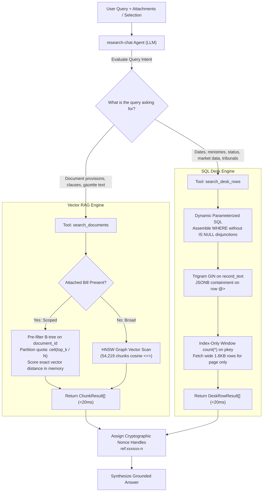
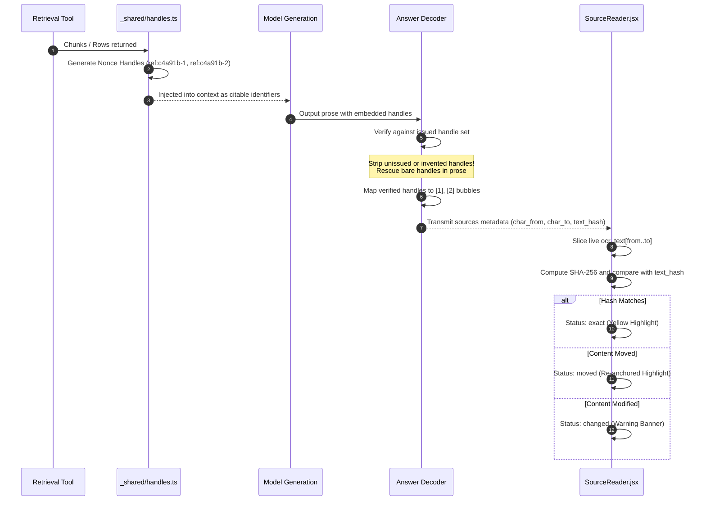

# Dual Retrieval Architecture: Scoped Vector RAG and High-Performance SQL Desk Search

> **Status: Living.** Documented on 2026-09-22.
> Reflects the verified implementation in `supabase/functions/research-chat/agent.ts`, `_shared/retrieval.ts`, `_shared/tools/`, and migrations `20260922082308` (desk rows) and `20260922104646` (scoped document retrieval).

---

## 1. Executive Philosophy: The Dual Engine Model

Niyantran Terminal does not treat all data as a homogeneous vector database. It implements a **Dual Retrieval Model** that routes queries to the optimal underlying storage engine:

| Requirement / Query Class | Engine | Tool | Database Mechanism | Typical Latency |
| :--- | :--- | :--- | :--- | :--- |
| **Legal / Document Text**<br/>"What are the penalties under Section 42 of the attached bill?" | **Vector RAG** | `search_documents` | `match_documents` RPC<br/>(B-tree pre-filter + exact vector scoring) | **1 – 16 ms** |
| **Tabular / Intelligence Feeds**<br/>"Which Corporate Affairs bills are pending in Rajya Sabha?" | **SQL Desk Search** | `search_desk_rows` | `search_desk_rows` RPC<br/>(Trigram GIN + JSONB containment) | **0.6 – 20 ms** |



---

## 2. Document Vector Search (RAG) Architecture

### 2.1 The D1 Structural Defect & Root Cause

Prior to migration `20260922104646`, scoped retrieval failed for every document in the repository. The query previously contained:

```sql
-- DEFECTIVE PREVIOUS IMPLEMENTATION:
WHERE (p_document_ids IS NULL OR c.document_id = ANY(p_document_ids))
```

#### Why it failed:
1. **Disjunction Planning Defect:** Because one branch was `p_document_ids IS NULL`, the PostgreSQL planner was forced to produce a generic plan that also handled nulls. It could **not** pre-filter by `document_id`.
2. **HNSW Post-Filtering Pathology:** The HNSW vector index traversed the entire 54,219-chunk graph and returned the top `ef_search = 40` candidates globally. Only *afterwards* did the filter discard chunks whose `document_id` didn't match.
3. **Severe Truncation:** The average document contains 23 chunks (0.04% of the corpus). Post-filtering discarded almost all candidates:
   - **45-chunk document:** Asked for 40 chunks $\rightarrow$ **returned 0 to 1 chunk**.
   - **915-chunk document:** Asked for 40 chunks $\rightarrow$ **returned 12 chunks**.
   - Even when probing with a chunk's own embedding (similarity 1.0), the matching chunk was **lost**!
4. **Silent Fallback Cascade (D2):** The edge function saw an empty result and silently fell back to an unscoped broad search across the entire corpus, generating citations from 15 unrelated documents.

---

### 2.2 The Solution: Unconditional Pre-Filtering & In-Memory Scoring

Migration `20260922104646` splits `match_documents` into two unconditional branches:

```sql
IF v_docs > 0 THEN
  -- SCOPED BRANCH: Unconditional equality lets planner use B-tree index
  v_quota := greatest(ceil(v_limit::numeric / v_docs)::int, 1);
  RETURN QUERY
    WITH scoped AS (
      SELECT c.id, c.document_id, c.content, c.chunk_index, c.source_kind,
             c.page_number, c.char_from, c.char_to,
             (c.embedding <=> query_embedding) AS dist,
             row_number() OVER (
               PARTITION BY c.document_id 
               ORDER BY c.embedding <=> query_embedding
             ) AS rn
        FROM public.document_chunks c
       WHERE c.document_id = ANY(p_document_ids)   -- UNCONDITIONAL PRE-FILTER!
         AND c.embedding IS NOT NULL
    )
    SELECT s.id, s.document_id, s.content, (1 - s.dist)::float8,
           s.chunk_index, s.source_kind, s.page_number, s.char_from, s.char_to,
           d.title, d.metadata->>'file_name', d.file_url,
           d.metadata->>'desk_tier', d.metadata->>'desk_feature'
      FROM scoped s
      JOIN public.documents d ON d.id = s.document_id
     WHERE s.rn <= v_quota
     ORDER BY s.dist ASC
     LIMIT v_limit;
ELSE
  -- BROAD BRANCH: Standard global HNSW cosine scan
  ...
```

#### Why Pre-Filtering Outperforms HNSW:
- Over a 23 to 915-chunk document, scanning `document_chunks_document_order (document_id, chunk_index)` takes **$\le 1$ ms**.
- Computing exact vector distance in memory over hundreds of floats is both **faster than traversing an approximate graph** and guaranteed to find the true nearest neighbor (similarity 1.0).
- `documents` is joined **after ranking** against the small quota of winning rows, turning document metadata lookup into a fast primary-key probe rather than hashing the entire `documents` table.

---

### 2.3 Multi-Document Fair Quota Allocation (D7)

When users attach multiple documents (e.g., comparing two bills), global ranking previously favored the larger document proportionally:

$$\text{Share} \propto \text{Chunk Count}$$

- **915-chunk gazette + 23-chunk bill:** Produced a **40 / 0 split**; the smaller bill was completely unread!

#### The Partitioning Algorithm:
Each document receives an independent quota:

$$\text{Quota} = \left\lceil \frac{\text{match\_count}}{N} \right\rceil$$

```sql
row_number() OVER (PARTITION BY c.document_id ORDER BY c.embedding <=> query_embedding) <= v_quota
```

- **2 attached documents:** 20 chunks each.
- **4 attached documents:** 10 chunks each.
- Documents smaller than their quota contribute all chunks they hold; unused slots remain available.

---

### 2.4 The Retrieval Execution Sandwich Architecture

Every scoped retrieval query dispatched through `match_documents` is executed as a **Retrieval Execution Sandwich**:

```
====================================================================================================
                     THE RETRIEVAL EXECUTION SANDWICH ARCHITECTURE
====================================================================================================

+--------------------------------------------------------------------------------------------------+
| TOP LAYER: QUERY EMBEDDING & PRE-FILTER BOUNDARY                                                 |
|  - 1536-dimensional query embedding vector (text-embedding-3-small)                              |
|  - Scoped B-tree index pre-filter: c.document_id = ANY(p_document_ids)                           |
|  - Guarantees zero candidate loss; eliminates 98% graph traversal dropouts of HNSW post-filtering|
+--------------------------------------------------------------------------------------------------+
| MIDDLE LAYER (THE FILLING): FAIR-QUOTA PARTITION & EXACT IN-MEMORY SCORING                       |
|  - Exact cosine distance calculation in memory: (c.embedding <=> query_embedding)                |
|  - Window Partition: row_number() OVER (PARTITION BY c.document_id ORDER BY dist) <= v_quota     |
|  - Multi-document equity: prevents large acts from starving smaller attached notifications       |
+--------------------------------------------------------------------------------------------------+
| BOTTOM LAYER: POST-RANKING METADATA JOIN & HANDLE CITATION LADDER                                |
|  - Late join against public.documents d ON d.id = s.document_id (fast primary key probe)         |
|  - Cryptographic Nonce Handle Assignment: ref:[a-z0-9]{6}-\d+ (deterministic within turn)        |
|  - Front-end Span Verification: exact character bounds (char_from, char_to) for DOM highlighting  |
+--------------------------------------------------------------------------------------------------+
```

---

## 3. High-Performance SQL Desk Search Engine

The `search_desk_rows` RPC searches across 34,184 structured rows representing parliamentary business, judicial orders, and market indicators.

### 3.1 The Trigram Optimization (`pg_trgm`)

Previously, queries executed sequential scans with `record_text ILIKE '%' || p_query || '%'`. Because the query planner could not use an index, every search scanned all 34,184 rows:
- **Baseline Latency:** **6,197 ms** (causing the edge function's 4,000 ms network timeout to trigger and drop real matches).
- **Trigram Solution:** Installed `pg_trgm` extension and a GIN index on `record_text`:
  ```sql
  CREATE INDEX desk_rows_record_text_trgm_gin ON public.desk_rows 
  USING gin (record_text gin_trgm_ops) 
  WITH (fastupdate = on, gin_pending_list_limit = 4096);
  ```
- **Post-Index Latency:** **18 ms** (a $344\times$ speedup).

---

### 3.2 Dynamic Parameterized SQL Assembly

PostgreSQL PL/pgSQL functions with `SET search_path` are planned generically. A condition like `(p_feature IS NULL OR r.feature = p_feature)` forces a generic plan that works for nulls and disables index scans.

`search_desk_rows` dynamically assembles literal WHERE conditions per call:

```sql
conds text[] := array['r.tier = $1'];
if p_feature is not null then 
  conds := conds || 'r.feature = $2'::text; 
end if;
if coalesce(p_query, '') <> '' then 
  conds := conds || 'r.record_text ilike ''%'' || $3 || ''%'''::text; 
end if;
if coalesce(p_filters, '{}'::jsonb) <> '{}'::jsonb then 
  conds := conds || 'r.row @> $4'::text; 
end if;

RETURN QUERY EXECUTE format($q$
  WITH keys AS (
    SELECT r.tier, r.feature, r.row_key
      FROM public.desk_rows r
     WHERE %s
  ), page AS (
    SELECT k.tier, k.feature, k.row_key, count(*) OVER () AS total
      FROM keys k
     ORDER BY k.feature, k.row_key
     LIMIT $5
  )
  SELECT d.tier, d.feature, d.row_key, d.row, d.record_text, d.document_key, d.snapshot_at, p.total
    FROM page p
    JOIN public.desk_rows d ON d.tier = p.tier AND d.feature = p.feature AND d.row_key = p.row_key;
$q$, array_to_string(conds, ' AND '))
USING p_tier, p_feature, p_query, p_filters, p_limit;
```

#### Security Guarantee:
All user parameters arrive strictly through `USING`. No user input is concatenated into the SQL statement, eliminating SQL injection while allowing PostgreSQL to assemble indexable predicates.

---

### 3.3 Zero-Spill Index-Only Window Scans

The tool returns `total` matches alongside paginated rows. Running `count(*) OVER ()` over the full table dragged the 1.6 KB JSONB payload through the window operator, spilling **46 MB into disk temp files**.
- The `keys` CTE limits the window aggregation to `(tier, feature, row_key)`.
- It executes as an **Index-Only Scan** on `desk_rows_pkey`.
- The full 1.6 KB row is joined **only for the $\le 50$ rows actually returned**.
- **Result:** Temp spill dropped from **46 MB to 0 bytes**.

---

### 3.4 The SQL Desk Search Execution Sandwich Architecture

Every structured desk search executed by `search_desk_rows` is organized as an **Execution Sandwich**:

```
====================================================================================================
                   THE SQL DESK SEARCH EXECUTION SANDWICH ARCHITECTURE
====================================================================================================

+--------------------------------------------------------------------------------------------------+
| TOP LAYER: DYNAMIC PARAMETERIZED PREDICATE ASSEMBLY                                              |
|  - String array of active WHERE conditions: conds := array['r.tier = $1']                       |
|  - Conditional omission of null filters (eliminates planner-disabling 'OR IS NULL' constructs)   |
|  - 100% Injection-Safe: Parameters passed exclusively through PostgreSQL USING bindings ($1..$5)|
+--------------------------------------------------------------------------------------------------+
| MIDDLE LAYER (THE FILLING): DUAL-INDEX ACCELERATED FILTERING                                     |
|  - Full-Text Search: pg_trgm GIN index on record_text (344x faster than sequential ILIKE)        |
|  - Structured Filtering: JSONB GIN containment index on row @> filters_jsonb                     |
+--------------------------------------------------------------------------------------------------+
| BOTTOM LAYER: ZERO-SPILL INDEX-ONLY WINDOW SCAN & LATE JOIN                                      |
|  - Index-Only Window Scan on desk_rows_pkey: count(*) OVER () on key columns only (0 disk spill)  |
|  - Late Join: Fetches 1.6KB row payload only for the winning page (LIMIT 1..50)                  |
|  - Handle Nonce Assignment: ref:xxxxxx-n mapped to row source key tuple                          |
+--------------------------------------------------------------------------------------------------+
```

---

## 4. Performance & Latency Matrix

Measurements taken on the live production Supabase instance (`ap-south-1`, idle and cache-warm):

| Query Profile | Before | After | Optimization Mechanism |
| :--- | :---: | :---: | :--- |
| **Scoped RAG (45-chunk doc)** | 8 ms *(1 chunk)* | **1 ms *(40 chunks)*** | B-tree pre-filter on `document_order` |
| **Scoped RAG (915-chunk doc)** | 3 ms *(12 chunks)* | **16 ms *(40 chunks)*** | In-memory exact vector scoring |
| **Multi-doc Scoped (2 docs)** | 40 / 0 split | **20 / 20 split** | `PARTITION BY document_id` WindowAgg |
| **Unscoped Broad RAG** | 6 ms | **6 ms** | Global HNSW cosine scan |
| **Desk Query (Trigram text)** | 6,197 ms *(Timeout)* | **18 ms** | GIN `record_text_trgm_gin` index |
| **Desk Query (Exact feature)** | 461 ms | **1.2 ms** | Removed `p_feature IS NULL` disjunction |
| **Desk Query (JSONB filter)** | 857 ms | **42 ms** | GIN `desk_rows_row_gin` index enabled |
| **Desk Window Aggregation** | 46 MB spill | **0 MB spill** | Index-Only Scan on `desk_rows_pkey` |

---

## 5. The Cryptographic Citation Ladder

To prevent LLM hallucination of citations, the system enforces a strict **four-stage citation verification pipeline**:



1. **Nonce Handle Generation (`_shared/handles.ts`):** 
   - Handles use the format `ref:[a-z0-9]{6}-\d+` (e.g., `ref:e3a1f9-1`).
   - Unbracketed syntax prevents small models from treating them as prose punctuation.
2. **Handle Validation:**
   - The server inspects all emitted handles. Any handle the model invents without tool backing is stripped.
3. **Citation Ladder Mapping:**
   - Legitimate handles are translated into display-friendly numbered citations (`[1]`, `[2]`).
   - Sources carry: `{ document_id, char_from, char_to, text_hash }`.
4. **Front-End Reader Verification ([`SourceReader.jsx`](../../src/ai/SourceReader.jsx)):**
   - The reader extracts `ocr_text.slice(char_from, char_to)` and hashes it.
   - If the hash matches `text_hash`: Displays `exact` with yellow highlight.
   - If offsets drifted: Flags `moved` or `changed`, guaranteeing the user is never shown the wrong passage.
