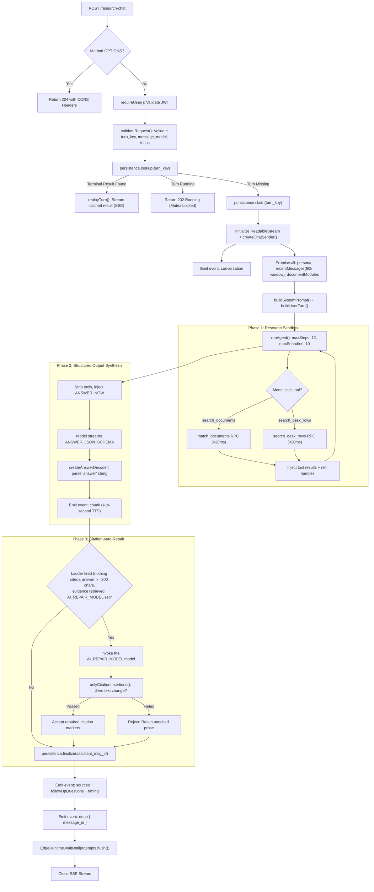
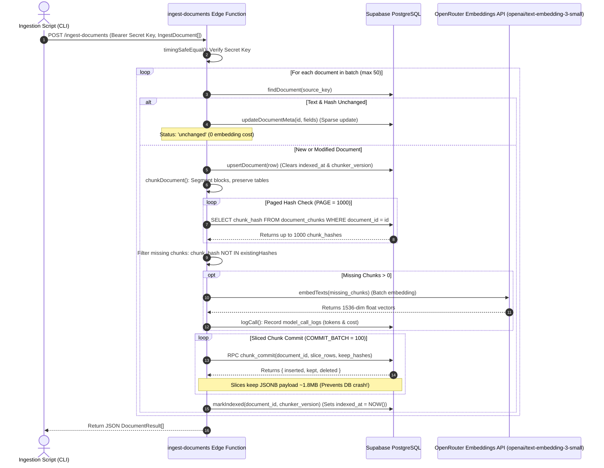
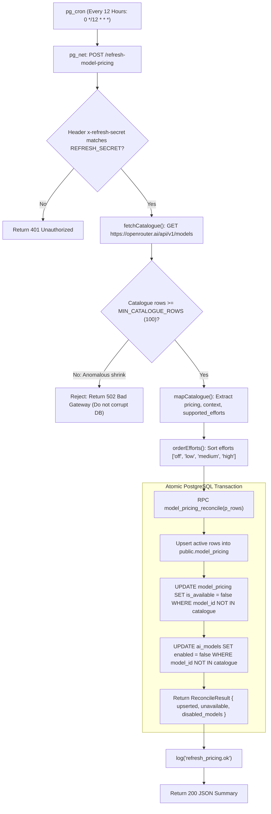

# Supabase Edge Functions & Shared Runtime Subsystem

> **Status: Living.** Documented on 2026-09-22.
> Reflects the verified implementation in `supabase/functions/` (`research-chat/`, `ingest-documents/`, `refresh-model-pricing/`, `admin-models/`, `health/`, `desk-brief/`), `_shared/` library, `deno.json`, and database migrations `20260921115831` through `20260922104646`.
> Corrected 2026-09-28: six functions (the `desk-brief` row and §9 added), deployed versions, the repair model (read from `AI_REPAIR_MODEL`), and the test counts.
> Corrected 2026-09-29: the exact-match CORS limit (open-work F8), the legacy key fallback (F9) and the deploy drift that F9 redeploys.

---

## 1. Executive Catalog of Deployed Functions

The server-side backend of Niyantran Terminal runs as a distributed suite of serverless Deno TypeScript edge functions deployed on Supabase Edge Runtime. Each function encapsulates an autonomous operational domain, enforcing strict security perimeters, deterministic error boundaries, and zero-leak database interactions:

| Function Name | Entry Point | Invocation Trigger | Auth Boundary | Primary Responsibility | Critical Operational Invariants |
| :--- | :--- | :--- | :--- | :--- | :--- |
| **`research-chat`** | `research-chat/index.ts` | Browser Client (HTTP POST) | `requireUser` (Supabase User JWT) | Multi-turn research agent loop, OpenRouter streaming, tool execution, citation repair, telemetry. | `NETWORK_TIMEOUT_MS = 4_000`<br/>`WINDOW_CHARS = 60_000`<br/>`BUDGET.maxSteps = 12` |
| **`ingest-documents`** | `ingest-documents/index.ts` | Ingestion Scripts / CLI (HTTP POST) | `authorised` (Bearer matching `SUPABASE_SECRET_KEYS`) | PDF/OCR parsing, structural chunking, embeddings via OpenRouter (`openai/text-embedding-3-small`), 100-chunk slice commits. | `COMMIT_BATCH = 100`<br/>PostgREST 1000-row hash pagination<br/>Zero DB OOM crash guarantee |
| **`refresh-model-pricing`** | `refresh-model-pricing/index.ts` | `pg_cron` via `pg_net` (HTTP POST) | `x-refresh-secret` or Secret Key | Ingests OpenRouter catalog, updates token pricing, normalizes reasoning efforts, syncs allowlist. | `MIN_CATALOGUE_ROWS = 100`<br/>Atomic `model_pricing_reconcile`<br/>Auto-disables orphaned models |
| **`admin-models`** | `admin-models/index.ts` | Admin Panel (HTTP GET / PUT) | `requireUser` + `is_platform_admin` | Manages active LLM allowlist (`ai_models`) and user role mappings (`ai_roles`). | Restricts columns via `pickRow`<br/>Calls `admin_models_upsert`<br/>`invalidateRegistry()` |
| **`health`** | `health/index.ts` | Deployment Gate / Ping (HTTP GET) | `requireUser` (Supabase User JWT) | End-to-end verification probe checking DB reachability, RLS identity, and vector extension. | Asserts `auth.uid() === token.userId`<br/>Reports `pricing_rows` & `models_enabled` |
| **`desk-brief`** | `desk-brief/index.ts` | Browser desk rail, or the Vercel router forwarding the caller's bearer (HTTP POST) | `requireUser` (Supabase User JWT) | Organises one selected desk row into a JSON brief through OpenRouter; one `model_call_logs` row per attempt. | `MAX_BODY_BYTES = 131_072`<br/>`PROVIDER_TIMEOUT_MS = 50_000`<br/>503 when no model is enabled |

**Deployed versions on 2026-09-28** (`docs/agents/coordination.md`, "Operations — 2026-09-28"): `health` v7, `admin-models` v7, `refresh-model-pricing` v8, `ingest-documents` v10, `desk-brief` v2 and `research-chat` v32. `research-chat` v32 was deployed through a one-file entry that imports `createResearchHandler` from a pinned commit and calls `Deno.serve` itself, so the dashboard does not show the repository files. The emergency deploy form, its checks and the rollback steps are in [`../agents/rollback-runbook.md`](../agents/rollback-runbook.md). There is no `embed` function: embedding is the shared module `_shared/embed.ts`.

The deployed code is not all `main` (as recorded in `docs/plans/open-work.md` on 2026-09-29): `ingest-documents` v10 was built from `a030847` and does not have the later `_shared/chunking.ts`, and `research-chat` still runs from the pinned-commit entry. Redeploying all six functions from one `main` commit is open-work F9 (with owner action A1 covering a CLI redeploy of `research-chat`).

**CORS (open-work F8).** On `main` at `71292af`, and in every deployed function, `_shared/cors.ts` allows an origin only when it exactly equals one entry of the comma-separated `ALLOWED_ORIGINS` secret (without the secret, only `http://localhost:5173`). There are no wildcards, and every Vercel preview has its own hostname, so every function uses the same check and the browser-facing ones (`research-chat`, `desk-brief`, and `admin-models` from the admin panel) refuse calls from every preview. A probe on 2026-09-29 confirmed it: production and `http://localhost:5173` got an `access-control-allow-origin` header, while the `git-main` preview URL, a deployment URL and `localhost:5301` got none.

---

## 2. The Edge Function Execution Sandwich Architecture

Every request reaching a Supabase Edge Function is processed through a multi-tiered **Execution Sandwich**. Security checks, CORS preflights, and isolate-level caches wrap around the core business logic, terminating with durable transaction commits and detached background telemetry flushes:

```
====================================================================================================
                   THE EDGE FUNCTION EXECUTION SANDWICH ARCHITECTURE
====================================================================================================

+--------------------------------------------------------------------------------------------------+
| TOP LAYER: PREFLIGHT & CORS INGRESS PERIMETER                                                    |
|  - Preflight Interceptor: preflight(req) returns HTTP 204 for OPTIONS with 24h cache-control     |
|  - Origin Allowlist Verification: corsHeaders(req) matches origin against ALLOWED_ORIGINS        |
|  - Ingress Header Sanitization: validates Content-Type and Authorization presence                |
+--------------------------------------------------------------------------------------------------+
| LAYER 2: CRYPTOGRAPHIC AUTHENTICATION & IDENTITY EXTRACTION                                      |
|  - requireUser(): Validates Bearer JWT structure, extracts payload, verifies subject with Auth   |
|  - Secret Key Webhooks: timingSafeEqual() constant-time comparison prevents timing side-channels |
|  - Dual Client Resolution: userClient (RLS active) vs. serviceClient (RLS bypassed)              |
+--------------------------------------------------------------------------------------------------+
| LAYER 3: ISOLATE CACHE & BOUNDED NETWORK WRAPPER                                                 |
|  - Per-Isolate Caches: documentModulesCache, personaPrompt bundled JSON, serviceClient singleton |
|  - Bounded Execution Wrapper: bounded(..., 4000ms) prevents hanging RPCs or database locks     |
|  - Abort Signal Propagation: AbortSignal.any merges client disconnects and timeout bounds       |
+--------------------------------------------------------------------------------------------------+
| MIDDLE LAYER (THE FILLING): CORE AGENT & DATA LOGIC                                              |
|  - research-chat: Phase 1 (Research Sandbox) -> Phase 2 (Synthesis) -> Phase 3 (Citation Repair)|
|  - ingest-documents: Hash-difference embedding -> 100-chunk sliced atomic commit transactions   |
|  - refresh-model-pricing: OpenRouter catalogue JSON normalization -> model_pricing_reconcile     |
|  - admin-models: Column-sanitized upsert of allowed LLMs and role defaults                      |
+--------------------------------------------------------------------------------------------------+
| LAYER 5: DURABLE POSTGRES TRANSACTION COMMIT                                                     |
|  - research_turns: RPC claim_research_turn mutex -> RPC finalize_research_turn completion         |
|  - chunk_commit: RPC chunk_commit inserts chunks and updates document indexed_at atomically     |
|  - model_pricing_reconcile: RPC updates prices and disables obsolete allowlist rows              |
+--------------------------------------------------------------------------------------------------+
| BOTTOM LAYER: WIRE RESPONSE STREAMING & DETACHED ASYNC FLUSH                                     |
|  - Real-time Output: SSE stream (research-chat) or JSON envelope (admin/ingest/health)           |
|  - EdgeRuntime.waitUntil: Keeps isolate alive to flush telemetry (chat_turn_traces, call logs)   |
|    even if the client disconnects or aborts before stream termination                            |
+--------------------------------------------------------------------------------------------------+
```

---

## 3. Deno Edge Runtime Configuration & Environment

Edge functions run under Deno v1.x via Supabase Edge Runtime. The project maintains a top-level configuration file:

### 3.1 Runtime Configuration (`supabase/functions/deno.json`)
```json
{
  "lock": false,
  "fmt": { "lineWidth": 120, "singleQuote": true },
  "lint": { "rules": { "tags": ["recommended"] } }
}
```

### 3.2 Secret Management & Key Rotation Architecture (`_shared/supabase.ts`)
On 2026-09-21, Niyantran Terminal deprecated legacy environment variables (`SUPABASE_ANON_KEY` and `SUPABASE_SERVICE_ROLE_KEY`) after an audit identified exposure risks. The architecture migrated to JSON-object key rings injected by the Supabase platform. *(Corrected 2026-09-24: "deprecated" does not mean removed. `publishableKey()` and `secretKey()` in `_shared/supabase.ts` still fall back to `SUPABASE_ANON_KEY` and `SUPABASE_SERVICE_ROLE_KEY` when the key-ring variables are absent. The project's legacy keys themselves were disabled on 2026-09-21.)* *(Corrected 2026-09-29: on `main` at `71292af` the fallback is still in `_shared/supabase.ts`, and the thrown messages now name both variables, as the code below shows. Removing the fallback is open-work F9.)*

```typescript
export function namedKey(raw: string | undefined, name = 'default'): string | null {
  if (!raw) return null;
  try {
    const parsed = JSON.parse(raw) as Record<string, unknown>;
    const v = parsed?.[name];
    return typeof v === 'string' && v ? v : null;
  } catch {
    return null;
  }
}

export function publishableKey(): string {
  const k = namedKey(Deno.env.get('SUPABASE_PUBLISHABLE_KEYS')) ?? Deno.env.get('SUPABASE_ANON_KEY');
  if (!k) throw new Error('no publishable key: SUPABASE_PUBLISHABLE_KEYS (or SUPABASE_ANON_KEY) is not set');
  return k;
}

export function secretKey(): string {
  const k = namedKey(Deno.env.get('SUPABASE_SECRET_KEYS')) ?? Deno.env.get('SUPABASE_SERVICE_ROLE_KEY');
  if (!k) throw new Error('no secret key: SUPABASE_SECRET_KEYS (or SUPABASE_SERVICE_ROLE_KEY) is not set');
  return k;
}
```

#### Dual Supabase Client Architecture
1. **`userClient(token)`:** Initialized with the caller's JWT:
   ```typescript
   global: { headers: { Authorization: `Bearer ${token}` } }
   ```
   Ensures that all subsequent queries and RPCs are strictly evaluated under PostgreSQL Row-Level Security (RLS) policies as `auth.uid()`.
2. **`serviceClient()`:** Initialized as a lazily instantiated singleton using `secretKey()`. Bypasses RLS; used **exclusively** after edge functions have performed their own application-level authorization checks.

---

## 4. Deep-Dive: `research-chat` Edge Function

The `research-chat` function is the primary AI orchestration engine. It coordinates real-time user questions, multi-step tool calls, and streaming responses over Server-Sent Events.



### 4.1 Bounded Execution Protection (`research-chat/index.ts:51-92`)
To guarantee that network drops or database slow-downs do not tie up Deno isolates indefinitely, all database queries and RPC calls are wrapped with `bounded()`:
- **`NETWORK_TIMEOUT_MS = 4_000`:** Every database call is raced against a 4-second timeout.
- **Fail-Safe Logging:** If a query fails or times out, `bounded()` records the exact database error in internal logs (`log('research.bounded_failed', ...)`) while returning an opaque `HTTP 503 Research service unavailable` to the browser, concealing database internals from potential adversaries.

### 4.2 Detached Telemetry Flush via `EdgeRuntime.waitUntil`
Telemetry recording (`chat_turn_traces`, token counts, USD pricing, latency breakdowns) must never increase user-perceived streaming latency. 

When the answer stream concludes:
```typescript
const work = executeClaimedTurn(...)
  .then((saved) => sendTerminal(sender, saved, visible))
  .then(async () => {
    try {
      await attempts.flush();
    } finally {
      sender.done();
    }
  });

deps.waitUntil?.(work);
```
`EdgeRuntime.waitUntil` guarantees that the Deno runtime keeps the cloud worker alive until `attempts.flush()` has committed all telemetry rows to PostgreSQL, even after the browser has closed the HTTP connection.

---

## 5. Deep-Dive: `ingest-documents` Edge Function

The `ingest-documents` function processes document batches from the ingestion pipeline. It enforces strict memory budgeting to eliminate database out-of-memory crashes.



### 5.1 The Postmaster OOM Crash Post-Mortem & The 100-Chunk Ceiling

#### The Defect
On 2026-09-22, ingesting *"The Finance Bill, 2006"* (969,286 characters, 915 chunks) in a single `chunk_commit` RPC call killed the PostgreSQL server outright.
- **Payload Bloat:** Each chunk contains content text and 1,536 float numbers (vector embedding). 915 chunks produced a single **17 MB JSONB payload** sent over the wire.
- **Postgres Crash:** The PostgreSQL postmaster vanished between checkpoints without an error message, triggering database restart recovery:
  ```text
  LOG: database system was not properly shut down; automatic recovery in progress
  ```

#### The Resolution (`COMMIT_BATCH = 100`)
`ingest-documents/handler.ts` introduced chunk commit slicing:
- **Batch Size:** Fixed at `COMMIT_BATCH = 100`.
- **Payload Bound:** Each slice is restricted to **$\sim 1.8 \text{ MB}$**, over $7\times$ lower than the crash threshold.
- **Visibility Safety:** `upsertDocument` clears `indexed_at` at the start of ingestion. `match_documents` filters on `indexed_at IS NOT NULL`. Therefore, a document remains completely invisible to search queries across all intermediate slice commits until `markIndexed` sets `indexed_at = NOW()`.

### 5.2 The PostgREST 1000-Row Pagination Fix (`index.ts:27-50`)
PostgREST enforces a hard ceiling of `db-max-rows = 1000` per HTTP query. An unpaged query on a document with 2,240 chunks returned only the first 1,000 hashes with no error. The edge function assumed the remaining 1,240 chunks were missing, re-embedded them, and crashed on worker resource limits.

`supabaseDb.existingHashes()` implements a deterministic pagination loop:
```typescript
const PAGE = 1000;
const hashes = new Set<string>();
for (let from = 0;; from += PAGE) {
  const { data, error } = await client
    .from('document_chunks')
    .select('chunk_hash')
    .eq('document_id', documentId)
    .order('chunk_hash')
    .range(from, from + PAGE - 1);
  if (error) throw new Error(`document_chunks read: ${error.message}`);
  for (const r of data ?? []) hashes.add(r.chunk_hash as string);
  if (!data || data.length < PAGE) return hashes;
}
```

---

## 6. Deep-Dive: `refresh-model-pricing` Edge Function

The `refresh-model-pricing` function is executed every 12 hours (cron `0 */12 * * *`, migration `20260921000007`; corrected 2026-09-24 from "hourly") via Supabase `pg_cron` and `pg_net` to synchronize OpenRouter's live catalog with the database.



### 6.1 Reasoning Effort Ordering & Normalization (`handler.ts:38-47`)
Different LLM providers describe reasoning effort using conflicting scales. OpenRouter publishes `supported_efforts` in descending order, but front-end pickers expect ascending order from cheapest to most intensive:

```typescript
export const EFFORT_ORDER = ['off', 'minimal', 'low', 'medium', 'high', 'xhigh', 'max'] as const;

export function orderEfforts(values: Iterable<string>): string[] {
  const seen = new Set<string>();
  for (const v of values) {
    const e = v === 'none' ? 'off' : v;
    if ((EFFORT_ORDER as readonly string[]).includes(e)) seen.add(e);
  }
  return EFFORT_ORDER.filter((e) => seen.has(e));
}
```

### 6.2 Atomic Allowlist Synchronization Invariant
If a model provider deprecates a model or OpenRouter takes it offline, the system must prevent users from selecting a dead endpoint. 

`model_pricing_reconcile` executes atomically inside PostgreSQL:
1. Upserts current pricing for available models.
2. Sets `is_available = false` on `model_pricing` for any model absent from the incoming payload.
3. Automatically updates `public.ai_models SET enabled = false` for any allowlisted model that became unavailable, recording the change in `disabled_models`.

---

## 7. Deep-Dive: `admin-models` Edge Function

The `admin-models` function provides the administrative API for configuring which AI models are exposed to users in the terminal workbench.

### 7.1 Security Architecture
- **Authentication:** Requires a valid user JWT (`requireUser`).
- **Authorization Check:** Executes RPC `is_platform_admin()` through the caller's `userClient(token)`. The function takes no arguments; it reads `auth.uid()` from the caller's JWT (corrected 2026-09-24). If false, immediately emits `HTTP 403 admin only` and logs `admin_models.forbidden`.
- **Field Stripping (`pickRow`):** Only explicit columns (`MODEL_FIELDS` and `ROLE_FIELDS`) are retained; arbitrary payload properties are safely dropped.
- **Service Role Escalation:** After verifying administrative credentials, the write executes via `serviceClient().rpc('admin_models_upsert', ...)`, allowing database triggers (`guard_ai_models`) to validate model invariants and return clear `HTTP 400` errors on constraint violations.
- **Registry Invalidation:** On successful write, calls `invalidateRegistry()` to immediately flush the edge runtime's memory cache.

---

## 8. Deep-Dive: `health` Edge Function

The `health` function serves as an automated verification gate. Calling `GET /health` with a valid user token verifies all four tiers of the infrastructure:

```typescript
export async function handleHealth(req: Request, deps: HealthDeps): Promise<Response> {
  const pre = preflight(req, deps.origins);
  if (pre) return pre;
  const cors = corsHeaders(req, deps.origins);
  try {
    if (req.method !== 'GET') throw new HttpError(405, 'method not allowed');
    const { userId, token } = await requireUser(req, deps.verify);
    const row = await deps.probe(token);
    
    // Verifies that RLS saw the exact token subject
    if (row.uid !== userId) throw new HttpError(500, 'auth.uid() did not match token subject');
    
    return json({
      ok: true,
      version: deps.version,
      vector: row.vector,
      pricing_rows: row.pricing_rows,
      models_enabled: row.models_enabled,
      user_id: userId,
    }, 200, cors);
  } catch (err) {
    return errorResponse(err, cors);
  }
}
```

### Verification Response Payload
```json
{
  "ok": true,
  "version": "2026.09.22",
  "vector": true,
  "pricing_rows": 446,
  "models_enabled": 8,
  "user_id": "d0a7a3b4-19c2-4011-9a74-b52e0081d6f2"
}
```

---

## 9. Deep-Dive: `desk-brief` Edge Function

`desk-brief` organises **one** selected desk row (not the whole desk) into a short brief: headline, summary, findings and KPIs. `desk-brief/index.ts` only wires dependencies; `desk-brief/handler.ts` is framework-free and tested by `desk-brief/handler_test.ts`.

1. **Preflight and caller:** CORS from `ALLOWED_ORIGINS`; `POST` only; `requireUser()` verifies the bearer before anything else is read.
2. **Bounds:** the body is capped at 128 KiB, the row at 32 KiB and 40 fields, the source extract at 12,000 characters and the source note at 400.
3. **Model choice (`chooseModel`):** `OPENROUTER_DESK_MODEL` when it names an enabled model in `public.ai_models`, otherwise the model holding the `DEFAULT_ANALYST` role in `public.ai_roles`. With neither, or with no `OPENROUTER_API_KEY`, it answers 503.
4. **Provider call:** one OpenRouter chat completion with `response_format: { type: 'json_object' }` and a 50-second timeout, below the Vercel router's own limit.
5. **Telemetry:** every attempt writes one `model_call_logs` row (`caller = 'desk-brief'`, `purpose = 'desk_brief'`) with the service client; a telemetry failure never fails the brief.
6. **Response:** the parsed brief is normalised and returned as JSON with `hash`, `model`, `generatedAt` and `scope`. A malformed model answer is a 502; nothing is cached here. Caching happens in the browser and, for forwarded requests, in `server/deskBrief.mjs` (see `docs/flow.md` §3).

---

## 10. The Shared Library Subsystem (`supabase/functions/_shared/`)

The `_shared/` directory contains cross-cutting utilities shared across edge functions, unit tested in isolation:

| Module | Core Exports | Architectural Role |
| :--- | :--- | :--- |
| **`auth.ts`** | `requireUser()`, `Caller` | Structural Bearer verification, JWT subject extraction, auth error translation. |
| **`cors.ts`** | `corsHeaders()`, `preflight()`, `allowedOrigins()` | Exact-match origin allowlist from `ALLOWED_ORIGINS` (no patterns, so Vercel previews are refused; open-work F8); handles HTTP OPTIONS preflights with 24h max-age. |
| **`supabase.ts`** | `userClient()`, `serviceClient()`, `publishableKey()`, `secretKey()` | Dual client resolution; multi-key JSON parsing; key-rotation safety. |
| **`openrouterStream.ts`** | `streamChat()`, `StreamRequest`, `ModelEvent` | SSE chunk consumer for OpenRouter API, tool-call frame extraction, token usage accounting. |
| **`embed.ts`** | `embedTexts()`, `EMBED_MODEL`, `EMBED_DIMS` | Generates 1536-dimensional embeddings with automatic retry and rate-limit backoff. |
| **`chunking.ts`** | `chunkDocument()`, `blocks()`, `CHUNK` | Structural document chunking; atomic table preservation (`rowspan`/`colspan`); character invariants. |
| **`handles.ts`** | `createHandleAssigner()`, `HandleAssigner` | Generates deterministic, collision-resistant citation handles (`ref:[a-z0-9]{6}-\d+`). |
| **`citations.ts`** | `applyCitationLadder()`, `parseBracketMarkers()` | Validates and anchors `[n]` bracket markers in model prose to retrieved passages. |
| **`deskCatalog.ts`** | `deskCatalogBlock()`, `resolveFeature()` | Maps user desk tiers and feature names to active database modules and system prompt blocks. |
| **`deskGroundingRules.ts`**| `DESK_GROUNDING_RULES`, `selectedRecordBlock()` | Canonical grounding prompt blocks ensuring tabular fields are not confused with full-text clauses. |

---

## 11. Verification & Test Suite

All edge functions and shared library modules are verified under Deno's native test runner using the root configuration:

```bash
# Execute entire edge function test suite
deno test -A --config supabase/functions/deno.json supabase/functions/

# Execute research-chat tests only
deno test -A --config supabase/functions/deno.json supabase/functions/research-chat/

# Execute shared library tests only
deno test -A --config supabase/functions/deno.json supabase/functions/_shared/
```

On 2026-09-28 the suite has **38** `*_test.ts` files, and the day's run passed **447** tests. `.github/workflows/ci.yml` runs the full command on every push (advisory).

### Verified Baseline Benchmark (2026-09-22, historical)
- **Total Deno Test Suites:** 17 files.
- **Total Tests Passed:** **394 passed**, 0 failed.
- **Total Runtime:** $\sim 3.8 \text{ seconds}$.
- **Zero Mock Leaks:** In-memory mocks verify all database RPC parameters, error responses, and stream frames without making external network calls during CI runs.
