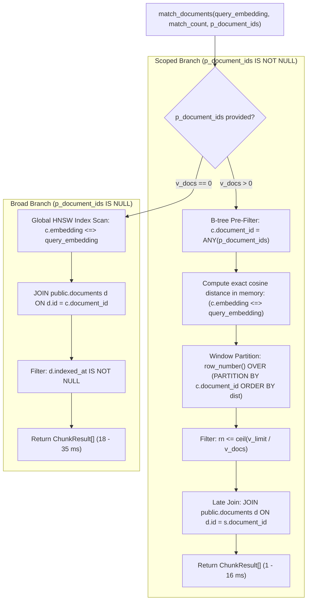
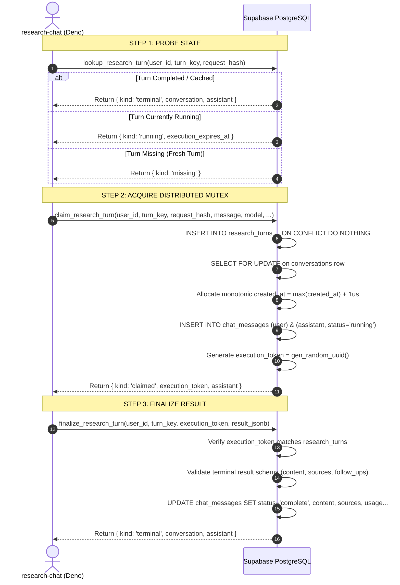

# Stored Procedures, Versioned RPCs & Database Security Topology

> **Status: Living.** Documented on 2026-09-22.
> Reflects the verified implementation in `supabase/migrations/` (migrations `20260921000001` through `20260922121946`), PostgreSQL 15, and `pgvector` 0.7.0.
> Corrected 2026-09-28: the functions added by the migrations of that day (`20260928100000` through `20260928150000`) and the replaced `handle_new_user()` are listed in §1 and §9.1. On 2026-09-28 the repository had 31 migrations.
> Corrected 2026-09-29: the plan-entitlement functions of `20260929100000_plan_entitlements` are listed in §9.2, and `handle_new_user()` was replaced again. The repository now has 32 migrations.

---

## 1. Executive RPC & Stored Procedure Catalog

Niyantran Terminal executes all performance-critical, concurrency-sensitive, and security-enforcing operations inside PostgreSQL stored procedures (PL/pgSQL functions). Client applications and edge functions do not execute raw, multi-statement transactional logic over HTTP; they invoke versioned RPCs:

| Procedure / RPC Name | Security Context | Execution Grants | Search Path | Primary Responsibility | Migration Source |
| :--- | :--- | :--- | :--- | :--- | :--- |
| **`match_documents`** | `SECURITY INVOKER` | `authenticated`, `service_role` | `public, extensions` | Scoped & broad vector cosine similarity search with fair-quota multi-document partitioning. | `20260922104646` |
| **`search_desk_rows`** | `SECURITY INVOKER` | `authenticated`, `service_role` | `public` | Dynamic parameterized SQL search across 34,184 desk rows with zero-spill index-only window scans. | `20260922082308` |
| **`chunk_commit`** | `SECURITY DEFINER` | `service_role` only | `public, extensions` | Atomic upsert and obsolete chunk pruning during document ingestion; enforces 1536-dim vector bounds. | `20260921000014` |
| **`lookup_research_turn`**| `SECURITY INVOKER` | `service_role` only | `''` (Hardened) | Checks turn execution status, detects orphaned runs, and auto-expires stalled turns (>120s). | `20260921115831` |
| **`claim_research_turn`** | `SECURITY INVOKER` | `service_role` only | `''` (Hardened) | Concurrency mutex (`SELECT ... FOR UPDATE`), serializes microsecond message history, issues `execution_token`. | `20260921115831` |
| **`finalize_research_turn`**| `SECURITY INVOKER` | `service_role` only | `''` (Hardened) | Validates `execution_token`, atomically writes terminal answer, sources, and usage metadata. | `20260921115831` |
| **`model_pricing_reconcile`**| `SECURITY DEFINER` | `service_role` only | `''` (Hardened) | Ingests OpenRouter pricing, clamps reasoning efforts via `effort_rank`, auto-disables orphaned models. | `20260922121946` |
| **`effort_rank`** | `IMMUTABLE SQL` | `PUBLIC`, all roles | `''` (Hardened) | Maps reasoning effort strings (`off`..`max`) to ordinal rank integers (0..6) for deterministic sorting. | `20260922121946` |
| **`admin_models_upsert`** | `SECURITY DEFINER` | `service_role` only | `''` (Hardened) | Administrative upsert for `ai_models` and `ai_roles` after validating foreign keys and triggers. | `20260921000008` |
| **`ai_health`** | `SECURITY INVOKER` | `authenticated`, `service_role` | `''` (Hardened) | End-to-end foundation probe: asserts `pgvector` presence, pricing rows, enabled models, and `auth.uid()`. | `20260921000006` |
| **`is_platform_admin`** | `SECURITY DEFINER` (`LANGUAGE sql`, `STABLE`, no arguments) | `authenticated`, `service_role` | `''` (Hardened) | Returns true when a `user_profiles` row exists with `user_id = auth.uid()`, `role = 'admin'` and `status = 'active'`. *(Corrected 2026-09-24: previously listed as `SECURITY INVOKER` checking `role = 'platform_admin'`.)* | Defined in `backend/sql/auth_schema.sql`; no repo migration defines it. `20260921000012` only re-grants it and sets its search path. |
| **`handle_new_user`** (trigger on `auth.users`) | `SECURITY DEFINER` | none (revoked from `PUBLIC`, `anon`, `authenticated`) | `''` (Hardened) | Creates the `user_profiles` row for a new account with fixed role, plan and status; since 2026-09-28 it also maps the signup `personaId` onto `persona`. | Defined in `backend/sql/auth_schema.sql`; replaced by `20260928120000_signup_persona` |
| **`touch_user_preferences`** (trigger) | `SECURITY INVOKER` | none (revoked from all API roles) | `''` (Hardened) | Stamps `user_preferences.updated_at` with the server clock. | `20260928100000` |
| **`analytics_event_summary(p_limit)`** | `SECURITY INVOKER` | `service_role` only | `''` (Hardened) | Total and per-name event counts for the admin summary route. | `20260928100100` |
| **`purge_analytics_events()`** | `SECURITY INVOKER` | `service_role` only | `''` (Hardened) | Deletes events older than 180 days; scheduled nightly by `pg_cron` where present. | `20260928100100` |
| **`analytics_rate_hit(p_bucket, p_limit, p_window_seconds)`** | `SECURITY INVOKER` | `service_role` only | `''` (Hardened) | Counts one hit in the bucket's fixed window and says whether it is within the limit. | `20260928130000` |
| **`purge_analytics_rate_windows()`** | `SECURITY INVOKER` | `service_role` only | `''` (Hardened) | Deletes rate windows older than an hour; scheduled every 15 minutes by `pg_cron` where present. | `20260928130000` |
| **`issue_invoice(p)`** | `SECURITY INVOKER` | `service_role` only | `''` (Hardened) | Assigns the next gapless `NIY/<FY>/<seq>` number and inserts the invoice in one statement. | `20260928140000` |
| **`upsert_nter_article(p)`** | `SECURITY INVOKER` | `service_role` only | `''` (Hardened) | Upserts one nter.news article (by `article_id`, then `link`), skips stale revisions and keeps the newest 200. | `20260928150000` |

---

## 2. The RPC Invocation Sandwich Architecture

Every database RPC invocation operates as a **Security & Transaction Sandwich**: parameter validation, search path hardening, and row-level locks encapsulate the procedural business logic, terminating in strict constraint assertions and structured JSONB/table outputs:

```
====================================================================================================
                       THE RPC INVOCATION SANDWICH ARCHITECTURE
====================================================================================================

+--------------------------------------------------------------------------------------------------+
| TOP LAYER: SECURITY ENCLOSURE & PARAMETER PARSING                                                |
|  - Search Path Hardening: SET search_path = '' forces all tables to be schema-qualified         |
|    (e.g. public.documents), eliminating schema-hijacking attacks                                 |
|  - Security Context: Strict separation of SECURITY INVOKER (RLS caller) vs. SECURITY DEFINER    |
|  - Type Assertion: Parameter clamps, array length checks, and JSON type validation                |
+--------------------------------------------------------------------------------------------------+
| LAYER 2: CONCURRENCY MUTEX & ROW-LEVEL LOCKS                                                     |
|  - Pessimistic Locks: SELECT ... FOR UPDATE on parent research_turns or conversations            |
|  - Key Shares: FOR KEY SHARE prevents concurrent foreign-key deletion during active turns        |
|  - Timestamp Monotonicity: max(created_at) + interval '1 microsecond' prevents chronological race |
+--------------------------------------------------------------------------------------------------+
| MIDDLE LAYER (THE FILLING): PROCEDURAL BUSINESS & RETRIEVAL LOGIC                                |
|  - match_documents: B-tree pre-filter + row_number() OVER (PARTITION BY doc) <= v_quota          |
|  - search_desk_rows: Dynamic parameterized SQL without 'OR IS NULL' + index-only window scan     |
|  - chunk_commit: Set difference (insert missing chunk_hashes, prune obsolete ones)               |
|  - model_pricing_reconcile: Price upsert + effort_rank intersect + tool-loss auto-disable        |
+--------------------------------------------------------------------------------------------------+
| LAYER 4: DATABASE TRIGGER INTEGRITY CHECKPOINT                                                   |
|  - guard_research_turn(): Raises exception 23514 if claimed user_id or turn_key is altered        |
|  - guard_research_result(): Enforces immutability of terminal chat_messages rows                 |
|  - guard_ai_models(): Asserts unique default model and valid effort rungs                        |
+--------------------------------------------------------------------------------------------------+
| BOTTOM LAYER: STRUCTURED WIRE OUTPUT ENVELOPE                                                    |
|  - JSONB Return Envelope: jsonb_build_object('kind', ..., 'assistant', to_jsonb(m))              |
|  - Tabular Stream: Streaming tuple results for high-speed vector and trigram searches            |
|  - Diagnostic Instrumentation: GET DIAGNOSTICS row_count for audit logging                       |
+--------------------------------------------------------------------------------------------------+
```

---

## 3. Deep-Dive: Vector Retrieval RPC (`match_documents`)

Located in migration `20260922104646_match_documents_prefilter_and_quota.sql`, `match_documents` provides high-speed vector cosine retrieval across 54,219 embedded chunks.

### 3.1 Function Signature & Argument Clamps
```sql
CREATE OR REPLACE FUNCTION public.match_documents(
  query_embedding extensions.vector(1536),
  match_count     int    DEFAULT 40,
  p_document_ids  uuid[] DEFAULT NULL,
  p_desk_tier     text   DEFAULT NULL
) RETURNS TABLE (
  id            uuid,
  document_id   uuid,
  content       text,
  similarity    float8,
  chunk_index   int,
  source_kind   text,
  page_number   int,
  char_from     int,
  char_to       int,
  title         text,
  file_name     text,
  file_url      text,
  desk_tier     text,
  desk_feature  text
)
LANGUAGE plpgsql STABLE SECURITY INVOKER
SET search_path = public, extensions;
```

### 3.2 Dual Execution Logic



#### Why Scoped Uses B-Tree Pre-Filtering Rather Than HNSW
1. **Elimination of Post-Filter Candidate Loss:** HNSW graph traversal on a 54,219-chunk dataset returns the top 40 global nearest neighbors. If the search is scoped to a specific 25-chunk document, HNSW post-filtering drops 98% of candidates, returning 0 to 1 chunk.
2. **In-Memory Scoring Velocity:** Over 20 to 900 chunks, scanning `document_chunks_document_order` B-tree index takes $< 1\text{ ms}$. Computing exact cosine distances in memory is faster than graph traversal and guaranteed to find the true nearest neighbor (similarity 1.0).
3. **Late Join Optimization:** Joining `documents` after computing the top candidates replaces hashing the 2,338-row `documents` table with $\le 40$ primary-key index lookups.

---

## 4. Deep-Dive: Structured Desk Retrieval RPC (`search_desk_rows`)

Located in migration `20260922082308_desk_rows_search_optional_predicates.sql`, `search_desk_rows` powers high-speed searches across 34,184 structured intelligence rows.

### 4.1 Function Signature
```sql
CREATE OR REPLACE FUNCTION public.search_desk_rows(
  p_tier    text,
  p_feature text  DEFAULT NULL,
  p_query   text  DEFAULT NULL,
  p_filters jsonb DEFAULT '{}'::jsonb,
  p_limit   int   DEFAULT 20
) RETURNS TABLE (
  tier         text,
  feature      text,
  row_key      text,
  "row"        jsonb,
  record_text  text,
  document_key text,
  snapshot_at  timestamptz,
  total        bigint
)
LANGUAGE plpgsql STABLE SECURITY INVOKER
SET search_path = public;
```

### 4.2 Dynamic Parameterized Execution (100% Injection-Safe)

To prevent the PostgreSQL planner from choosing generic, de-indexed sequential scans due to nullable parameters, `search_desk_rows` dynamically constructs its SQL predicate array:

```sql
conds text[] := array['r.tier = $1'];
if p_feature is not null then 
  conds := conds || 'r.feature = $2'::text; 
end if;
if coalesce(p_query, '') <> '' then 
  conds := conds || 'r.record_text ilike ''%'' || $3 || ''%'''::text; 
end if;
if coalesce(p_filters, '{}'::jsonb) <> '{}'::jsonb then 
  conds := conds || 'r.row @> $4'::text; 
end if;

return query execute format($q$
  with keys as (
    select r.tier, r.feature, r.row_key
      from public.desk_rows r
     where %s
  ), page as (
    select k.tier, k.feature, k.row_key, count(*) over () as total
      from keys k
     order by k.feature, k.row_key
     limit $5
  )
  select d.tier, d.feature, d.row_key, d.row, d.record_text, d.document_key, d.snapshot_at, p.total
    from page p
    join public.desk_rows d
      on d.tier = p.tier and d.feature = p.feature and d.row_key = p.row_key
   order by d.feature, d.row_key
$q$, array_to_string(conds, ' and '))
using p_tier, p_feature, p_query, p_filters, least(greatest(coalesce(p_limit, 20), 1), 50);
```

#### Key Innovations:
1. **Dynamic Predicate Construction:** Conditions for omitted parameters are left out entirely, allowing PostgreSQL to use the `pg_trgm` GIN index on `record_text` and JSONB containment `@>` index on `row`.
2. **Zero Injection Risk:** User arguments never enter the string formatting; they are passed strictly via `USING` bindings (`$1..$5`).
3. **Index-Only Window Scan (Zero Disk Spill):** The `keys` CTE executes `count(*) OVER ()` on `(tier, feature, row_key)` using an index-only scan on `desk_rows_pkey`. Wide 1.6 KB row payloads are joined only for the $\le 50$ rows in the active page, dropping temporary disk spills from **46 MB to 0 bytes**.

---

## 5. Deep-Dive: Ingestion & Revision Integrity RPC (`chunk_commit`)

Located in migration `20260921000014_corpus_revision_integrity.sql`, `chunk_commit` coordinates atomic document revisions.

### 5.1 Function Signature
```sql
CREATE OR REPLACE FUNCTION public.chunk_commit(
  p_document_id uuid,
  p_rows        jsonb,
  p_keep_hashes text[]
) RETURNS jsonb
LANGUAGE plpgsql SECURITY DEFINER
SET search_path = public, extensions;
```

### 5.2 Atomic Revision Protocol
1. **Obsolete Chunk Pruning:**
   ```sql
   DELETE FROM public.document_chunks
    WHERE document_id = p_document_id
      AND NOT (chunk_hash = ANY (COALESCE(p_keep_hashes, '{}'::text[])));
   ```
2. **In-Place Update of Existing Chunks:**
   If a chunk already exists with matching `chunk_hash`, its metadata, index positions, and token counts are updated in place, preserving existing vector embeddings and incrementing `v_kept`.
3. **Strict Vector Dimension Assertion:**
   For new chunks, the function verifies embedding structure before inserting:
   ```sql
   IF r->'embedding' IS NULL OR jsonb_typeof(r->'embedding') <> 'array' THEN
     RAISE EXCEPTION 'chunk_commit: new chunk % has no embedding', v_hash;
   END IF;
   IF jsonb_array_length(r->'embedding') <> 1536 THEN
     RAISE EXCEPTION 'chunk_commit: new chunk % has embedding width %, expected 1536', 
       v_hash, jsonb_array_length(r->'embedding');
   END IF;
   ```
4. **Execution Permissions:**
   ```sql
   REVOKE ALL ON FUNCTION public.chunk_commit(uuid, jsonb, text[]) FROM PUBLIC, anon, authenticated;
   GRANT EXECUTE ON FUNCTION public.chunk_commit(uuid, jsonb, text[]) TO service_role;
   ```
   Completely shielded from public and client-authenticated API access.

---

## 6. Deep-Dive: Research Turn Lifecycle RPCs (`research_turns`)

Located in migration `20260921115831_research_turn_persistence.sql`, this triad of RPCs manages distributed state, double-click suppression, and idempotent stream recovery.



### 6.1 `lookup_research_turn`
- **Purpose:** Fast idempotency check.
- **Auto-Expiration:** If an assistant message is still marked `status = 'running'` but `execution_expires_at <= clock_timestamp()`, it automatically transitions the message to `status = 'interrupted'`, clearing stalled state without requiring manual cleanup jobs.

### 6.2 `claim_research_turn`
- **Pessimistic Concurrency Mutex:** Performs an atomic `INSERT ... ON CONFLICT DO NOTHING` on `research_turns(user_id, turn_key)`. If two tabs or double-clicks arrive simultaneously, only one acquires the claim; the second encounters `ROW_COUNT = 0` and branches immediately to `lookup_research_turn`.
- **Clock Timestamp Microsecond Monotonicity:** Avoids `now()` (which is fixed at transaction start time). Evaluates `SELECT greatest(clock_timestamp(), max(created_at) + interval '1 microsecond')` to ensure assistant replies never have a timestamp earlier than or equal to their parent user prompt.

### 6.3 `finalize_research_turn`
- **Cryptographic Token Verification:** Compares `p_execution_token` against `t.execution_token`. Prevents a timed-out, resurrected isolate from overwriting a newly claimed turn.
- **Terminal Payload Validation:** Rejects malformed results with `ERRCODE = '22023'` if `status` is not in `('complete', 'error', 'cancelled', 'truncated', 'interrupted')` or if `sources`, `follow_ups`, or `activity` are not JSON arrays.

---

## 7. Deep-Dive: AI Model Catalog & Allowlist RPCs

Located in migrations `20260921000008` and `20260922121946`.

### 7.1 `effort_rank(p_effort text)`
An immutable SQL function providing canonical ordering for model reasoning effort rungs:

```sql
CREATE OR REPLACE FUNCTION public.effort_rank(p_effort text)
RETURNS int LANGUAGE sql IMMUTABLE SET search_path = '' AS $$
  SELECT array_position(ARRAY['off','minimal','low','medium','high','xhigh','max'], p_effort)
$$;
```

### 7.2 `model_pricing_reconcile(p_rows jsonb)`
Executes the atomic reconciliation between OpenRouter's live catalog and the terminal database:

1. **Upserts Pricing Records:** Maps all models in `p_rows` to `public.model_pricing`, setting `is_available = true` and `fetched_at = v_run`.
2. **Marks Missing Models Unavailable:**
   ```sql
   UPDATE public.model_pricing
      SET is_available = false
    WHERE is_available AND fetched_at < v_run;
   ```
3. **Clamps Allowlisted Reasoning Efforts:** Intersects the efforts declared in `ai_models.efforts` with the model's actual supported efforts, ordering them via `effort_rank`.
4. **Auto-Disables Incompatible Models:**
   ```sql
   WITH gone AS (
     UPDATE public.ai_models m
        SET enabled = false, is_default = false
      WHERE m.enabled
        AND NOT EXISTS (
          SELECT 1 FROM public.model_pricing p
           WHERE p.model_id = m.model_id 
             AND p.is_available 
             AND 'tools' = ANY(p.supported_parameters)
        )
     RETURNING m.model_id
   )
   SELECT COALESCE(array_agg(model_id), '{}') INTO v_disabled FROM gone;
   ```
   Guarantees that no user can dispatch queries to an offline or tool-incapable model.

---

## 8. Deep-Dive: System Verification & Health RPC (`ai_health`)

Located in migration `20260921000006_health_rpc.sql`, `ai_health` acts as a deployment verification gate:

```sql
CREATE OR REPLACE FUNCTION public.ai_health()
RETURNS TABLE (
  vector          boolean,
  pricing_rows    int,
  models_enabled  int,
  uid             uuid
)
LANGUAGE plpgsql STABLE SECURITY INVOKER
SET search_path = '' AS $$
BEGIN
  RETURN QUERY
  SELECT
    EXISTS (SELECT 1 FROM pg_extension WHERE extname = 'vector') AS vector,
    (SELECT count(*)::int FROM public.model_pricing WHERE is_available) AS pricing_rows,
    (SELECT count(*)::int FROM public.ai_models WHERE enabled) AS models_enabled,
    auth.uid() AS uid;
END;
$$;

REVOKE ALL ON FUNCTION public.ai_health() FROM PUBLIC, anon;
GRANT EXECUTE ON FUNCTION public.ai_health() TO authenticated, service_role;
```

---

## 9. RPC Security Audit & Permission Matrix

A security audit of the 11 AI-backend stored procedures (written on 2026-09-22; §9.1 covers the functions added on 2026-09-28):

| Function | Security Definer? | Search Path Hardened? | Anon Access? | Authenticated Access? | Service Role Access? | Primary Threat Mitigated |
| :--- | :---: | :---: | :---: | :---: | :---: | :--- |
| **`match_documents`** | No (`INVOKER`) | Yes (`public, extensions`) | **No** (Revoked) | Yes | Yes | Unauthenticated vector scraping & database CPU exhaustion. |
| **`search_desk_rows`** | No (`INVOKER`) | Yes (`public`) | **No** (Revoked) | Yes | Yes | SQL injection and unauthorized desk scraping. |
| **`chunk_commit`** | **Yes (`DEFINER`)**| Yes (`public, extensions`) | **No** (Revoked) | **No** (Revoked) | Yes | Unauthorized document modification or corrupt vector injection. |
| **`lookup_research_turn`**| No (`INVOKER`) | Yes (`''`) | **No** (Revoked) | **No** (Revoked) | Yes | Client-side snooping of concurrent research turns. |
| **`claim_research_turn`** | No (`INVOKER`) | Yes (`''`) | **No** (Revoked) | **No** (Revoked) | Yes | Race conditions, double-billing, and history forgery. |
| **`finalize_research_turn`**| No (`INVOKER`) | Yes (`''`) | **No** (Revoked) | **No** (Revoked) | Yes | Fake answer injection or citation handle tampering. |
| **`model_pricing_reconcile`**| **Yes (`DEFINER`)**| Yes (`''`) | **No** (Revoked) | **No** (Revoked) | Yes | Unauthorized pricing manipulation or allowlist tampering. |
| **`effort_rank`** | No (`SQL`) | Yes (`''`) | Yes | Yes | Yes | Pure immutable helper function (no state access). |
| **`admin_models_upsert`**| **Yes (`DEFINER`)**| Yes (`''`) | **No** (Revoked) | **No** (Revoked) | Yes | Privilege escalation; restricted strictly to platform admins. |
| **`ai_health`** | No (`INVOKER`) | Yes (`''`) | **No** (Revoked) | Yes | Yes | Information leakage of cluster topology to anonymous users. |
| **`is_platform_admin`**| **Yes (`DEFINER`)** (corrected 2026-09-24) | Yes (`''`) | **No** (Revoked) | Yes | Yes | Forged admin claims in client-side applications. |

### 9.1 Functions added on 2026-09-28

All eight are `search_path = ''`. None is executable by `anon` or `authenticated`.

| Function | Security | Who may execute | Called by |
| :--- | :---: | :--- | :--- |
| `touch_user_preferences()` | `INVOKER` | No API role (trigger only) | `user_preferences_touch` trigger |
| `analytics_event_summary(integer)` | `INVOKER` | `service_role` | `GET /api/analytics/summary` (after an admin check) |
| `purge_analytics_events()` | `INVOKER` | `service_role` | `pg_cron` job `analytics-events-retention` (03:17 UTC) |
| `analytics_rate_hit(text, integer, integer)` | `INVOKER` | `service_role` | `POST /api/analytics/event` |
| `purge_analytics_rate_windows()` | `INVOKER` | `service_role` | `pg_cron` job `analytics-rate-windows-purge` (every 15 minutes) |
| `issue_invoice(jsonb)` | `INVOKER` | `service_role` | `POST /api/billing/verify`, and the demo `POST /api/billing/invoice` (refused on the serverless host; since 2026-09-29 the browser no longer calls it) |
| `upsert_nter_article(jsonb)` | `INVOKER` | `service_role` | `POST /api/news/ingest` |
| `handle_new_user()` (replaced) | `DEFINER` | No API role (trigger on `auth.users`) | Supabase Auth signup |

### 9.2 Functions added on 2026-09-29 (plan entitlements)

All are `search_path = ''`. The plan columns on `user_profiles` stay
protected by the profile authority guard (`20260921000012`), and the grant
log `plan_grants` is readable by `service_role` only.

| Function | Security | Who may execute | Called by |
| :--- | :---: | :--- | :--- |
| `my_entitlement()` | `DEFINER` | `authenticated`, `service_role` | The browser (`src/lib/entitlementStore.js`). Returns the caller's effective plan; a period that has ended reads as free. |
| `start_trial(text)` | `DEFINER` | `authenticated` | The upgrade dialog and the signup plan step. Grants 14 days of Pro or Enterprise, once per account. |
| `grant_paid_plan(uuid, text, text, text)` | `DEFINER` | `service_role` | `POST /api/billing/verify`, after its checks. Grants one month or one year, once per payment id. |
| `grant_manual_plan(uuid, text, timestamptz, uuid)` | `DEFINER` | `service_role` | `PATCH /api/users/:id` with `{ plan, planEnd }`, after the admin check. |
| `entitlement_from(user_profiles)`, `paid_plan_of(text)` | `INVOKER` | `service_role` | Helpers for the functions above. |
| `handle_new_user()` (replaced again) | `DEFINER` | No API role (trigger on `auth.users`) | Supabase Auth signup; starts the trial named by `raw_user_meta_data.plan` (pro or enterprise). |

### Hardening Invariants:
1. **Search Path Hardening (`SET search_path = ''`):** Every security-sensitive function sets an explicit, empty search path. All database objects must be fully qualified (e.g. `public.conversations`), preventing malicious users from creating shadowed tables or functions in untrusted schemas.
2. **PostgREST Exposure Restriction:** Out of the 11 functions in the table above, **7 functions are completely blocked from `anon` and `authenticated` roles** (and all eight in §9.1 are too), making them completely invisible to standard Supabase REST endpoints. They can be invoked solely by Edge Functions holding `service_role` credentials.
