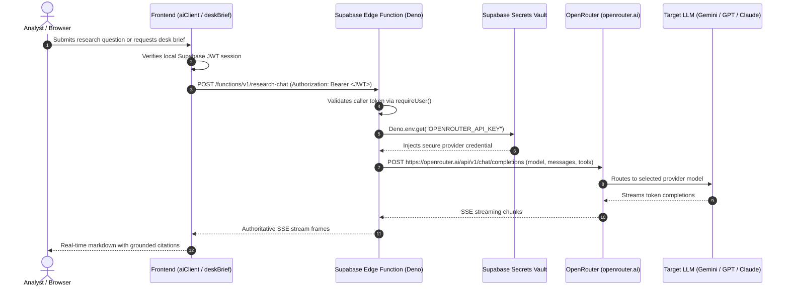

# ADR 0008: Universal Supabase Secret OpenRouter Gateway

> **Status: Normative.**
> **Date:** 2026-09-27
> **Deciders:** Niyantran Architecture & Systems Team
> **Amended:** 2026-09-28 (section 5: the legacy AI path is retired)

---

## 1. Context and Problem Statement

Previously, divergent execution paths existed between the Supabase Edge runtime (`supabase/functions/research-chat`) and legacy Node/Vite development server endpoints (`server/aiApi.mjs`, `server/deskBrief.mjs`). The legacy server paths attempted to read `process.env.OPENROUTER_API_KEY` directly from the local host environment, throwing:

```text
OPENROUTER_API_KEY missing on the server. Set OPENROUTER_API_KEY in the host environment (never in the browser).
```

However, the repository architecture and owner policy intentionally store the **only** provider API key (`OPENROUTER_API_KEY`) as a secure Supabase Secret (`Deno.env.get('OPENROUTER_API_KEY')`). Asking developers to copy secrets into `.env`, `.env.local`, Vercel environment variables, or client state violates the security boundary and fragments credential management.

Furthermore, client-side abstractions previously retained legacy assumptions treating Google Gemini as a separate API provider from OpenRouter, rather than recognizing that `google/gemini-...` are model identifiers routed through the unified OpenRouter gateway.

---

## 2. Decision Outcomes

1. **Supabase is the Sole Secret Boundary:**
   The provider credential `OPENROUTER_API_KEY` exists **exclusively** as a Supabase Secret in the Supabase Edge runtime. No `.env`, `.env.local`, Vercel client configuration, browser code, or host environment file may require or contain this secret.

2. **Supabase Edge Functions as Universal AI Gateway:**
   All production AI operations are executed through authenticated Supabase Edge Functions:
   - **Streaming Research Chat:** `supabase/functions/research-chat` (canonical streaming chat, document/row grounding, tool-use, citations, and conversation persistence).
   - **Desk Entry Briefs:** `supabase/functions/desk-brief` (canonical structured row extraction and narrative generation).
   - **Vector Embeddings:** `supabase/functions/_shared/embed.ts` (1536-dim embeddings via `openai/text-embedding-3-small`).
   - **Model Allowlist & Pricing:** `supabase/functions/admin-models` and `supabase/functions/refresh-model-pricing`.

3. **Client-Side Communication Contract:**
   The browser communicates with Edge Functions using standard Supabase authentication:
   ```http
   POST https://<project-ref>.supabase.co/functions/v1/research-chat
   Authorization: Bearer <Supabase access token>
   Content-Type: application/json
   ```
   No provider API keys are ever transmitted from or exposed to the browser.

4. **Model Abstraction Unification:**
   The platform uses OpenRouter as the single universal model gateway. Model identifiers such as `google/gemini-2.0-flash-001`, `google/gemini-flash-1.5`, and `openai/gpt-4o-mini` are OpenRouter model strings, not separate provider integrations. The UI and provider stores represent the provider uniformly as `openrouter`.

5. **Legacy Server Path Sanitization:**
   Legacy Node endpoints (`server/aiApi.mjs`, `server/deskBrief.mjs`) no longer require `process.env.OPENROUTER_API_KEY`. If local host keys are absent, they delegate to the canonical Supabase Edge backend or return a clean, unrevealing error:
   ```json
   { "ok": false, "error": "AI research service is temporarily unavailable." }
   ```
   Under no circumstances is an infrastructure secret or configuration request exposed to users.

---

## 3. Architecture Sequence



---

## 4. Verification and Invariants

- **Zero Secret Exposure:** Verified with repository-wide search that no provider secrets exist in client code, test fixtures, or public configuration.
- **Default Production Target:** `VITE_AI_BACKEND` defaults to `'supabase'` in application builds, guaranteeing the edge gateway is active.
- **Test Integrity:** All 40 test files (637 unit/integration tests) pass cleanly without requiring a local `OPENROUTER_API_KEY`.

---

## 5. Amendment (2026-09-28)

The legacy AI path was retired in 14b2344 (plan task D4). Decision outcomes 1
to 3 are unchanged: `OPENROUTER_API_KEY` exists only as a Supabase Secret, and
no file outside `supabase/functions/` calls a model provider. The following
statements above are no longer accurate and are kept only as the record:

- **Outcome 4, "provider stores":** `src/lib/aiModelsStore.js` was deleted. The
  browser reads enabled models, roles and pricing from `public.ai_models`,
  `public.ai_roles` and `public.model_pricing` under RLS
  (`src/lib/aiRegistry.js`). The default model is the row flagged `is_default`
  (ADR 0002), so the model ids quoted in outcome 4 are examples only.
- **Outcome 5:** `server/aiApi.mjs` no longer handles chat and never delegates it.
  It serves only `/api/ai/desk-brief` and `/api/ai/source-extract`. The browser
  sends chat straight to `research-chat`. `server/deskBrief.mjs` forwards the
  caller's bearer to the `desk-brief` Edge Function and returns the generic
  "AI research service is temporarily unavailable." message when that function
  fails or cannot be reached.
- **Section 4, "Default Production Target":** `VITE_AI_BACKEND` is no longer
  read or defined. There is only one AI backend, so there is no flag to
  default. The test counts in that section record a run on 2026-09-27.
