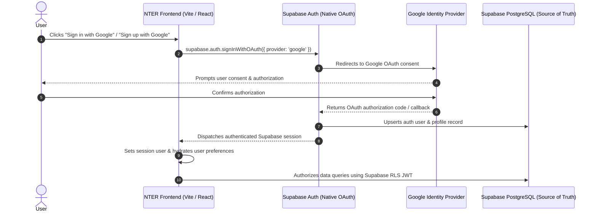
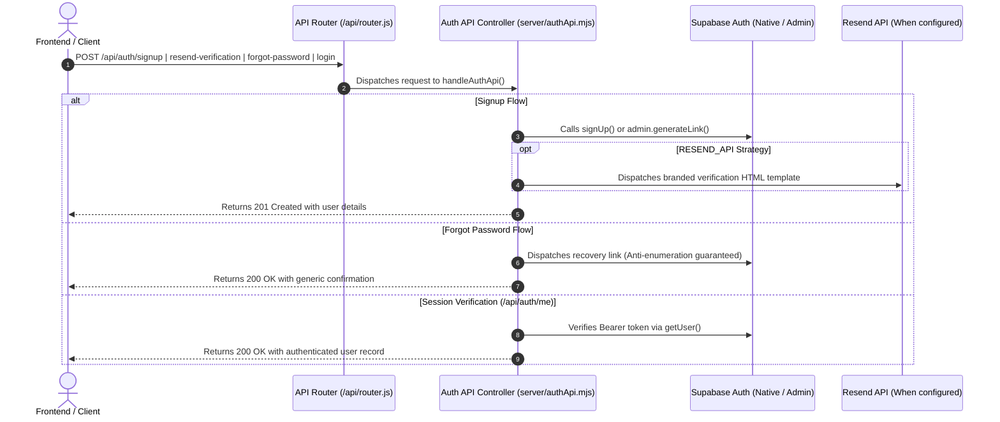
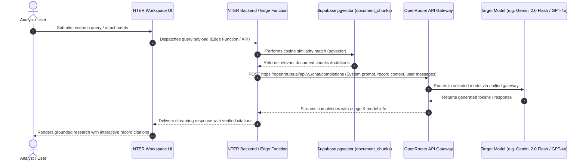
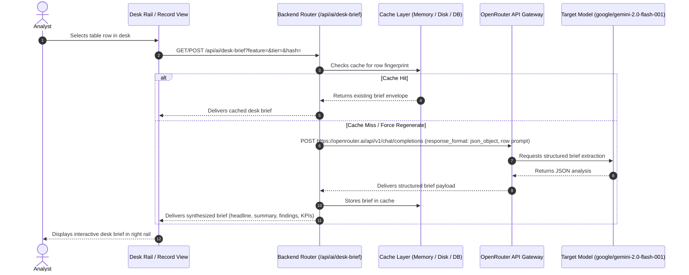

# System Execution Flows

> **Status: Living.** Describes the authoritative execution paths for authentication,
> AI research, desk brief synthesis, and data pipelines in Niyantran Terminal.

## 1. Authentication Flow: Native Google OAuth & Supabase Auth

Google authentication is handled exclusively through Supabase Auth native OAuth.
No custom token verification or server-side OAuth proxies (`google-auth-library` or `server/googleAuth.mjs`)
are used in the active execution path.

**Key Execution Stages:**
1. **User Initiation:** User clicks the Google Sign-In or Sign-Up button in `GoogleSignInButton.jsx`.
2. **Direct Native Handshake:** `supabase.auth.signInWithOAuth({ provider: 'google', options: { redirectTo } })` initiates browser OAuth flow directly with Supabase.
3. **Session Establishment:** Upon return from OAuth redirect, Supabase Auth issues durable session JWTs.
4. **Authorization:** All authenticated API requests attach the Supabase bearer token. PostgreSQL RLS policies enforce tenant and role isolation.

### 1.2. Server-Side Authentication Endpoints Flow (`/api/auth/*`)

Server-side authentication endpoints in `server/authApi.mjs` provide switchable transactional email delivery (`SUPABASE_NATIVE` or `RESEND_API`) and session verification:

---

## 2. Universal AI Research & RAG Flow

OpenRouter is the universal LLM gateway for all conversational AI, document grounding, and streaming research.
Direct LLM calls to Google Generative Language API, Gemini direct endpoints, or legacy providers are prohibited.

**Key Execution Stages:**
1. **Query Submission:** The analyst submits a research prompt with attached terminal rows, PDFs, or desk scope.
2. **RAG Retrieval:** The backend queries `public.document_chunks` using pgvector cosine similarity matching (`match_document_chunks`).
3. **Gateway Dispatch:** The backend packages the system prompt, grounding rules, extracted document text, and user messages, sending them to OpenRouter (`https://openrouter.ai/api/v1/chat/completions`) using the server-side `OPENROUTER_API_KEY`.
4. **Model Execution & Streaming:** OpenRouter routes the request to the configured model (e.g., `google/gemini-2.0-flash-001`). The generated narrative and citation IDs stream back to the client interface.

---

## 3. Desk Brief Generation Flow

Desk briefs provide structured entity organization for selected table rows in analytical desks.
Desk briefs are generated by the server via OpenRouter and cached in local memory, SQLite/file cache for development, and persisted in database records.

**Key Execution Stages:**
1. **Fingerprint Evaluation:** Stable hash generated from row fields (`entryFingerprint`).
2. **Cache Resolution:** Fast memory and disk check; if present, skips remote LLM call entirely.
3. **Structured OpenRouter Call:** When cache misses, `callOpenRouter` queries OpenRouter using `response_format: { type: 'json_object' }`.
4. **Normalization & Response:** The JSON response is normalized with server-calculated charts and returned to the frontend.
