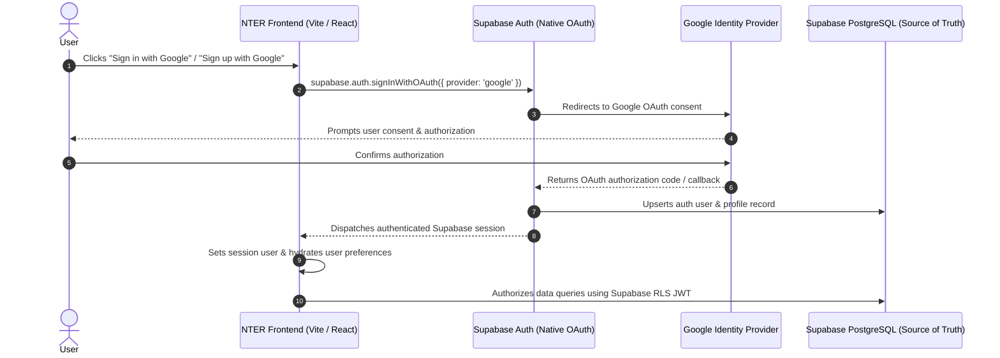
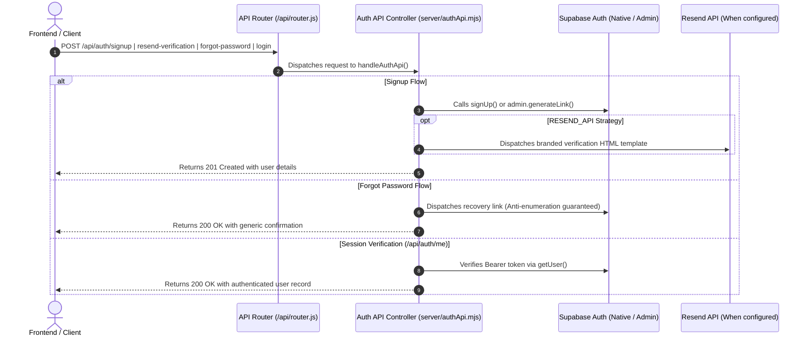
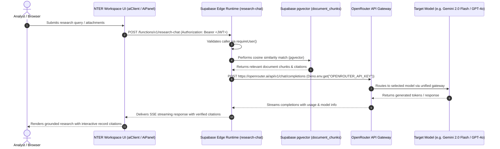
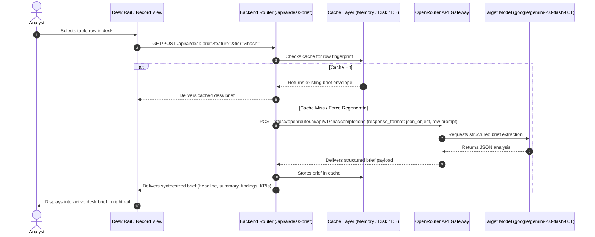
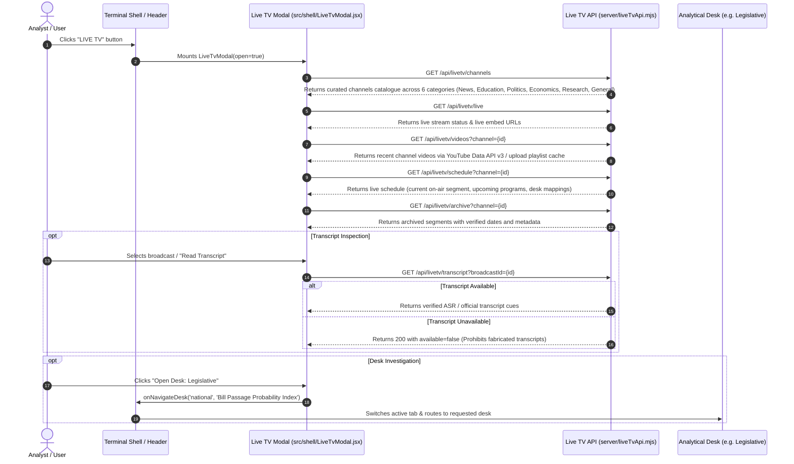
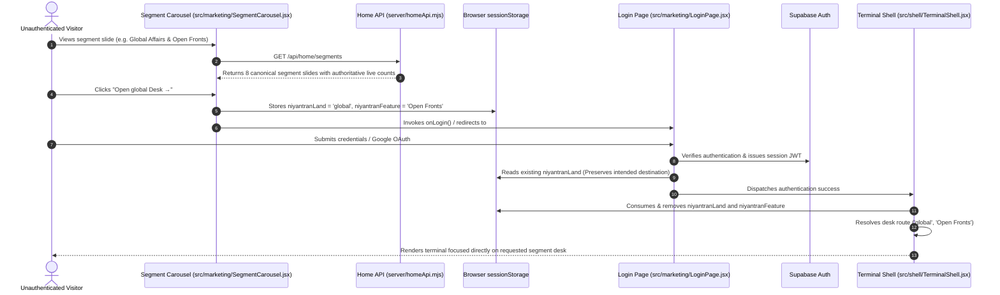
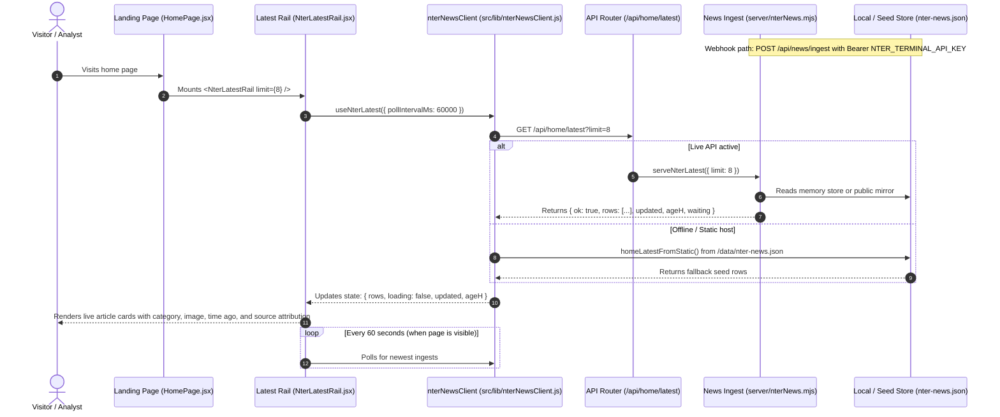
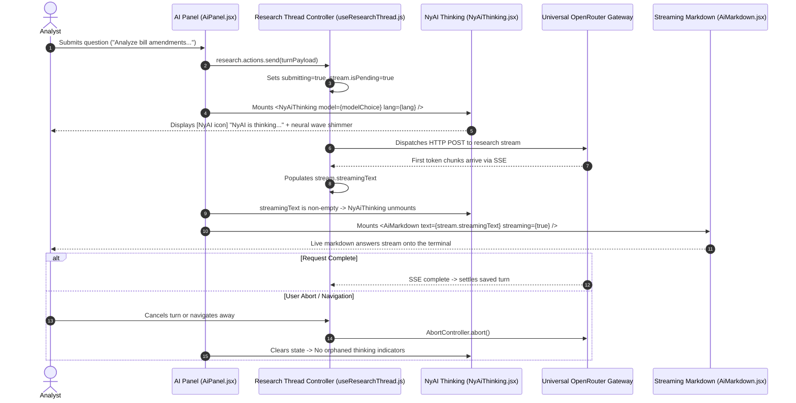
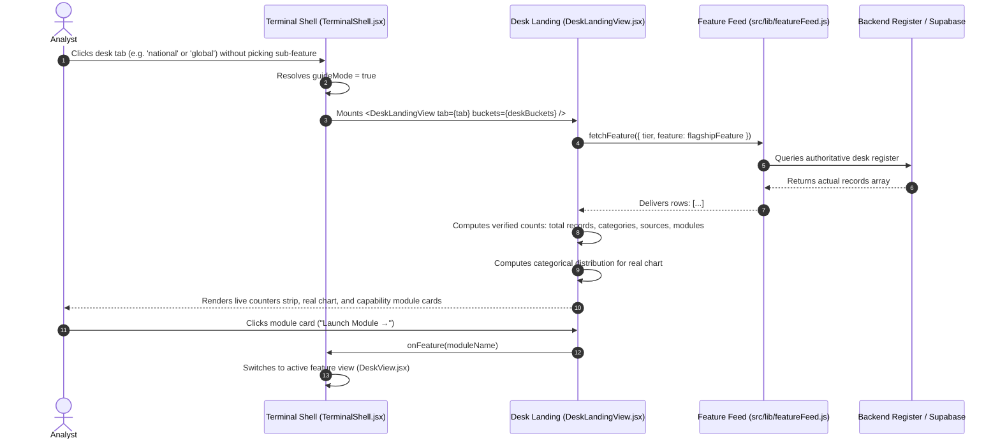

# System Execution Flows

> **Status: Living.** Describes the authoritative execution paths for authentication,
> AI research, desk brief synthesis, and data pipelines in Niyantran Terminal.

## 1. Authentication Flow: Native Google OAuth & Supabase Auth

Google authentication is handled exclusively through Supabase Auth native OAuth.
No custom token verification or server-side OAuth proxies (`google-auth-library` or `server/googleAuth.mjs`)
are used in the active execution path.


```mermaid
sequenceDiagram
    autonumber
    actor User
    participant Frontend as NTER Frontend (Vite / React)
    participant SupabaseAuth as Supabase Auth (Native OAuth)
    participant Google as Google Identity Provider
    participant DB as Supabase PostgreSQL (Source of Truth)

    User->>Frontend: Clicks "Sign in with Google" / "Sign up with Google"
    Frontend->>SupabaseAuth: supabase.auth.signInWithOAuth({ provider: 'google' })
    SupabaseAuth->>Google: Redirects to Google OAuth consent
    Google-->>User: Prompts user consent & authorization
    User->>Google: Confirms authorization
    Google-->>SupabaseAuth: Returns OAuth authorization code / callback
    SupabaseAuth->>DB: Upserts auth user & profile record
    SupabaseAuth-->>Frontend: Dispatches authenticated Supabase session
    Frontend->>Frontend: Sets session user & hydrates user preferences
    Frontend->>DB: Authorizes data queries using Supabase RLS JWT
```

**Key Execution Stages:**
1. **User Initiation:** User clicks the Google Sign-In or Sign-Up button in `GoogleSignInButton.jsx`.
2. **Direct Native Handshake:** `supabase.auth.signInWithOAuth({ provider: 'google', options: { redirectTo } })` initiates browser OAuth flow directly with Supabase.
3. **Session Establishment:** Upon return from OAuth redirect, Supabase Auth issues durable session JWTs.
4. **Authorization:** All authenticated API requests attach the Supabase bearer token. PostgreSQL RLS policies enforce tenant and role isolation.

### 1.2. Server-Side Authentication Endpoints Flow (`/api/auth/*`)

Server-side authentication endpoints in `server/authApi.mjs` provide switchable transactional email delivery (`SUPABASE_NATIVE` or `RESEND_API`) and session verification:


```mermaid
sequenceDiagram
    autonumber
    actor Client as Frontend / Client
    participant Router as API Router (/api/router.js)
    participant AuthApi as Auth API Controller (server/authApi.mjs)
    participant Supabase as Supabase Auth (Native / Admin)
    participant Resend as Resend API (When configured)

    Client->>Router: POST /api/auth/signup | resend-verification | forgot-password | login
    Router->>AuthApi: Dispatches request to handleAuthApi()
    alt Signup Flow
        AuthApi->>Supabase: Calls signUp() or admin.generateLink()
        opt RESEND_API Strategy
            AuthApi->>Resend: Dispatches branded verification HTML template
        end
        AuthApi-->>Client: Returns 201 Created with user details
    else Forgot Password Flow
        AuthApi->>Supabase: Dispatches recovery link (Anti-enumeration guaranteed)
        AuthApi-->>Client: Returns 200 OK with generic confirmation
    else Session Verification (/api/auth/me)
        AuthApi->>Supabase: Verifies Bearer token via getUser()
        AuthApi-->>Client: Returns 200 OK with authenticated user record
    end
```

---

## 2. Universal AI Research & RAG Flow (Supabase Edge Gateway)

OpenRouter is the universal LLM gateway for all conversational AI, document grounding, and streaming research.
The credential `OPENROUTER_API_KEY` exists **strictly in Supabase Secrets** and is never placed in `.env`, the browser, or Node host configurations.

```
Browser
  |
  | Supabase Auth bearer token
  v
Supabase Edge Function (research-chat / desk-brief / embed)
  |
  | Deno.env.get("OPENROUTER_API_KEY")
  v
OpenRouter (https://openrouter.ai/api/v1)
  |
  +--> selected model (google/gemini-2.0-flash-001, openai/gpt-4o-mini, etc.)
  |
  +--> streaming response (SSE token chunks)
  |
  +--> embeddings (openai/text-embedding-3-small, 1536 dims)
```


```mermaid
sequenceDiagram
    autonumber
    actor Analyst as Analyst / Browser
    participant Client as NTER Workspace UI (aiClient / AiPanel)
    participant Edge as Supabase Edge Runtime (research-chat)
    participant VectorDB as Supabase pgvector (document_chunks)
    participant OpenRouter as OpenRouter API Gateway
    participant LLM as Target Model (e.g. Gemini 2.0 Flash / GPT-4o)

    Analyst->>Client: Submits research query / attachments
    Client->>Edge: POST /functions/v1/research-chat (Authorization: Bearer <JWT>)
    Edge->>Edge: Validates caller via requireUser()
    Edge->>VectorDB: Performs cosine similarity match (pgvector)
    VectorDB-->>Edge: Returns relevant document chunks & citations
    Edge->>OpenRouter: POST https://openrouter.ai/api/v1/chat/completions (Deno.env.get("OPENROUTER_API_KEY"))
    OpenRouter->>LLM: Routes to selected model via unified gateway
    LLM-->>OpenRouter: Returns generated tokens / response
    OpenRouter-->>Edge: Streams completions with usage & model info
    Edge-->>Client: Delivers SSE streaming response with verified citations
    Client-->>Analyst: Renders grounded research with interactive record citations
```

**Key Execution Stages:**
1. **Query Submission:** The analyst submits a research prompt with attached terminal rows, PDFs, or desk scope.
2. **Edge Security Boundary:** The browser passes its authenticated Supabase access token to the Edge Function (`research-chat`); no API key is sent or possessed by the browser.
3. **RAG Retrieval:** The Edge Function queries `public.document_chunks` using pgvector cosine similarity matching (`match_document_chunks`).
4. **Gateway Dispatch:** The Edge Function reads `Deno.env.get('OPENROUTER_API_KEY')` and queries OpenRouter (`https://openrouter.ai/api/v1/chat/completions`).
5. **Model Execution & Streaming:** OpenRouter routes the request to the configured model (e.g., `google/gemini-2.0-flash-001`). The generated narrative and citation IDs stream back via SSE directly to the client interface.


---

## 3. Desk Brief Generation Flow

Desk briefs provide structured entity organization for selected table rows in analytical desks.
Desk briefs are generated by the server via OpenRouter and cached in local memory, SQLite/file cache for development, and persisted in database records.


```mermaid
sequenceDiagram
    autonumber
    actor Analyst as Analyst
    participant Frontend as Desk Rail / Record View
    participant Router as Backend Router (/api/ai/desk-brief)
    participant Cache as Cache Layer (Memory / Disk / DB)
    participant OpenRouter as OpenRouter API Gateway
    participant LLM as Target Model (google/gemini-2.0-flash-001)

    Analyst->>Frontend: Selects table row in desk
    Frontend->>Router: GET/POST /api/ai/desk-brief?feature=&tier=&hash=
    Router->>Cache: Checks cache for row fingerprint
    alt Cache Hit
        Cache-->>Router: Returns existing brief envelope
        Router-->>Frontend: Delivers cached desk brief
    else Cache Miss / Force Regenerate
        Router->>OpenRouter: POST https://openrouter.ai/api/v1/chat/completions (response_format: json_object, row prompt)
        OpenRouter->>LLM: Requests structured brief extraction
        LLM-->>OpenRouter: Returns JSON analysis
        OpenRouter-->>Router: Delivers structured brief payload
        Router->>Cache: Stores brief in cache
        Router-->>Frontend: Delivers synthesized brief (headline, summary, findings, KPIs)
    end
    Frontend-->>Analyst: Displays interactive desk brief in right rail
```

**Key Execution Stages:**
1. **Fingerprint Evaluation:** Stable hash generated from row fields (`entryFingerprint`).
2. **Cache Resolution:** Fast memory and disk check; if present, skips remote LLM call entirely.
3. **Structured OpenRouter Call:** When cache misses, `callOpenRouter` queries OpenRouter using `response_format: { type: 'json_object' }`.
4. **Normalization & Response:** The JSON response is normalized with server-calculated charts and returned to the frontend.

---

## 4. Live TV Intelligence Streaming & Verification Flow (CR-08)

The Live TV intelligence module connects public broadcasting and parliamentary proceedings directly to analytical desks without ungrounded mock streams.


```mermaid
sequenceDiagram
    autonumber
    actor Analyst as Analyst / User
    participant Shell as Terminal Shell / Header
    participant Modal as Live TV Modal (src/shell/LiveTvModal.jsx)
    participant Backend as Live TV API (server/liveTvApi.mjs)
    participant Desk as Analytical Desk (e.g. Legislative)

    Analyst->>Shell: Clicks "LIVE TV" button
    Shell->>Modal: Mounts LiveTvModal(open=true)
    Modal->>Backend: GET /api/livetv/channels
    Backend-->>Modal: Returns curated channels catalogue across 6 categories (News, Education, Politics, Economics, Research, General)
    Modal->>Backend: GET /api/livetv/live
    Backend-->>Modal: Returns live stream status & live embed URLs
    Modal->>Backend: GET /api/livetv/videos?channel={id}
    Backend-->>Modal: Returns recent channel videos via YouTube Data API v3 / upload playlist cache
    Modal->>Backend: GET /api/livetv/schedule?channel={id}
    Backend-->>Modal: Returns live schedule (current on-air segment, upcoming programs, desk mappings)
    Modal->>Backend: GET /api/livetv/archive?channel={id}
    Backend-->>Modal: Returns archived segments with verified dates and metadata
    opt Transcript Inspection
        Analyst->>Modal: Selects broadcast / "Read Transcript"
        Modal->>Backend: GET /api/livetv/transcript?broadcastId={id}
        alt Transcript Available
            Backend-->>Modal: Returns verified ASR / official transcript cues
        else Transcript Unavailable
            Backend-->>Modal: Returns 200 with available=false (Prohibits fabricated transcripts)
        end
    end
    opt Desk Investigation
        Analyst->>Modal: Clicks "Open Desk: Legislative"
        Modal->>Shell: onNavigateDesk('national', 'Bill Passage Probability Index')
        Shell->>Desk: Switches active tab & routes to requested desk
    end
```

---

## 5. Front-Page Segment Carousel & Sign-In Navigation Gate Flow (CR-09)

The front-page carousel allows unauthenticated analysts to explore verified public metrics across all 8 canonical analytical segments, preserving their navigation intent when signing in.


```mermaid
sequenceDiagram
    autonumber
    actor Visitor as Unauthenticated Visitor
    participant Carousel as Segment Carousel (src/marketing/SegmentCarousel.jsx)
    participant HomeApi as Home API (server/homeApi.mjs)
    participant Session as Browser sessionStorage
    participant Login as Login Page (src/marketing/LoginPage.jsx)
    participant Supabase as Supabase Auth
    participant Shell as Terminal Shell (src/shell/TerminalShell.jsx)

    Visitor->>Carousel: Views segment slide (e.g. Global Affairs & Open Fronts)
    Carousel->>HomeApi: GET /api/home/segments
    HomeApi-->>Carousel: Returns 8 canonical segment slides with authoritative live counts
    Visitor->>Carousel: Clicks "Open global Desk →"
    Carousel->>Session: Stores niyantranLand = 'global', niyantranFeature = 'Open Fronts'
    Carousel->>Login: Invokes onLogin() / redirects to #login
    Visitor->>Login: Submits credentials / Google OAuth
    Login->>Supabase: Verifies authentication & issues session JWT
    Login->>Session: Reads existing niyantranLand (Preserves intended destination)
    Login->>Shell: Dispatches authentication success
    Shell->>Session: Consumes & removes niyantranLand and niyantranFeature
    Shell->>Shell: Resolves desk route ('global', 'Open Fronts')
    Shell-->>Visitor: Renders terminal focused directly on requested segment desk
```

---

## 6. NTER.news Live Latest Rail Flow (CR-12)

Replaces frozen Market Metrics in the primary position with live intelligence feed data from `nter.news`.


```mermaid
sequenceDiagram
    autonumber
    actor Visitor as Visitor / Analyst
    participant Landing as Landing Page (HomePage.jsx)
    participant Rail as Latest Rail (NterLatestRail.jsx)
    participant Client as nterNewsClient (src/lib/nterNewsClient.js)
    participant Router as API Router (/api/home/latest)
    participant Ingest as News Ingest (server/nterNews.mjs)
    participant Store as Local / Seed Store (nter-news.json)

    Note over Ingest,Store: Webhook path: POST /api/news/ingest with Bearer NTER_TERMINAL_API_KEY
    Visitor->>Landing: Visits home page
    Landing->>Rail: Mounts <NterLatestRail limit={8} />
    Rail->>Client: useNterLatest({ pollIntervalMs: 60000 })
    Client->>Router: GET /api/home/latest?limit=8
    alt Live API active
        Router->>Ingest: serveNterLatest({ limit: 8 })
        Ingest->>Store: Reads memory store or public mirror
        Ingest-->>Client: Returns { ok: true, rows: [...], updated, ageH, waiting }
    else Offline / Static host
        Client->>Store: homeLatestFromStatic() from /data/nter-news.json
        Store-->>Client: Returns fallback seed rows
    end
    Client-->>Rail: Updates state: { rows, loading: false, updated, ageH }
    Rail-->>Visitor: Renders live article cards with category, image, time ago, and source attribution
    loop Every 60 seconds (when page is visible)
        Rail->>Client: Polls for newest ingests
    end
```

---

## 7. NyAI Thinking Animation & Streaming Transition Flow (CR-13)

Provides an accessible, branded research assistant thinking state during LLM reasoning and retrieval before streaming tokens arrive.


```mermaid
sequenceDiagram
    autonumber
    actor Analyst as Analyst
    participant Panel as AI Panel (AiPanel.jsx)
    participant Thread as Research Thread Controller (useResearchThread.js)
    participant Thinking as NyAI Thinking (NyAiThinking.jsx)
    participant Gateway as Universal OpenRouter Gateway
    participant Stream as Streaming Markdown (AiMarkdown.jsx)

    Analyst->>Panel: Submits question ("Analyze bill amendments...")
    Panel->>Thread: research.actions.send(turnPayload)
    Thread->>Thread: Sets submitting=true, stream.isPending=true
    Panel->>Thinking: Mounts <NyAiThinking model={modelChoice} lang={lang} />
    Thinking-->>Analyst: Displays [NyAI icon] "NyAI is thinking..." + neural wave shimmer
    Thread->>Gateway: Dispatches HTTP POST to research stream
    Gateway-->>Thread: First token chunks arrive via SSE
    Thread->>Thread: Populates stream.streamingText
    Panel->>Thinking: streamingText is non-empty -> NyAiThinking unmounts
    Panel->>Stream: Mounts <AiMarkdown text={stream.streamingText} streaming={true} />
    Stream-->>Analyst: Live markdown answers stream onto the terminal
    alt Request Complete
        Gateway-->>Thread: SSE complete -> settles saved turn
    else User Abort / Navigation
        Analyst->>Thread: Cancels turn or navigates away
        Thread->>Gateway: AbortController.abort()
        Panel->>Thinking: Clears state -> No orphaned thinking indicators
    end
```

---

## 8. Desk Landing Pages Flow

Replaces static text guides on desk landing routes with verified live counters, modular capability cards, and one real categorical chart.


```mermaid
sequenceDiagram
    autonumber
    actor Analyst as Analyst
    participant Shell as Terminal Shell (TerminalShell.jsx)
    participant LandingView as Desk Landing (DeskLandingView.jsx)
    participant FeedLib as Feature Feed (src/lib/featureFeed.js)
    participant DB as Backend Register / Supabase

    Analyst->>Shell: Clicks desk tab (e.g. 'national' or 'global') without picking sub-feature
    Shell->>Shell: Resolves guideMode = true
    Shell->>LandingView: Mounts <DeskLandingView tab={tab} buckets={deskBuckets} />
    LandingView->>FeedLib: fetchFeature({ tier, feature: flagshipFeature })
    FeedLib->>DB: Queries authoritative desk register
    DB-->>FeedLib: Returns actual records array
    FeedLib-->>LandingView: Delivers rows: [...]
    LandingView->>LandingView: Computes verified counts: total records, categories, sources, modules
    LandingView->>LandingView: Computes categorical distribution for real chart
    LandingView-->>Analyst: Renders live counters strip, real chart, and capability module cards
    Analyst->>LandingView: Clicks module card ("Launch Module →")
    LandingView->>Shell: onFeature(moduleName)
    Shell->>Shell: Switches to active feature view (DeskView.jsx)
```


## 9. Front-Page Carousel Flow (CR-09 / CR-10)

The **SegmentCarousel** is the primary segment discovery mechanism on the marketing home page.
The duplicate "One Terminal. Endless Intelligence." (mkt-caps) section was removed in CR-10 because it competed with the carousel.

```
Unauthenticated visitor
  ↓
HomePage renders SegmentCarousel (fetches /api/home/segments for live counts)
  ↓
Visitor clicks "Open {desk} Desk →" on active slide
  ↓
handleOpenDesk(seg):
  sessionStorage.setItem('niyantranLand', seg.deskId)
  sessionStorage.setItem('niyantranFeature', seg.feature)
  onLogin() → shows LoginPage / Google sign-in
  ↓
After successful sign-in:
  TerminalShell.jsx reads sessionStorage.niyantranLand
  → resolveDeskRoute(land, intendedFeature)
  → Correct desk opens (not a generic dashboard)
```

**Keyboard Navigation (CR-09 accessibility):**
- `ArrowLeft` / `ArrowUp` → Previous slide
- `ArrowRight` / `ArrowDown` → Next slide
- `Home` → First slide
- `End` → Last slide
- Autoplay pauses on `mouseenter`, resumes on `mouseleave`.

**Data flow:**
```
Browser → GET /api/home/segments
  → server/homeApi.mjs serveHomeSegments()
  → Returns authoritative segments array (8 segments × live counts)
  → SegmentCarousel renders from backend data
  → Falls back to FALLBACK_SEGMENTS if backend unavailable
```

---

## 10. Live TV & Transcript Flow (CR-08)

```
User clicks "LIVE TV" in TerminalShell or DeskLandingView (or navigates to #livetv)
  ↓
LiveTvModal mounts
  ↓
Fetches channels:  GET /api/livetv/channels
Fetches live:      GET /api/livetv/live
Fetches videos:    GET /api/livetv/videos?channel=<id>
Fetches schedule:  GET /api/livetv/schedule?channel=<id>
Fetches archive:   GET /api/livetv/archive?channel=<id>
  ↓
User selects broadcast or switches to Transcript tab:
  ↓
Fetches transcript: GET /api/livetv/transcript?broadcastId=<id>
  ↓
Backend resolution (server/liveTvApi.mjs -> BROADCAST_TRANSCRIPTS / api/router.js):
  - If transcript available (e.g. arch-dd-2026-09-26, arch-stv-2026-09-25, arch-wion-2026-09-24):
    Returns ok: true, available: true, source, cues: [{timestamp, speaker, text}]
    LiveTvModal renders timestamped cues, speaker tags, timestamps, and real-time search filter.
  - If transcript unavailable (e.g. arch-cnbc-2026-09-23 or un-transcribed live stream):
    Returns ok: true, available: false, cues: []
    LiveTvModal renders explicit non-fabricated message ("Transcript unavailable for this broadcast. No fabricated transcript generated.").
```

---

## 11. Vercel Production Deployment & Routing Reconciliation

```
Browser Client (Vercel Origin / Production)
  ↓
/api/* Request (Vercel Rewrite: /api/(.*) → /api/router?__route=$1)
  ↓
api/router.js (Single Consolidated Serverless Gateway)
  ├─ /api/feature-feed        → server/featureFeed.mjs
  ├─ /api/home/*              → server/homeApi.mjs
  ├─ /api/livetv/*            → server/liveTvApi.mjs (13 YouTube channels + cache)
  ├─ /api/news/ingest         → server/nterNews.mjs (bearer authenticated)
  ├─ /api/marketing/intro-video → server/marketingMediaApi.mjs
  ├─ /api/analytics/*         → server/analyticsApi.mjs
  ├─ /api/user-prefs          → server/userPrefsApi.mjs (Supabase JWT caller verified)
  ├─ /api/billing/*           → server/billingApi.mjs
  ├─ /api/air, /api/ships     → server/transitApi.mjs
  ├─ /api/opensanctions, /api/fts → server/diplomacyApi.mjs
  ├─ /api/portwatch, etc.     → server/assetsApi.mjs
  ├─ /api/users               → server/usersApi.mjs (Supabase session verification)
  ├─ /api/auth/*              → server/authApi.mjs
  ├─ /api/ai/chat             → server/aiApi.mjs (OpenRouter server key OR Supabase Edge Function research-chat)
  └─ /api/ai/desk-brief       → server/deskBrief.mjs
```

**Resolution of Production Deployment Issues (Ready for Production):**
1. **`/api/marketing/intro-video` & `/api/analytics/event` & `/api/user-prefs` (404 → 200/401):** Updated `routePath(req)` in `api/router.js` to extract `__route` from `req.url` search params when `req.query` is not pre-populated in serverless node execution.
2. **Native Supabase Auth (Section 2):** Removed obsolete custom variable-based email auth and backend proxies. `SignupPage.jsx` now uses browser-native `supabase.auth.signUp()` and `supabase.auth.resend()`. `ForgotPasswordPage.jsx` uses `supabase.auth.resetPasswordForEmail()`. Google OAuth uses native `supabase.auth.signInWithOAuth()`.
3. **Live TV YouTube Player Error 153 (Section 9):** Replaced `referrerPolicy="no-referrer"` with `referrerPolicy="strict-origin-when-cross-origin"`, added explicit `origin` query parameter to embed URLs, and added a truthful fallback card with a direct "Watch on YouTube ↗" link for non-embeddable or offline broadcasts.
4. **AI Research Authentication & Gateway (Section 4):** Attached `apikey` (`supabase.supabaseKey`) in `sendResearchTurn()` and in `server/aiApi.mjs` when proxying to `research-chat` Edge Function. `OPENROUTER_API_KEY` remains strictly server-side in Supabase Secrets.
5. **Admin-Approved LLM Module (Section 6):** Reused `public.ai_models` allowlist via `loadRegistry()`. Added truthful empty and loading states in `ModelPicker.jsx`.
6. **Semantic Card/Status Colors (Section 8):** Added `getStatusToneClass()` in `src/lib/format.js` and high-contrast semantic classes (`.status-green`, `.status-amber`, `.status-red`, `.status-neutral`) in `src/index.css`.
7. **Supabase Clock Skew Warning (Section 16):** Confirmed non-breaking informational warning in `@supabase/gotrue-js` (`GoTrueClient.ts:3951`) caused by client machine clock lagging behind Supabase server UTC time.
8. **External Extension Warnings:** Confirmed third-party web3/MetaMask wallet content scripts (`ObjectMultiplex`), not originating from NTER.


