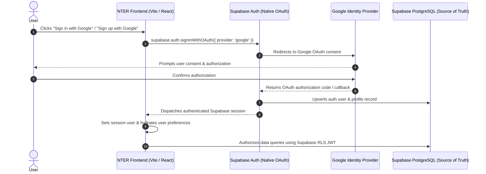
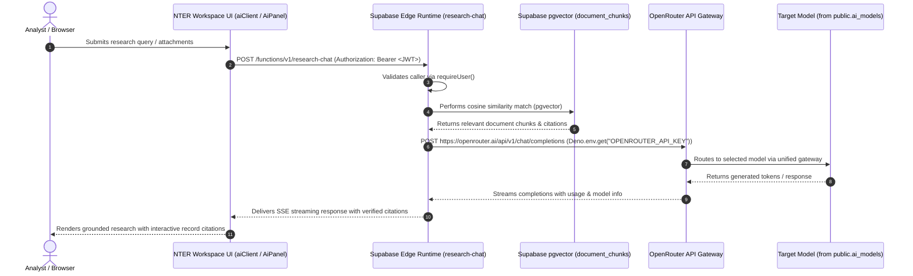
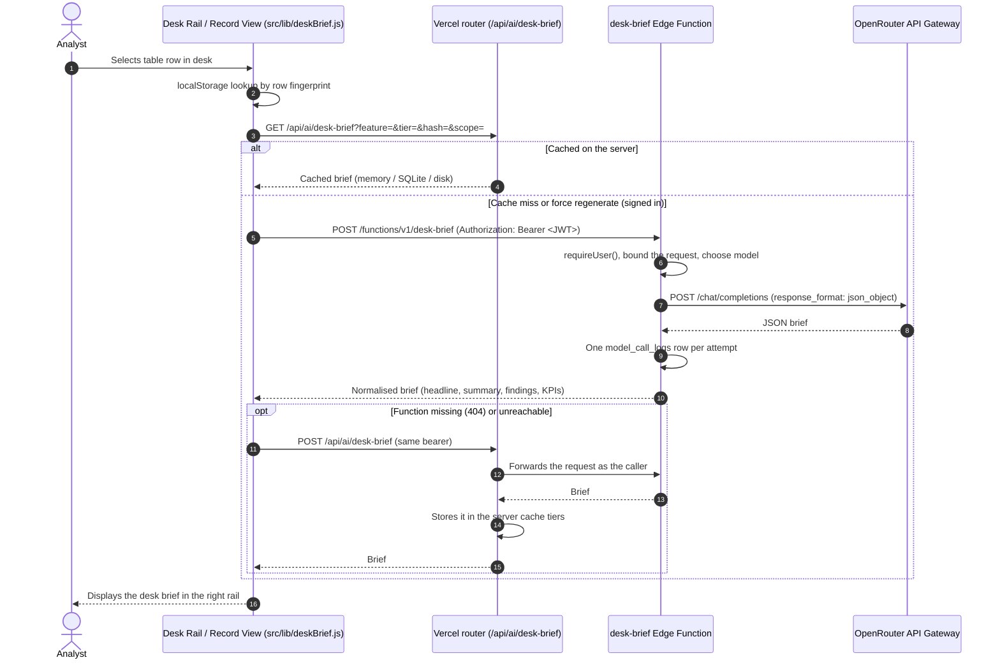
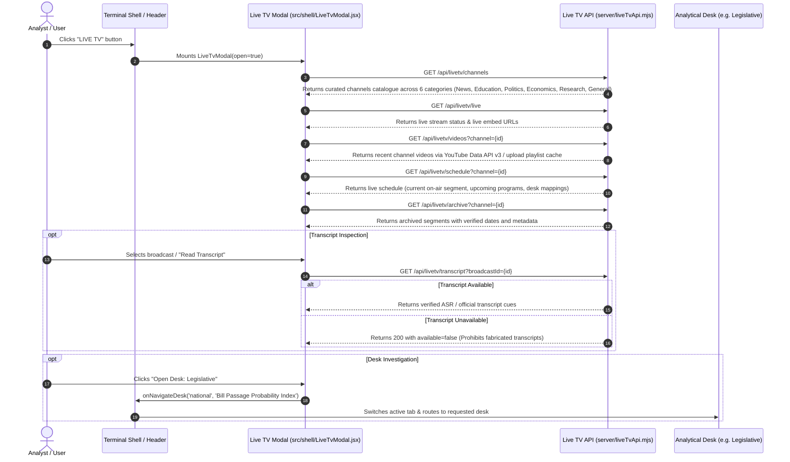
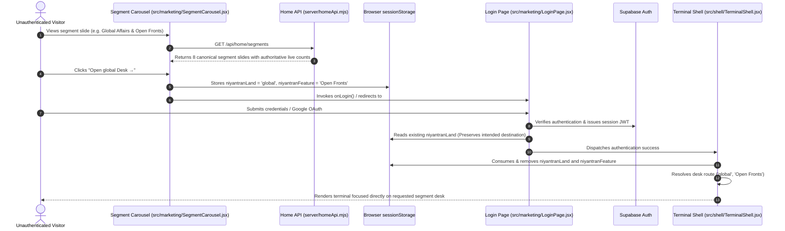
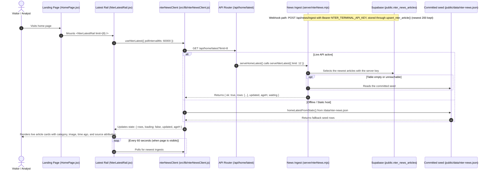
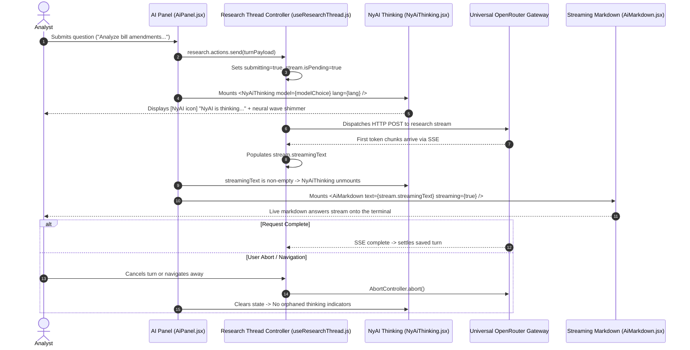
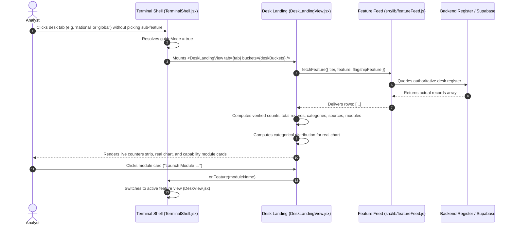

# System Execution Flows

> **Status: Living.** Describes the authoritative execution paths for authentication,
> AI research, desk brief synthesis, and data pipelines in Niyantran Terminal.

## 1. Authentication Flow: Native Google OAuth & Supabase Auth

Google authentication is handled exclusively through Supabase Auth native OAuth.
No custom token verification or server-side OAuth proxies (`google-auth-library` or `server/googleAuth.mjs`)
are used in the active execution path.


```mermaid
sequenceDiagram
    autonumber
    actor User
    participant Frontend as NTER Frontend (Vite / React)
    participant SupabaseAuth as Supabase Auth (Native OAuth)
    participant Google as Google Identity Provider
    participant DB as Supabase PostgreSQL (Source of Truth)

    User->>Frontend: Clicks "Sign in with Google" / "Sign up with Google"
    Frontend->>SupabaseAuth: supabase.auth.signInWithOAuth({ provider: 'google' })
    SupabaseAuth->>Google: Redirects to Google OAuth consent
    Google-->>User: Prompts user consent & authorization
    User->>Google: Confirms authorization
    Google-->>SupabaseAuth: Returns OAuth authorization code / callback
    SupabaseAuth->>DB: Upserts auth user & profile record
    SupabaseAuth-->>Frontend: Dispatches authenticated Supabase session
    Frontend->>Frontend: Sets session user & hydrates user preferences
    Frontend->>DB: Authorizes data queries using Supabase RLS JWT
```

**Key Execution Stages:**
1. **User Initiation:** User clicks the Google Sign-In or Sign-Up button in `GoogleSignInButton.jsx`.
2. **Direct Native Handshake:** `supabase.auth.signInWithOAuth({ provider: 'google', options: { redirectTo } })` initiates browser OAuth flow directly with Supabase.
3. **Session Establishment:** Upon return from OAuth redirect, Supabase Auth issues durable session JWTs.
4. **Authorization:** All authenticated API requests attach the Supabase bearer token. PostgreSQL RLS policies enforce tenant and role isolation.

### 1.2. Email and password sign-in (browser to Supabase Auth)

The browser calls Supabase Auth directly for every account action; no Niyantran server route sits in between:

- `src/marketing/LoginPage.jsx`: `supabase.auth.signInWithPassword()`.
- `src/marketing/SignupPage.jsx`: `supabase.auth.signUp()` and `supabase.auth.resend()`. The persona picked at signup travels as `personaId` in the user metadata; `handle_new_user()` maps it onto `user_profiles.persona` (migration `20260928120000_signup_persona.sql`). The plan picked on the pricing page (the signup link's `plan` parameter) travels as `plan`; when it is `pro` or `enterprise`, `handle_new_user()` starts the account's one 14-day trial on the server and logs it in `plan_grants` (migration `20260929100000_plan_entitlements.sql`). The browser then reads the plan back through `my_entitlement()` (`refreshEntitlement()` in `src/lib/entitlementStore.js`) and never stores it.
- Trials after signup: the upgrade dialog (`src/shell/UpgradeModal.jsx`) calls the `start_trial()` RPC, which refuses an account that has used its trial or already pays. Google sign-ups carry no plan metadata, so they get no signup trial and start one from the upgrade dialog (open-work P10). *(Corrected 2026-09-29: before F2 phase 1 the trial and any paid plan were written only to `sessionStorage`.)*
- `src/marketing/ForgotPasswordPage.jsx`: `supabase.auth.resetPasswordForEmail()`.
- `src/marketing/GoogleSignInButton.jsx`: `supabase.auth.signInWithOAuth({ provider: 'google' })` (section 1).

`/api/auth/*` is **not served in production** (removed from `api/router.js` on 2026-09-28, `93f31e6`; the app never called it). `server/authApi.mjs`, with its switchable `SUPABASE_NATIVE` / `RESEND_API` email delivery, is still mounted by the Vite dev and preview servers only (`authApiPlugin()` in `vite.config.js`). *(Corrected 2026-09-28: this section previously described `/api/auth/*` as a live flow through the production router.)*

---

## 2. Universal AI Research & RAG Flow (Supabase Edge Gateway)

OpenRouter is the universal LLM gateway for all conversational AI, document grounding, and streaming research.
The credential `OPENROUTER_API_KEY` exists **strictly in Supabase Secrets** and is never placed in `.env`, the browser, or Node host configurations.

```
Browser
  |
  | Supabase Auth bearer token
  v
Supabase Edge Function (research-chat / desk-brief)
  |
  | Deno.env.get("OPENROUTER_API_KEY")
  v
OpenRouter (https://openrouter.ai/api/v1)
  |
  +--> selected model (enabled rows of public.ai_models; default google/gemini-3.8-flash on 2026-09-28)
  |
  +--> streaming response (SSE token chunks)
  |
  +--> embeddings (openai/text-embedding-3-small, 1536 dims)
```

There is no `embed` Edge Function: embedding is the shared module `supabase/functions/_shared/embed.ts`, used by `research-chat` (query vectors) and `ingest-documents` (chunk vectors). *(Corrected 2026-09-28.)*


```mermaid
sequenceDiagram
    autonumber
    actor Analyst as Analyst / Browser
    participant Client as NTER Workspace UI (aiClient / AiPanel)
    participant Edge as Supabase Edge Runtime (research-chat)
    participant VectorDB as Supabase pgvector (document_chunks)
    participant OpenRouter as OpenRouter API Gateway
    participant LLM as Target Model (from public.ai_models)

    Analyst->>Client: Submits research query / attachments
    Client->>Edge: POST /functions/v1/research-chat (Authorization: Bearer <JWT>)
    Edge->>Edge: Validates caller via requireUser()
    Edge->>VectorDB: Performs cosine similarity match (pgvector)
    VectorDB-->>Edge: Returns relevant document chunks & citations
    Edge->>OpenRouter: POST https://openrouter.ai/api/v1/chat/completions (Deno.env.get("OPENROUTER_API_KEY"))
    OpenRouter->>LLM: Routes to selected model via unified gateway
    LLM-->>OpenRouter: Returns generated tokens / response
    OpenRouter-->>Edge: Streams completions with usage & model info
    Edge-->>Client: Delivers SSE streaming response with verified citations
    Client-->>Analyst: Renders grounded research with interactive record citations
```

**Key Execution Stages:**
1. **Query Submission:** The analyst submits a research prompt with attached terminal rows, PDFs, or desk scope.
2. **Edge Security Boundary:** The browser passes its authenticated Supabase access token to the Edge Function (`research-chat`); no API key is sent or possessed by the browser.
3. **RAG Retrieval:** The Edge Function queries `public.document_chunks` using pgvector cosine similarity through the `match_documents` RPC (`_shared/retrieval.ts`), and desk rows through `search_desk_rows`.
4. **Gateway Dispatch:** The Edge Function reads `Deno.env.get('OPENROUTER_API_KEY')` and queries OpenRouter (`https://openrouter.ai/api/v1/chat/completions`).
5. **Model Execution & Streaming:** OpenRouter routes the request to the model chosen from `public.ai_models` (the row with `is_default = true`; on 2026-09-28 that is `google/gemini-3.8-flash`). The generated narrative and citation IDs stream back via SSE directly to the client interface.


---

## 3. Desk Brief Generation Flow

Desk briefs organise one selected table row in an analytical desk. They are generated by the `desk-brief` Edge Function (deployed; v2 on 2026-09-28), which verifies the caller, picks the model and calls OpenRouter with the key held in Supabase secrets. `server/deskBrief.mjs` never holds a provider key: the `/api/ai/desk-brief` route forwards the caller's own bearer to the function. *(Corrected 2026-09-28: this section previously said the function was not deployed and that the Vercel fallback called OpenRouter itself with `OPENROUTER_API_KEY`.)*

Caching: the browser keeps its own copy in `localStorage`. The router keeps briefs it has forwarded in memory, in `desk-briefs/*.json` under `writablePath()` and in the SQLite `entry_briefs` table (`server/db.mjs`). On Vercel those server tiers live under `/tmp` and are lost on cold starts; briefs are **not** stored in Supabase. The SQLite tier is due to be removed (open-work C3, blocked on owner action O4).


```mermaid
sequenceDiagram
    autonumber
    actor Analyst as Analyst
    participant Frontend as Desk Rail / Record View (src/lib/deskBrief.js)
    participant Router as Vercel router (/api/ai/desk-brief)
    participant Edge as desk-brief Edge Function
    participant OpenRouter as OpenRouter API Gateway

    Analyst->>Frontend: Selects table row in desk
    Frontend->>Frontend: localStorage lookup by row fingerprint
    Frontend->>Router: GET /api/ai/desk-brief?feature=&tier=&hash=&scope=
    alt Cached on the server
        Router-->>Frontend: Cached brief (memory / SQLite / disk)
    else Cache miss or force regenerate (signed in)
        Frontend->>Edge: POST /functions/v1/desk-brief (Authorization: Bearer <JWT>)
        Edge->>Edge: requireUser(), bound the request, choose model
        Edge->>OpenRouter: POST /chat/completions (response_format: json_object)
        OpenRouter-->>Edge: JSON brief
        Edge->>Edge: One model_call_logs row per attempt
        Edge-->>Frontend: Normalised brief (headline, summary, findings, KPIs)
        opt Function missing (404) or unreachable
            Frontend->>Router: POST /api/ai/desk-brief (same bearer)
            Router->>Edge: Forwards the request as the caller
            Edge-->>Router: Brief
            Router->>Router: Stores it in the server cache tiers
            Router-->>Frontend: Brief
        end
    end
    Frontend-->>Analyst: Displays the desk brief in the right rail
```

**Key Execution Stages:**
1. **Fingerprint Evaluation:** A stable hash of the row fields (`entryFingerprint`) is the cache key.
2. **Cache Resolution:** `localStorage`, then the router's cached-brief `GET` (which needs no bearer and returns only an exact fingerprint match).
3. **Generation:** On a miss the browser calls the Edge Function directly. It falls back to the router's `POST` only when the function answers 404 or cannot be reached; any other answer is final, so a failed brief is not paid for twice. The router refuses a `POST` without a bearer.
4. **Model choice:** `OPENROUTER_DESK_MODEL` when it names an enabled model, otherwise the model holding the `DEFAULT_ANALYST` role in `public.ai_roles`; with neither, the function answers 503.

---

## 4. Live TV Intelligence Streaming & Verification Flow (CR-08)

The Live TV intelligence module connects public broadcasting and parliamentary proceedings directly to analytical desks without ungrounded mock streams.


```mermaid
sequenceDiagram
    autonumber
    actor Analyst as Analyst / User
    participant Shell as Terminal Shell / Header
    participant Modal as Live TV Modal (src/shell/LiveTvModal.jsx)
    participant Backend as Live TV API (server/liveTvApi.mjs)
    participant Desk as Analytical Desk (e.g. Legislative)

    Analyst->>Shell: Clicks "LIVE TV" button
    Shell->>Modal: Mounts LiveTvModal(open=true)
    Modal->>Backend: GET /api/livetv/channels
    Backend-->>Modal: Returns curated channels catalogue across 6 categories (News, Education, Politics, Economics, Research, General)
    Modal->>Backend: GET /api/livetv/live
    Backend-->>Modal: Returns live stream status & live embed URLs
    Modal->>Backend: GET /api/livetv/videos?channel={id}
    Backend-->>Modal: Returns recent channel videos via YouTube Data API v3 / upload playlist cache
    Modal->>Backend: GET /api/livetv/schedule?channel={id}
    Backend-->>Modal: Returns live schedule (current on-air segment, upcoming programs, desk mappings)
    Modal->>Backend: GET /api/livetv/archive?channel={id}
    Backend-->>Modal: Returns archived segments with verified dates and metadata
    opt Transcript Inspection
        Analyst->>Modal: Selects broadcast / "Read Transcript"
        Modal->>Backend: GET /api/livetv/transcript?broadcastId={id}
        alt Transcript Available
            Backend-->>Modal: Returns verified ASR / official transcript cues
        else Transcript Unavailable
            Backend-->>Modal: Returns 200 with available=false (Prohibits fabricated transcripts)
        end
    end
    opt Desk Investigation
        Analyst->>Modal: Clicks "Open Desk: Legislative"
        Modal->>Shell: onNavigateDesk('national', 'Bill Passage Probability Index')
        Shell->>Desk: Switches active tab & routes to requested desk
    end
```

---

## 5. Front-Page Segment Carousel & Sign-In Navigation Gate Flow (CR-09)

The front-page carousel allows unauthenticated analysts to explore verified public metrics across all 8 canonical analytical segments, preserving their navigation intent when signing in.


```mermaid
sequenceDiagram
    autonumber
    actor Visitor as Unauthenticated Visitor
    participant Carousel as Segment Carousel (src/marketing/SegmentCarousel.jsx)
    participant HomeApi as Home API (server/homeApi.mjs)
    participant Session as Browser sessionStorage
    participant Login as Login Page (src/marketing/LoginPage.jsx)
    participant Supabase as Supabase Auth
    participant Shell as Terminal Shell (src/shell/TerminalShell.jsx)

    Visitor->>Carousel: Views segment slide (e.g. Global Affairs & Open Fronts)
    Carousel->>HomeApi: GET /api/home/segments
    HomeApi-->>Carousel: Returns 8 canonical segment slides with authoritative live counts
    Visitor->>Carousel: Clicks "Open global Desk →"
    Carousel->>Session: Stores niyantranLand = 'global', niyantranFeature = 'Open Fronts'
    Carousel->>Login: Invokes onLogin() / redirects to #login
    Visitor->>Login: Submits credentials / Google OAuth
    Login->>Supabase: Verifies authentication & issues session JWT
    Login->>Session: Reads existing niyantranLand (Preserves intended destination)
    Login->>Shell: Dispatches authentication success
    Shell->>Session: Consumes & removes niyantranLand and niyantranFeature
    Shell->>Shell: Resolves desk route ('global', 'Open Fronts')
    Shell-->>Visitor: Renders terminal focused directly on requested segment desk
```

---

## 6. NTER.news Live Latest Rail Flow (CR-12)

Replaces frozen Market Metrics in the primary position with live intelligence feed data from `nter.news`. Since 2026-09-28 (`7160391`) ingested articles live in `public.nter_news_articles` and the ingest writes nothing to disk. `/api/home/latest` (`serveHomeLatest()` in `server/homeApi.mjs`) keeps its own snapshot cache under `writablePath('home-snapshots')`.


```mermaid
sequenceDiagram
    autonumber
    actor Visitor as Visitor / Analyst
    participant Landing as Landing Page (HomePage.jsx)
    participant Rail as Latest Rail (NterLatestRail.jsx)
    participant Client as nterNewsClient (src/lib/nterNewsClient.js)
    participant Router as API Router (/api/home/latest)
    participant Ingest as News Ingest (server/nterNews.mjs)
    participant Store as Supabase (public.nter_news_articles)
    participant Seed as Committed seed (public/data/nter-news.json)

    Note over Ingest,Store: Webhook path: POST /api/news/ingest with Bearer NTER_TERMINAL_API_KEY, stored through upsert_nter_article() (newest 200 kept)
    Visitor->>Landing: Visits home page
    Landing->>Rail: Mounts <NterLatestRail limit={8} />
    Rail->>Client: useNterLatest({ pollIntervalMs: 60000 })
    Client->>Router: GET /api/home/latest?limit=8
    alt Live API active
        Router->>Ingest: serveHomeLatest() calls serveNterLatest({ limit: 12 })
        Ingest->>Store: Selects the newest articles with the server key
        opt Table empty or unreachable
            Ingest->>Seed: Reads the committed seed
        end
        Ingest-->>Client: Returns { ok: true, rows: [...], updated, ageH, waiting }
    else Offline / Static host
        Client->>Seed: homeLatestFromStatic() from /data/nter-news.json
        Seed-->>Client: Returns fallback seed rows
    end
    Client-->>Rail: Updates state: { rows, loading: false, updated, ageH }
    Rail-->>Visitor: Renders live article cards with category, image, time ago, and source attribution
    loop Every 60 seconds (when page is visible)
        Rail->>Client: Polls for newest ingests
    end
```

---

## 7. NyAI Thinking Animation & Streaming Transition Flow (CR-13)

Provides an accessible, branded research assistant thinking state during LLM reasoning and retrieval before streaming tokens arrive.


```mermaid
sequenceDiagram
    autonumber
    actor Analyst as Analyst
    participant Panel as AI Panel (AiPanel.jsx)
    participant Thread as Research Thread Controller (useResearchThread.js)
    participant Thinking as NyAI Thinking (NyAiThinking.jsx)
    participant Gateway as Universal OpenRouter Gateway
    participant Stream as Streaming Markdown (AiMarkdown.jsx)

    Analyst->>Panel: Submits question ("Analyze bill amendments...")
    Panel->>Thread: research.actions.send(turnPayload)
    Thread->>Thread: Sets submitting=true, stream.isPending=true
    Panel->>Thinking: Mounts <NyAiThinking model={modelChoice} lang={lang} />
    Thinking-->>Analyst: Displays [NyAI icon] "NyAI is thinking..." + neural wave shimmer
    Thread->>Gateway: Dispatches HTTP POST to research stream
    Gateway-->>Thread: First token chunks arrive via SSE
    Thread->>Thread: Populates stream.streamingText
    Panel->>Thinking: streamingText is non-empty -> NyAiThinking unmounts
    Panel->>Stream: Mounts <AiMarkdown text={stream.streamingText} streaming={true} />
    Stream-->>Analyst: Live markdown answers stream onto the terminal
    alt Request Complete
        Gateway-->>Thread: SSE complete -> settles saved turn
    else User Abort / Navigation
        Analyst->>Thread: Cancels turn or navigates away
        Thread->>Gateway: AbortController.abort()
        Panel->>Thinking: Clears state -> No orphaned thinking indicators
    end
```

---

## 8. Desk Landing Pages Flow

Replaces static text guides on desk landing routes with verified live counters, modular capability cards, and one real categorical chart.


```mermaid
sequenceDiagram
    autonumber
    actor Analyst as Analyst
    participant Shell as Terminal Shell (TerminalShell.jsx)
    participant LandingView as Desk Landing (DeskLandingView.jsx)
    participant FeedLib as Feature Feed (src/lib/featureFeed.js)
    participant DB as Backend Register / Supabase

    Analyst->>Shell: Clicks desk tab (e.g. 'national' or 'global') without picking sub-feature
    Shell->>Shell: Resolves guideMode = true
    Shell->>LandingView: Mounts <DeskLandingView tab={tab} buckets={deskBuckets} />
    LandingView->>FeedLib: fetchFeature({ tier, feature: flagshipFeature })
    FeedLib->>DB: Queries authoritative desk register
    DB-->>FeedLib: Returns actual records array
    FeedLib-->>LandingView: Delivers rows: [...]
    LandingView->>LandingView: Computes verified counts: total records, categories, sources, modules
    LandingView->>LandingView: Computes categorical distribution for real chart
    LandingView-->>Analyst: Renders live counters strip, real chart, and capability module cards
    Analyst->>LandingView: Clicks module card ("Launch Module →")
    LandingView->>Shell: onFeature(moduleName)
    Shell->>Shell: Switches to active feature view (DeskView.jsx)
```


## 9. Front-Page Carousel Flow (CR-09 / CR-10)

The **SegmentCarousel** is the primary segment discovery mechanism on the marketing home page.
The duplicate "One Terminal. Endless Intelligence." (mkt-caps) section was removed in CR-10 because it competed with the carousel.

```
Unauthenticated visitor
  ↓
HomePage renders SegmentCarousel (fetches /api/home/segments for live counts)
  ↓
Visitor clicks "Open {desk} Desk →" on active slide
  ↓
handleOpenDesk(seg):
  sessionStorage.setItem('niyantranLand', seg.deskId)
  sessionStorage.setItem('niyantranFeature', seg.feature)
  onLogin() → shows LoginPage / Google sign-in
  ↓
After successful sign-in:
  TerminalShell.jsx reads sessionStorage.niyantranLand
  → resolveDeskRoute(land, intendedFeature)
  → Correct desk opens (not a generic dashboard)
```

**Keyboard Navigation (CR-09 accessibility):**
- `ArrowLeft` / `ArrowUp` → Previous slide
- `ArrowRight` / `ArrowDown` → Next slide
- `Home` → First slide
- `End` → Last slide
- Autoplay pauses on `mouseenter`, resumes on `mouseleave`.

**Data flow:**
```
Browser → GET /api/home/segments
  → server/homeApi.mjs serveHomeSegments()
  → Returns authoritative segments array (8 segments × live counts)
  → SegmentCarousel renders from backend data
  → Falls back to FALLBACK_SEGMENTS if backend unavailable
```

---

## 10. Live TV & Transcript Flow (CR-08)

```
User clicks "LIVE TV" in TerminalShell or DeskLandingView (or navigates to #livetv)
  ↓
LiveTvModal mounts
  ↓
Fetches channels:  GET /api/livetv/channels
Fetches live:      GET /api/livetv/live
Fetches videos:    GET /api/livetv/videos?channel=<id>
Fetches schedule:  GET /api/livetv/schedule?channel=<id>
Fetches archive:   GET /api/livetv/archive?channel=<id>
  ↓
User selects broadcast or switches to Transcript tab:
  ↓
Fetches transcript: GET /api/livetv/transcript?broadcastId=<id>
  ↓
Backend resolution (server/liveTvApi.mjs -> BROADCAST_TRANSCRIPTS / api/router.js):
  - If transcript available (e.g. arch-dd-2026-09-26, arch-stv-2026-09-25, arch-wion-2026-09-24):
    Returns ok: true, available: true, source, cues: [{timestamp, speaker, text}]
    LiveTvModal renders timestamped cues, speaker tags, timestamps, and real-time search filter.
  - If transcript unavailable (e.g. arch-cnbc-2026-09-23 or un-transcribed live stream):
    Returns ok: true, available: false, cues: []
    LiveTvModal renders explicit non-fabricated message ("Transcript unavailable for this broadcast. No fabricated transcript generated.").
```

---

## 11. Vercel Production Deployment & Routing Reconciliation

```
Browser Client (Vercel Origin / Production)
  ↓
/api/* Request (Vercel Rewrite: /api/(.*) → /api/router?__route=$1)
  ↓
api/router.js (Single Consolidated Serverless Gateway), in the order it matches:
  ├─ GET /api/feature-feed                     → server/featureFeed.mjs          public
  ├─ GET /api/constitutions, /api/growth       → server/resourcesApi.mjs         public
  ├─ GET /api/ohlc                             → server/homeApi.mjs              public
  ├─ GET /api/home/markets|latest|pulse|segments → server/homeApi.mjs            public
  ├─ GET|POST /api/home/refresh                → server/homeApi.mjs              public
  ├─ /api/livetv/*                             → server/liveTvApi.mjs            public (13 YouTube channels + cache)
  ├─ POST /api/news/ingest                     → server/nterNews.mjs             bearer NTER_TERMINAL_API_KEY
  ├─ GET /api/users                           → server/usersApi.mjs             admin
  ├─ PATCH /api/users/:id                      → server/usersApi.mjs             admin; { active, type }, or { plan, planEnd } through grant_manual_plan()
  ├─ /api/marketing/intro-video                → server/marketingMediaApi.mjs    GET public; writes admin
  ├─ /api/analytics/*                          → server/analyticsApi.mjs         POST /event public, rate-limited; reads admin
  ├─ /api/user-prefs                           → server/userPrefsApi.mjs         account
  ├─ GET /api/billing/config, /quote           → server/billingApi.mjs           public
  ├─ POST /api/billing/create-order            → server/billingApi.mjs           account
  ├─ POST /api/billing/verify                  → server/billingApi.mjs           account; grants the paid period (grant_paid_plan()), then issues the invoice
  ├─ POST /api/billing/invoice                 → server/billingApi.mjs           account; local demo record only, refused (403) on a serverless host
  ├─ GET /api/billing/invoices                 → server/billingApi.mjs           account; the caller's own invoices
  ├─ GET /api/billing/invoice/:id              → server/billingApi.mjs           account; read under RLS (owner or admin)
  ├─ /api/air, /ships, /ais, /vessels          → server/transitApi.mjs           public
  ├─ /api/opensanctions, /api/fts              → server/diplomacyApi.mjs         public
  ├─ /api/portwatch, /launches, /celestrak, /wb-projects → server/assetsApi.mjs  public
  ├─ GET /api/ai/desk-brief                    → server/deskBrief.mjs            public (cached brief for an exact fingerprint only)
  ├─ POST /api/ai/desk-brief                   → server/deskBrief.mjs            bearer, forwarded to the desk-brief Edge Function
  └─ GET /api/ai/source-extract                → server/sourceExtract.mjs        account; public addresses only
```

"Account" means `authorizeLocalUser()` in `server/usersApi.mjs`: a verified Supabase session whose profile is active. "Admin" adds a platform-admin check. The same table, with notes, is in `docs/specs/2026-09-28-authorization-review.md` (B2). Routes retired on 2026-09-28: `/api/auth/*` (`93f31e6`), `/api/ai/fetch` (`def5f71`), `/api/ai/chat` (`14b2344`) and `/api/app-flags` (`9e7a125`). `server/aiApi.mjs` and `server/authApi.mjs` are Vite dev-server plugins; the router imports neither. *(Corrected 2026-09-28; the users and billing rows were split out on 2026-09-29 for the plan grants of migration `20260929100000`.)*

**Resolution of Production Deployment Issues (Ready for Production):**
1. **`/api/marketing/intro-video` & `/api/analytics/event` & `/api/user-prefs` (404 → 200/401):** Updated `routePath(req)` in `api/router.js` to extract `__route` from `req.url` search params when `req.query` is not pre-populated in serverless node execution.
2. **Native Supabase Auth (Section 2):** Removed obsolete custom variable-based email auth and backend proxies. `SignupPage.jsx` now uses browser-native `supabase.auth.signUp()` and `supabase.auth.resend()`. `ForgotPasswordPage.jsx` uses `supabase.auth.resetPasswordForEmail()`. Google OAuth uses native `supabase.auth.signInWithOAuth()`.
3. **Live TV YouTube Player Error 153 (Section 9):** Replaced `referrerPolicy="no-referrer"` with `referrerPolicy="strict-origin-when-cross-origin"`, added explicit `origin` query parameter to embed URLs, and added a truthful fallback card with a direct "Watch on YouTube ↗" link for non-embeddable or offline broadcasts.
4. **AI Research Authentication & Gateway (Section 4):** Attached `apikey` (`supabase.supabaseKey`) in `sendResearchTurn()` and in `server/aiApi.mjs` when proxying to `research-chat` Edge Function. `OPENROUTER_API_KEY` remains strictly server-side in Supabase Secrets. *(Corrected 2026-09-28: that proxy, `/api/ai/chat`, was retired in `14b2344`; the panel calls `research-chat` directly.)*
5. **Admin-Approved LLM Module (Section 6):** Reused `public.ai_models` allowlist via `loadRegistry()`. Added truthful empty and loading states in `ModelPicker.jsx`.
6. **Semantic Card/Status Colors (Section 8):** Added `getStatusToneClass()` in `src/lib/format.js` and high-contrast semantic classes (`.status-green`, `.status-amber`, `.status-red`, `.status-neutral`) in `src/index.css`.
7. **Supabase Clock Skew Warning (Section 16):** Confirmed non-breaking informational warning in `@supabase/gotrue-js` (`GoTrueClient.ts:3951`) caused by client machine clock lagging behind Supabase server UTC time.
8. **External Extension Warnings:** Confirmed third-party web3/MetaMask wallet content scripts (`ObjectMultiplex`), not originating from NTER.


